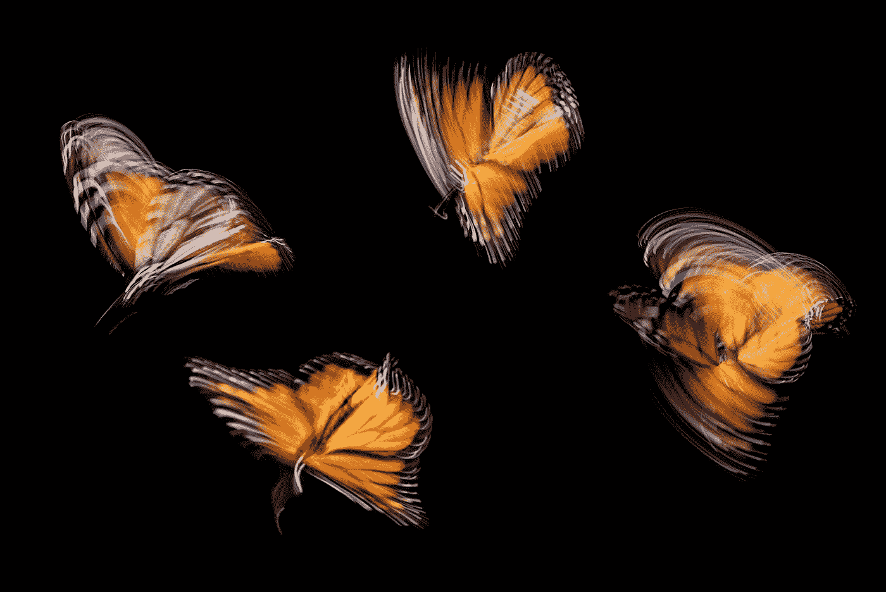

# 职业规划？我喜欢蝴蝶

> 原文：<https://medium.com/swlh/why-you-should-seriously-be-taking-career-guidance-from-butterflies-5f8c93377654>

你在幼儿园见过他们。实际版本更有启发性。

Photo by [Ian Parker](https://unsplash.com/@evanescentlight?utm_source=medium&utm_medium=referral) on [Unsplash](https://unsplash.com?utm_source=medium&utm_medium=referral)

一天，一只肥胖的毛毛虫进入了一个茧，过了一会儿，变成了一只美丽的翅膀，自由飞翔。差不多就是这样。

不，实际上不是。

真实版本的蝴蝶变形要有趣得多。而且有线索在…