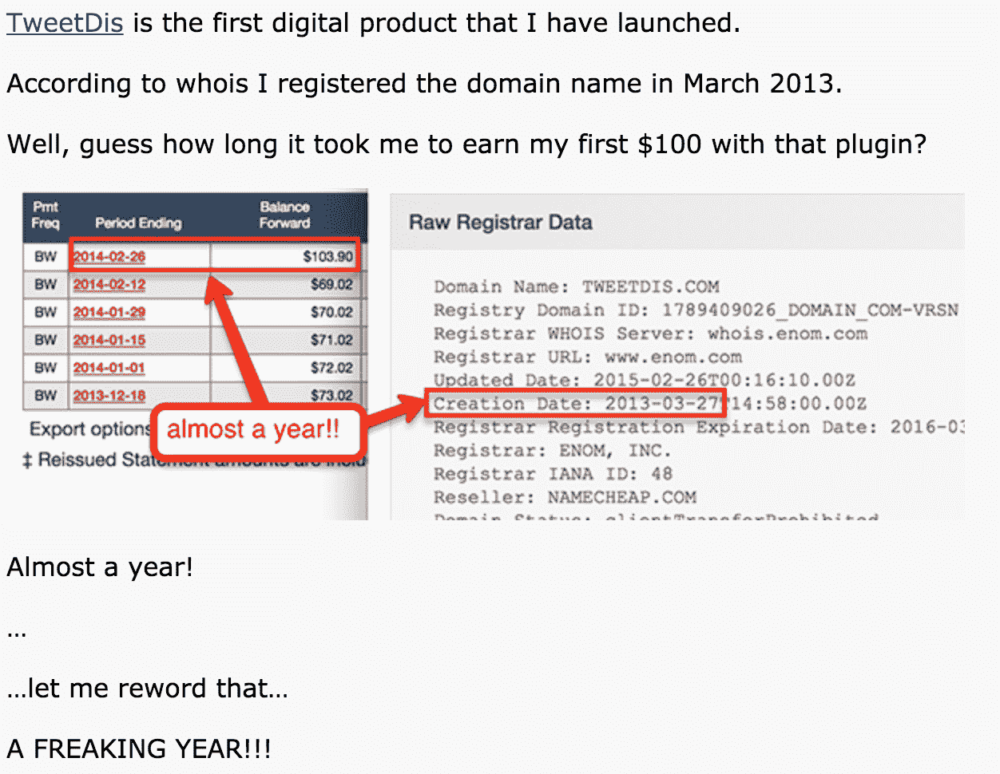
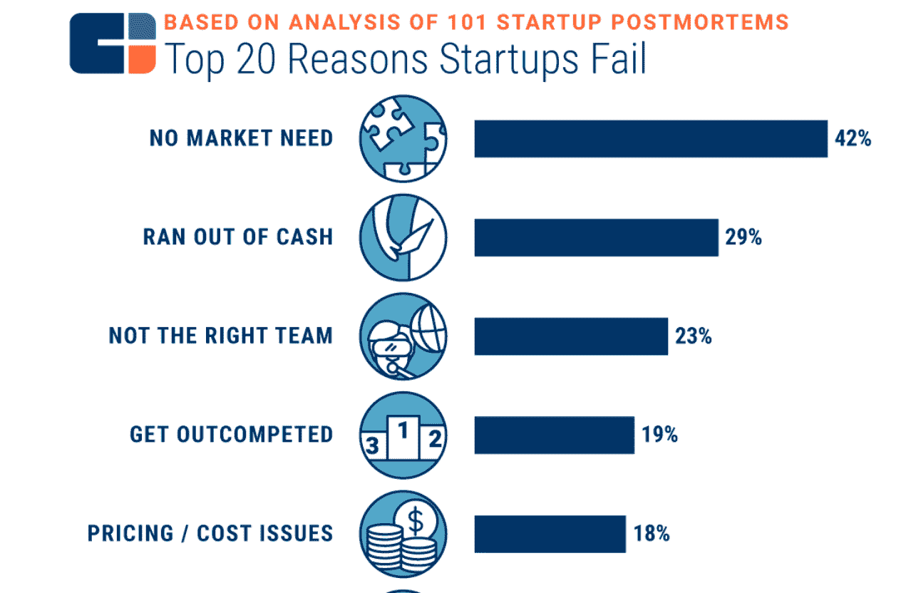
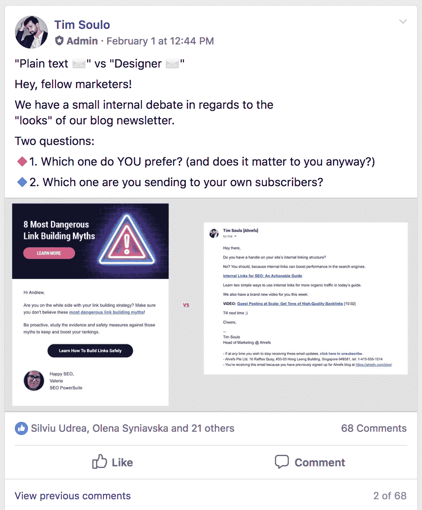
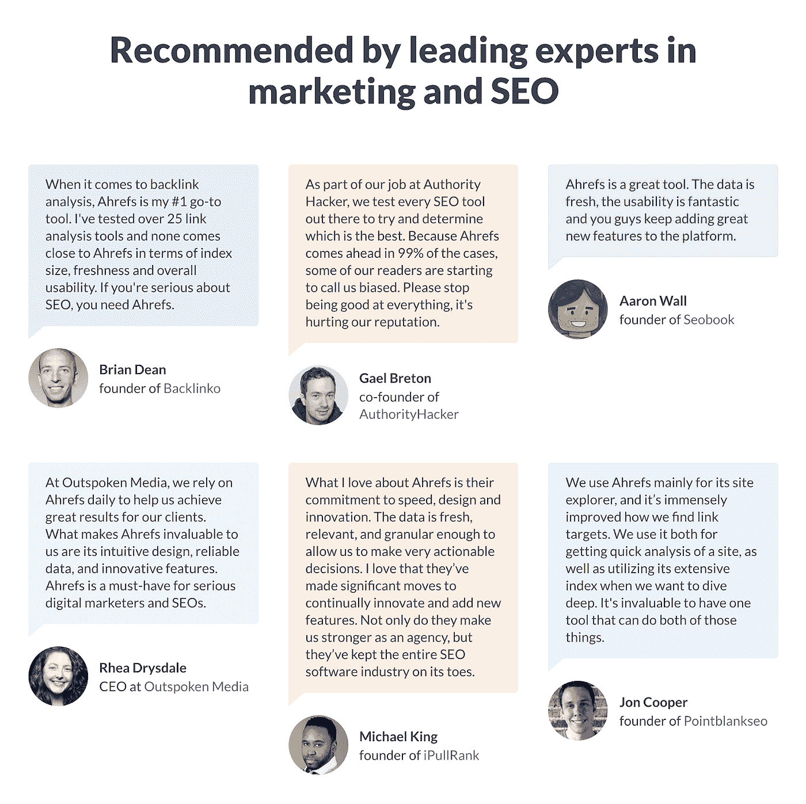
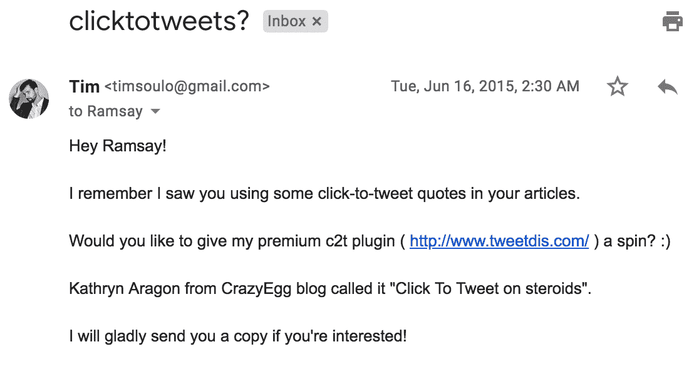
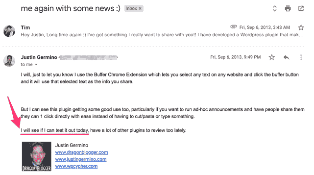
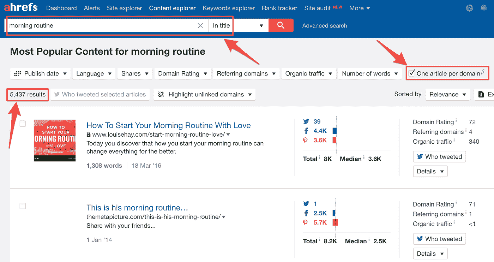

# 为什么你不应该向你的前 100 个顾客收费(是的，说真的)

> 原文：<https://medium.com/swlh/why-you-shouldnt-charge-your-first-100-customers-yes-seriously-1b307992188f>

如果你建造了它，他们就会来。

…但他们没有。

我花了超过 12 个月的晚上和周末，全力以赴来启动我的第一个高级 Wordpress 插件。

结果呢？高达 100 美元的销售额。

还好我白天有工作。

最令人沮丧的是，我*知道*我的插件会产生大量的销售，只要营销人员知道它对他们的博客有多大价值。

不幸的是，我犯了一个典型的“新手”企业家的错误:我愚蠢地认为，在向我个人博客的少数读者宣布推出我的产品后，销售额会像雪球一样越滚越大。

当然，我为自己把一个小创意变成了一个可行的产品而自豪——我甚至在没有任何技术技能的情况下成功地把它拿出来出售。

但是我面临着我最大的问题:

> *我如何获得我的第一个 100 个客户？*

如果你一直关注我在 Medium 的文章，你可能已经知道我是一个使用搜索引擎优化来获得客户的巨大倡导者(这意味着人们通过谷歌搜索找到你的网站。)

在我的第一个插件中，我犯了一个巨大的错误，那就是在开发产品的同时，没有从谷歌获得流量。

一旦准备出售的产品在我手中，我迫切需要得到我的第一个 100 名客户…但我不能再等一年来建立搜索流量，以达到潜在的客户。

注意我说的*客户*，不是*销售*？虽然现金对商业总是有好处的，但新推出的产品更重视获得客户而不是销售。

即使那些顾客不会给你一分钱。

你甚至可能想付钱给他们使用你的产品…

## **你需要尽快拥有第一批 100 名客户的 3 个理由**

我意识到我的提议要求许多企业家的思维方式发生重大转变。毕竟，你创业是为了赚钱，而不是送人。

但这里有一些值得思考的东西:你需要你的第一批顾客，远远超过他们需要你。

让我们暂时记住这一点。

从你潜在客户的角度考虑一下。也许很难承认，没有你他们也过得很好。他们要么:

*   不知道他们有问题；
*   意识到了这个问题，但不愿意去解决它；
*   已经解决了，但不是用你的产品。

相反，你的第一批顾客对你的成功绝对有帮助。

# **1。他们提供了宝贵的产品反馈。**

对于任何年轻的公司来说，实现产品与市场的契合都是一项至关重要的任务。事实上，这经常被认为是创业失败的头号原因。

你可以通过将你的产品交给行业领导者并听取他们的反馈来避免落入这个陷阱。

你所在领域的顶尖人物很有可能会为改进你的产品提供惊人的建议。

因为他们已经知道你的目标受众，他们可以发现看不见的机会，使你的产品更有吸引力。当然，相反的情况也会发生:他们也可能会说你的想法需要改进。

没有这些行业关系怎么办？那么，你能做的下一件最好的事情就是从你的顾客那里得到反馈。

明年，我工作的 SaaS 公司， [Ahrefs](http://ahrefs.com) (我是这里的 CMO)将庆祝我们的十周年纪念日。我们的产品开发团队仍然非常依赖客户反馈，甚至可以说这是我们成功的基石。

例证:我们最近对我们的 9000 多名脸书社区成员进行了调查，询问他们更喜欢我们发送的哪种电子邮件格式。

# **2。你会得到褒奖和成功的故事。**

假设你的第一个客户从你的产品中获得了前所未有的价值。在大多数情况下，他们会很乐意提供一份热情洋溢的推荐书，或者同意成为一个成功故事的主角。

这种类型的社交证明可以在你的网站、登陆页面和未来数年的众多营销材料中使用。

另一个好处？挖掘早期客户的成功故事，听听他们如何描述你的产品，可以极大地提高你的销售文案。

经典的广告建议建议这样做，因为企业主和他们的实际客户对产品的看法可能会有很大的偏差。

对我来说幸运的是，当许多行业领导者已经是我们产品的快乐用户时，我加入了 Ahrefs。在我们的主页上展示他们的反馈进一步提高了我们在 SEO 行业的可信度。

# **3。你会发现你的第一个“品牌倡导者”**

如果你仔细倾听你的第一批顾客，并落实他们的反馈，他们中的许多人会成为忠实的品牌拥护者。

想象一下，作为客户，你塑造了一个产品。难道你不会对那家公司有一种特殊的亲切感吗——尤其是当你要求的功能被实现的时候？

同时，不要犯听“权威人士”的话而牺牲“小人物”的错误。

虽然取悦你所在领域的权威人士，并根据他们的反馈采取行动，希望他们以后会把你提升为他们的追随者，这当然很诱人，但让我们现实一点。你不太可能仅仅因为 Gary Vee 给过你一条建议就让他推销你的产品或服务。

我知道我在说什么，因为[我试过](https://www.facebook.com/timsoulo/videos/10212249731346015/)。

相反，在你的圈子里，与那些还没有“那么大”的人建立联系是非常容易的。

当然，仅仅建立其中的一个联系不会对你的生意产生显著的影响。但是和几十个人交朋友，你会开始感觉到他们是如何向他们的朋友和社交圈推销你的生意的。

# **为什么你应该向你的前 100 名顾客付款**

如你所见，获得第一批 100 个客户对你的业务成功至关重要。

不过，有一点需要澄清——100 个客户并不意味着“你的应用程序有 100 个注册”。这意味着有 100 个人经常使用你的产品。

刚刚起步的企业家通常会惊讶地发现这实际上是多么具有挑战性。

有时，你的潜在客户可能没有时间试用你的产品。在这种情况下，我建议通过代表他们使用产品来为他们的业务取得成果(如果可能的话)。

如果潜在客户仍然不感兴趣，你可以改变思路，向他们支付咨询会议的费用。在这次谈话中，你可以提到你的产品的好处，并寻求反馈。

在我看来，Ahrefs 在大约 9 年前起飞的原因之一是因为我们的[首席执行官兼创始人 Dmitry](https://twitter.com/botsbreeder?lang=en) 了解尽快获得第一批 100 个客户的力量。

早在 2011 年发布 Ahrefs 的第一个版本时，Dmitry 就开放了对该工具的免费(但有限制)访问。与现有解决方案相比，他还使价格相对便宜，以使他的产品在价格上更具吸引力。

结合一个令人难以置信的强大的产品和对增加有机搜索流量的关注，你就有了:正是这个公式启动了 Ahrefs 的成功。

Ahrefs 得到了 SEO 的几篇报道、社交媒体提及和其他类型的免费宣传，SEO 对该工具的功能感到满意。

随着产品的不断发展，Dmitry 相应地修改了我们的定价。

***字至理名言:*** *永远不要出卖或出卖一生的账目。不要为了达到客户里程碑而这样做，更不要为了宣传而这样做。许多初创公司出售终身账户来赚快钱，并获得公关提升，但多年后发现自己被这些“死重量”的客户困住了。*

# **如何找到你的前 100 个客户**

关于找到你的第一批 100 个客户，已经说了很多了。

一些营销专业人士建议在行业论坛上闲逛，在 Quora 这样的平台上回答问题，并开展 PPC 活动。这些都不是坏主意。

然而，它们甚至比不上你通过接触你所在行业的博主和记者而建立起来的势头。

很明显，越有名的人，他们越不可能回应。这就是为什么你应该在产品开发的初始阶段就开始培养关系。

接触有影响力的人，讨论你想要解决的问题。了解他们是否认为这很重要，以及他们是如何处理的。

下面是四年前我发给一位知名博主的一封冷漠邮件的例子。我向他提供了一份我产品的免费拷贝，没有任何附加条件。可惜我一直没有收到他的回复=)

相比之下，我收到了一位博主的回复，这位博主是我很久以前认识的朋友，他要求看一下我新推出的产品:

他不仅带着我的产品兜了一圈，还给了我大量的反馈，这些反馈将用于未来的产品迭代。他甚至在自己的博客上发表了一篇评论该产品的文章。

在这一点上，你可能想知道:*我如何在我的行业内找到博客作者和记者？*

这里有一个简单的“破解”方法，你可以尝试使用 Ahrefs 的[内容浏览器](https://ahrefs.com/content-explorer)工具:

假设你开发了一个生产力应用程序，你正在寻找写关于生产力的博客的人。使用 Ahrefs 的内容浏览器，你可以在互联网上搜索标题中带有“早晨惯例”一词的最受欢迎的文章。

接下来，点击“每个域名一篇文章”选项。这个搜索参数很重要，因为一个博主可能在几篇不同的文章中提到了“早晨的例行公事”。

这就给了你一份 5，437 个博客的名单。

从这里开始，你可以争取说服 5000 名博客作者中的 100 名试用你的生产力应用，让筹码落到他们可能落到的地方。

## **现在，轮到你了…**

我希望你开始看到免费赠送你的早期产品的价值。

这听起来可能很疯狂，与合适的人分享你的产品可以给你带来宝贵的反馈、免费宣传和你产生吸引力所需的社会证明。

这听起来像是能为你的企业工作的策略吗？为什么或为什么不？在下面的评论里告诉我。

//

> 感谢阅读。如果你喜欢这篇文章，请随意鼓掌👏按钮几次(👏👏👏👏)帮别人找:)

更多深入的营销文章，请访问 Ahrefs 博客。

//