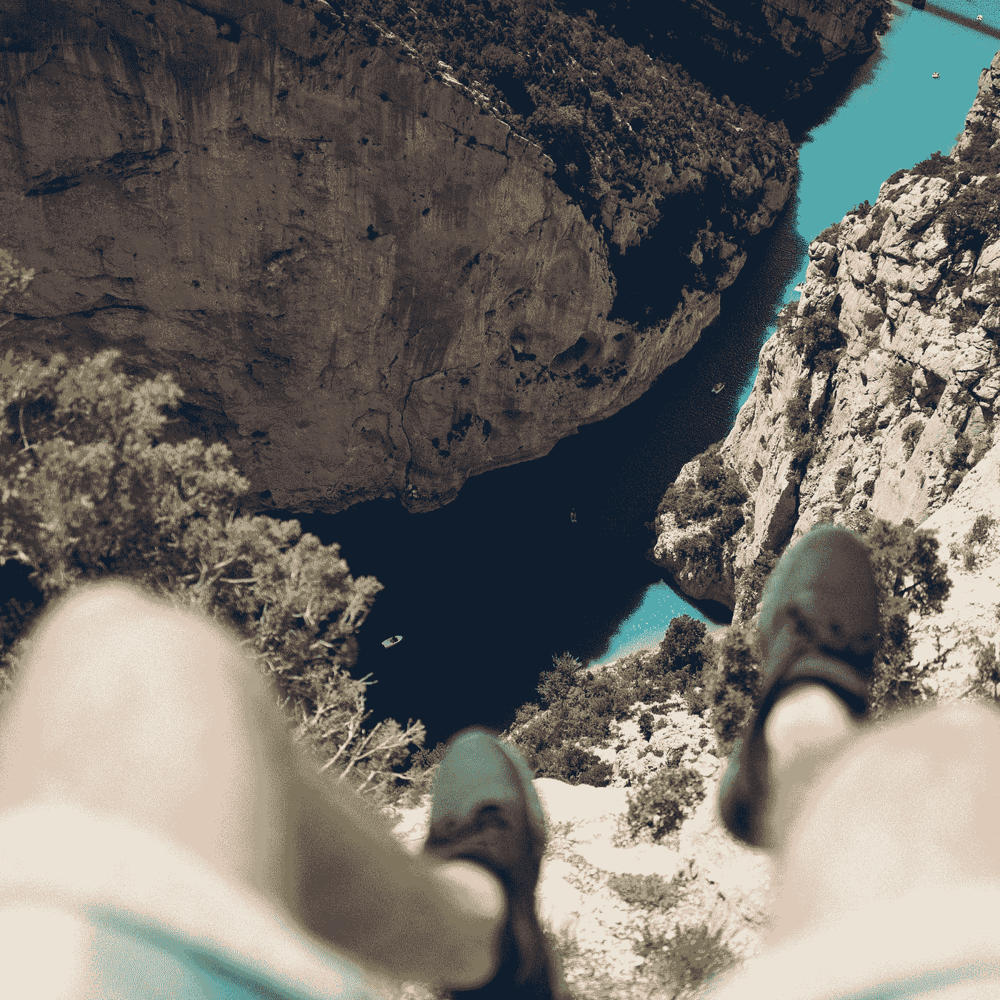

# 为什么你不应该面对你的恐惧？

> 原文：<https://medium.com/swlh/why-you-shouldnt-face-your-fears-3cbe9af7dc1d>

## 但是你应该每天把他们打得屁滚尿流

Photo by [Christoffer Engström](https://unsplash.com/@christoffere?utm_source=medium&utm_medium=referral) on [Unsplash](https://unsplash.com?utm_source=medium&utm_medium=referral)

绑着降落伞站在飞机边缘，等待跳伞的信号。我敢打赌，当我这么说的时候，面对你的恐惧时，我会想到这个画面(至少对我来说)。然而，它不一定要如此宏伟(或昂贵)。可能是生活中的小事。