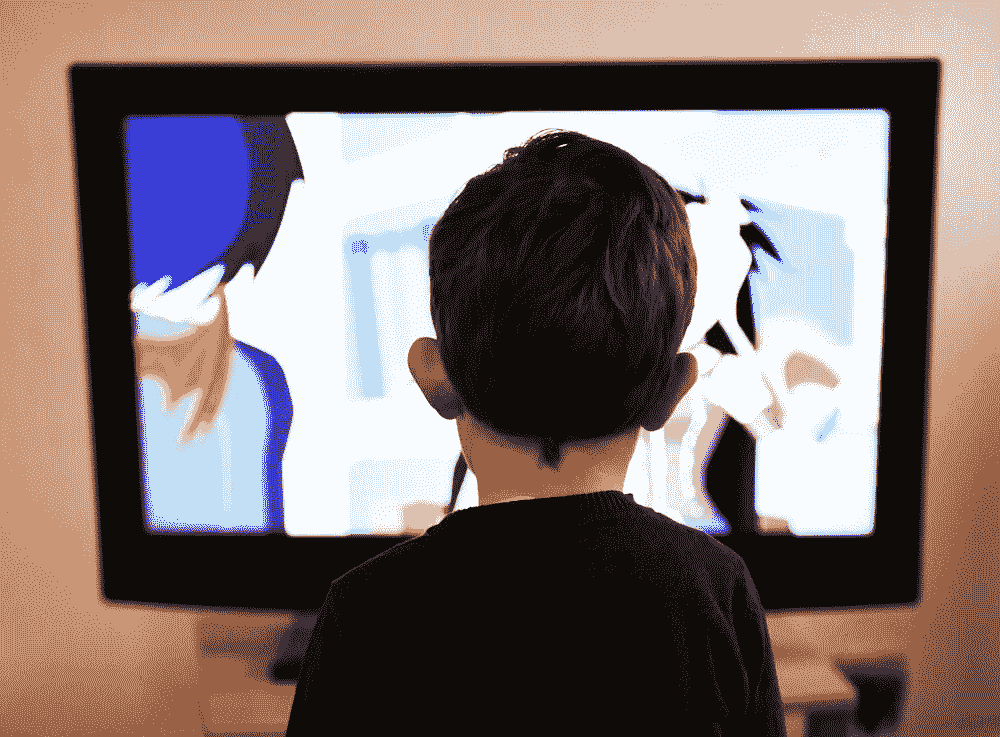

# 当你的孩子在看电视时，打断他们？这是危险的教育方式。

> 原文：<https://medium.com/swlh/why-you-shouldnt-interrupt-kids-while-they-are-watching-a-show-5635ae0d3476>

## 儿童节目以一堂道德课结束。中途关掉电视教会了他们道德上的失败——但不是其后果

Credit: Image by [Vidmir Raic](https://pixabay.com/users/mojzagrebinfo-278781/?utm_source=link-attribution&utm_medium=referral&utm_campaign=image&utm_content=403583) from [Pixabay](https://pixabay.com/?utm_source=link-attribution&utm_medium=referral&utm_campaign=image&utm_content=403583)

我们都做过。让孩子们在电视机前呆几分钟，让他们暂时脑叶切除，这样我们…