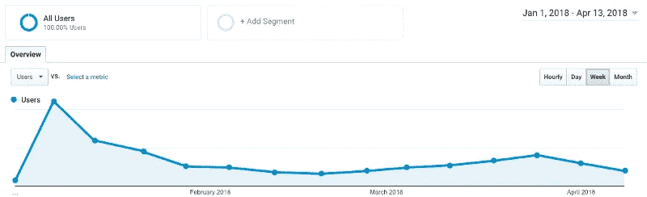
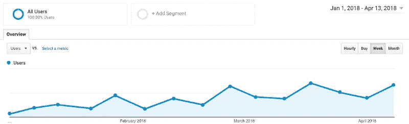

# 为什么你想把你的网站流量提高 10 倍，而不是 100 倍。

> 原文：<https://medium.com/swlh/why-you-want-increase-your-website-traffic-by-10x-not-100x-e2d28b02be9c>

loads of traffic, not always a good thing…

当推出新的技术产品时，有几个网站可以用来发布和推荐你的新网站。这篇博客讲述了我在使用向上投票和发布网站时的经历，以及一些帮助你知道何时以及如何在这些网站上发布你的产品和博客的建议。

我的解决方案创造了最大的成功，因此最大限度地提高了生存的机会，当推出一个新产品是创造许多可重复的和可扩展的推出，10 倍于你的网站流量。我认为你需要避免的是一次性事件，以不可持续的方式增加 100 倍的网站流量。从中长期来看，这样做会弊大于利，并扭曲反馈回路。

# 什么是启动和投票网站？

发布和投票网站是你可以发布新产品、博客和创意的网站。这些网站可以花很少的钱或很少的时间为你的网站流量提供巨大的推动力。这使得他们对那些资金匮乏、希望新产品有受众的初创公司非常有吸引力。他们中的许多人已经成为创业生态系统的关键。一些例子包括 [producthunt](https://www.producthunt.com/posts/how-does-it-look-on-social) 、 [betalist](https://betalist.com/startups/pilcro) 和 [betapage](https://betapage.co/product/how-does-it-look-on-social) 。在这些网站上发帖有多种好处。这些包括从一个积极参与、知识渊博的社区中获得很好的反馈，这些社区总是在寻找新产品和新想法，或者获得早期用户，这些用户很难获得。

# **健康警告…**

然而，这些网站都附有健康警告。它们会分散注意力，给人一种虚假的成功感。他们是[虚荣度量](https://techcrunch.com/2011/07/30/vanity-metrics)之火的燃料。

如果你是一个早期阶段的公司，当你在这些网站上发帖时，你网站的流量很可能会比你常规的有机流量大很多数量级。一个好的产品搜索发布可以在很短的时间内提供成千上万的网站点击率。

*Google analytics example of a Product Hunt launch and following months*

为什么这很重要？流量增加 100 倍肯定很棒吧？事实是，拥有 100 倍以上的流量可能会掩盖你网站的问题，混淆揭示你营销漏斗中问题的数据。在你的网站上有很多人会延迟回答你最基本的问题的需要。

> 我们称这些网站为“营销火箭筒”

通过给你一个一次性的、临时的解决方案(成倍地增加你网站的流量),这些网站可以隐藏一些基本的问题，当尘埃落定时，这些问题会回来困扰你。

# 有什么解决办法？

关键是创建可持续和可重复的营销流程。不仅仅是依靠一次性的营销火箭筒。你仍然可以使用发射场，但是你必须以正确的方式使用它们。在皮尔克罗我们有两条经验法则。

1.  确保你的发布是可重复的。发布专题、博客、附带项目、视频…
2.  估计这个发布会是你常规流量的 10 倍，否则就太早了

它们对发布有限制，例如下面的两个例子。(还有常识告诉你，同一个产品不能推出两次。)

> "**每家初创公司都有两次被曝光的机会。**发布前一次，发布期间一次。这些帖子之间应该至少有几周的时间。”测试列表
> 
> “如果产品、书籍或游戏**在**之前尚未提交，并且符合社区指南，您将被突出显示为该产品的猎人。”产品搜索

我们的经验是，当你的流量与你认为你将从这些网站产生的流量相差不到 10 倍时，就使用这些网站。这是为了让流量不会干扰你的分析，以至于无法测量其他任何东西。

例如，如果你估计一个产品搜索发布会让你的网站在一天内获得 10k 的点击率，那么做这个发布的正确时间是当你的网站每天有 1k 的点击率的时候。

*A Google Analytics example of regular “10x” launches*

# 那么，我们如何才能实现这些持续的发布呢

皮尔克罗有一句话，“永远要发射。”秘方是找到一种方法，以可扩展、可重复的方式不断推出内容和产品。这里有三个例子。

Always be launching

# 启动辅助项目

你可以在我们讨论过的发布点上发布副业。找到你的目标市场存在的一个小问题，用一个简单的产品解决它。这些不应该超过几个星期的开发工作，当然不是为了创收而设计的。你可以用一个简单的工具来帮助你的社区，让他们知道你理解并关心他们。这可以建立信任，如果实施得好，可以增加你主网站的流量。

# 发布博客

博客是不断给予的礼物。与发布一个产品或功能不同，你可以多次发布同一个博客，因为发布博客的渠道比发布产品的渠道多得多，你甚至可以从那个博客获得[有机搜索点击](https://www.quicksprout.com/the-complete-guide-to-building-your-blog-audience-chapter-3/)，因为读者可以通过搜索相关主题来发现它。

# 此次发布的特色不是整个产品

尝试推出单个功能，而不是整个产品。一个功能可能需要一两个月的时间来开发和发布，你不需要等待整个产品

# 最后

定期推出，经常推出，小规模推出。努力把启动变成一个过程而不是一个事件。应用经验法则，你的发布会使你的常规流量增加 10 倍以上。每次发布都会带来学习和成长，所以每次你发布一个功能或者一个博客，都会比上一次发布的表现更好。遵循这个过程会让你走上成功的正确轨道。

## 这篇文章发表在 [The Startup](https://medium.com/swlh) 上，这是 Medium 最大的创业刊物，拥有+409，714 名读者。

## 订阅接收[我们的头条](http://growthsupply.com/the-startup-newsletter/)。

