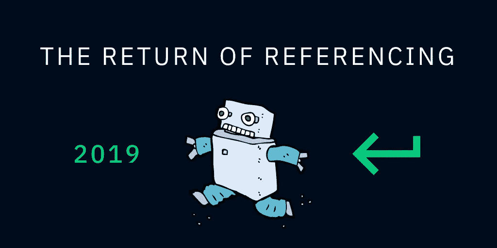
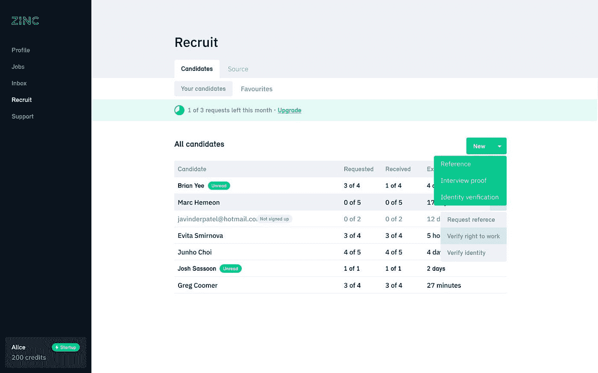
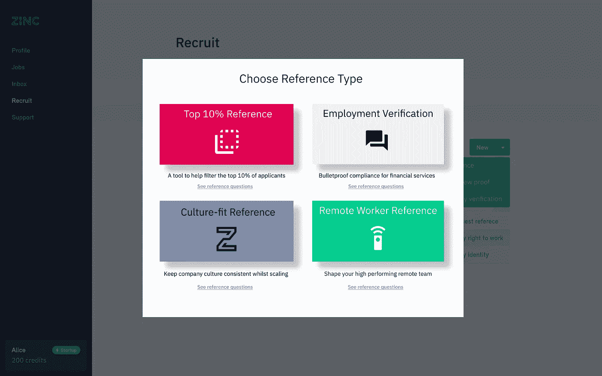
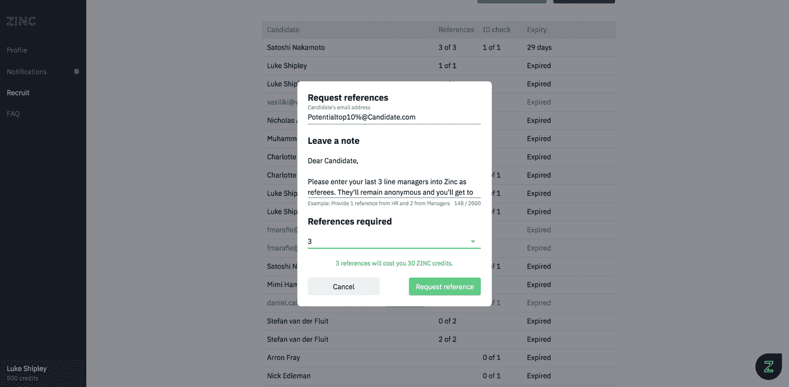

# 为什么您将在 2019 年再次开始引用

> 原文：<https://medium.com/swlh/why-youll-start-referencing-again-in-2019-20915f65ccc7>

*行为设计师启发了一种新的参考方式，诞生于斯坦福*

你不久前放弃了参考。你花了太多时间与前任经理交换语音邮件，而他们完全有理由不优先考虑你的谈话。它给了你一个不受欢迎的提醒，提醒你机构招聘人员强行发出另一条“希望你一切都好”的语音邮件，而在内心深处，他们知道这条消息会被置若罔闻。

行为设计师 [Nir Eyal](https://www.nirandfar.com/2012/04/abolish-the-reference-check.html) 设计系统和产品来灌输某些行为。2012 年，他提出了一个近乎完美的新参考系统。Nir 将这个系统归功于斯坦福大学的[Irv gross beck](http://gsbapps.stanford.edu/facultyprofiles/biomain.asp?id=43988829)。他建议我们利用人们的懒惰来消除参考中的偏见，并推断出我们需要雇用的信息。这可以通过给推荐人发电子邮件，要求他们不要回复，除非候选人是他们合作过的人中排名前 10%的人，给他们一个简单的出路。只有在候选人引人注目的特殊情况下，他们才应该给出推荐信。这是一个有趣的整体引用，比通常的确认偏差引用调用有效得多。然而，由于引用是 Zinc 所做的，我们有一些调整建议。我们也在我们的自动化系统中建立了这种参考技术，因此 2019 年的最佳参考方式将花费你几分钟而不是几周的时间。

我们发现裁判的礼貌胜过了他们的懒惰。也许这是英国人的事情，但不回应你喜欢但不是天下无敌的老同事的推荐信要求是不合适的。作为一个优秀的人类裁判，你应该给他们一个参考。但是同样地，你也不想过分夸大他们的能力，以至于蛋黄最终落在你的脸上。因此，我们希望设计系统，使最简单的默认响应是日期检查引用。做出最合理的回应，确认日期和求职者的职位，仅此而已。但是，如果这个申请人是你有幸与之分享看板的前 5%的工程师之一，那么我们希望你完成一份 15 分钟的大表格。那是 5%,因为人类的本性把它延伸到 10(双倍)。要求 10%的人，我们最终会得到前 20%的人，所以要求前 5%的人意味着他们可以在人性伸展之后用两只手数出摇滚明星。

> “你，裁判夫人，真的相信这个人是有福的吗？”好吧，那我就用一份长达 15 分钟的能力问卷来测试你对这句话的信念。一个真正让你思考的问题。很难。所以，如果你认为这个同事可能在 11%，那么默认回那个日期检查真的会更容易。毕竟它仍然是一个参考，你很忙。真的很忙。

对于发起推荐的招聘经理或招聘人员来说，这就是工作的样子。它真的是不到两分钟，即使你打字像大象戴着板球手套…

1.  前往 https://app.zincwork.com/recruit，然后单击“新建参考”。

2.选择 Nir 所说的“前 10%参考”或“平均无需适用”。

3.输入您的候选人电子邮件地址和备注。

Viola 参考结果返回。预计您的大部分推荐信如下所示。这意味着您的候选人推荐人不认为他们落入了前 10%。

The reference results arrive back

根据您的筛选过程以及您进行参考时的情况，由于您的最终用户首先进行了一些过滤，因此该值应高于您所看到的通过值的 90%。但这提出了一个很好的问题，什么时候进行你的推荐。你之前之所以选择第二好~确认偏差推荐这么长时间，是因为他们是在最后阶段进行的，在你和其他面试者确定这个候选人是前 10%之后。因此，除非一些明显可怕的事情被揭露出来，否则对任何人都没有好处。这就是为什么在预约最后一次面试之前，在你投入太多之前，你需要这些结果。您为自己节省了一些时间，这样您就可以在流程的早期获得额外的信息。

如果您需要帮助，请联系我们，使用锌的[员工背景调查工具](http://zincwork.com)筛选出前 10%的候选人。或者学习文化适应参考，远程工作者参考；[卢克@zincwork](http://hello@zinc.work) .com。感谢 Nir Eyal 在这个新的参考公式背后的灵感。

如果您需要锌的支持，请与我们联系。

**网站** : [https://zincwork](https://zinc.work) 。com

**领英:**[https://www.linkedin.com/company/zinc-work/](https://www.linkedin.com/company/zinc-work/)

## 这个故事发表在《创业》(Startup)杂志上，这是 Medium 最大的创业刊物，有+415，678 人关注。

## 在此订阅接收[我们的头条新闻。](http://growthsupply.com/the-startup-newsletter/)

