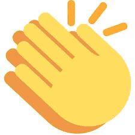

# 为什么你的企业需要你多洗澡

> 原文：<https://medium.com/swlh/why-your-business-needs-you-to-shower-more-f2e685827d94>

你在你的办公桌前。你深陷于一个问题中。你已经盯着它好几个小时了。你已经去掉了大部分显而易见的废话。你已经深入人心了。

现在你被困住了。

(via [Daniel Gregoire](https://unsplash.com/@yeeeeeeha), [unsplash](https://unsplash.com/photos/exUBQ2QVDyk))

**你需要弄清楚:**

*   为你的营销找到正确的词语组合
*   你商业模式的下一个支点
*   你的代码中不一致弹出的 bug
*   将你的研究联系在一起的联系
*   你文章的最后一行
*   你文章的第一行
*   那个标志设计
*   这一新功能可以防止你的用户产生混乱
*   你演讲的完美信息流

太接近了。如果你能稍微集中精力，你会得到它的。关掉音乐。关闭其他 27 个浏览器标签。靠过来。

这是场消耗战。你将凭借意志力解决这个问题。

(via [Jeroen Bosch](https://unsplash.com/@jeroenbosch), [unsplash](https://unsplash.com/photos/GKkIHrSCuPk))

**没有。还是卡住了。**

(via [Joe Green](https://unsplash.com/@jg), [unsplash](https://unsplash.com/photos/bfJjBskA3gA))

你可以继续让自己陷入更深的困境。你可以试着更接近问题的细微差别。

但事实是你需要洗个澡。

淋浴不是为了你的卫生……虽然你已经坐了一会儿了，所以你可能需要梳洗一下。

淋浴是迫使自己*远离问题的一种方式。*

而不仅仅是“离开”去做别的事情。“离开”到一个没有屏幕的地方。“离开”到一个你可以保持一定距离的地方，让你的大脑有机会自己整理和处理信息。

那个地方不一定是一个真正的浴室，但它为这个想法提供了一个很好的思维捷径。

它只是需要一个暂时忘记所有无尽细节的地方。

这当然不是一个新概念。我们已经知道淋浴分散注意力会产生“啊哈”时刻。我们都听说过以某种形式离开工作的好处。你甚至可能读过关于益处的研究。

但是我发现自己需要一次又一次的提醒。因此，我写了这篇文章，看看它是否有助于这个想法留在我自己的脑海里。

# 最近的“阵雨”时刻

对我来说，一个最好的例子发生在上周。最近，我对自己业务的[价值主张进行了大量思考。试着用新的眼光看待我正在解决的问题，以及是什么让我的立场独一无二。](https://mapandfire.com/?utm_source=blog&utm_medium=article&utm_campaign=shower)

星期五晚上，我从家里得到了一张通行证，可以独自出去玩一个晚上。作为一个天生的内向者，我知道有时候我需要独处的时间来理清思绪。

我有一个 IPA，去看了一部愚蠢的动作片。(技术上说是在一个屏幕上，但严格来说是为了消费，而不是互动)。

在开车回家的路上，我几天来第一次完全放松下来。我的注意力集中在远处市中心的灯光、新鲜的夜晚空气和一些背景音乐上。

这时，我的大脑给出了价值主张问题的答案。

就好像我已经用信息准备好了我的大脑，给它布置了一个任务，现在是它交作业的时候了。

这个小小的突破让我对这个概念有了全新的认识。这并不是思想上的 180 度大转变，而是已经存在的想法之间的联系。

我之前没有发现这种联系，因为我把我所有的精力都放在了树木上。当我后退的时候，它给了我的大脑一个机会以新的视角来看待森林。我给了我的大脑这些成分，现在这个空间提供了重新排列它们的空间。

有很多“淋浴”可以提供同样的效果:

*   IPA 和一部电影
*   在街区/附近散步
*   远足
*   沉思
*   一些其他形式的锻炼——游泳、投篮、跳绳
*   …或者洗个澡…尤其是当你因为运动而浑身发臭的时候…

唯一的要求就是专注于别的事情。给你的大脑一些空间。不要再用力了。退后放松。

这个小小的突破可能会让人觉得是暂时的生产力损失，但它可能会揭示你所需要的确切突破。

(via [Christal Yuen](https://unsplash.com/@dearskye), [unsplash](https://unsplash.com/photos/Aka2x2D4Ph0))

# 洗澡时寻求帮助

如果您需要一些帮助来组织您的想法，请在下面注册获得 7 个工作表，带您了解品牌和营销概念，如愿景陈述、客户动机、品牌原型、语气等等！

Get the worksheets: [mapandfire.com](https://mapandfire.com/?utm_source=blog&utm_medium=article&utm_campaign=shower)

# 如果你读到这里，请在下面给这个故事一些掌声:)

*原载于 2019 年 2 月 19 日*[*【mapandfire.com*](https://mapandfire.com/blog/why-your-business-needs-you-to-shower-more/)*。*

## 这篇文章发表在 [The Startup](https://medium.com/swlh) 上，这是 Medium 最大的创业刊物，拥有+426，678 名读者。

## 在此订阅接收[我们的头条新闻](https://growthsupply.com/the-startup-newsletter/)。

