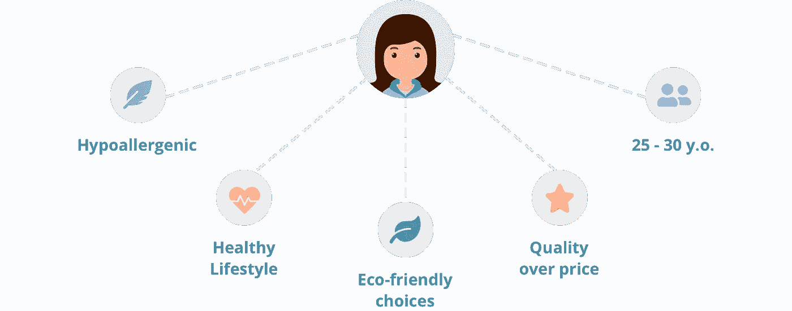

# 为什么你的电子商务需要智能。人工智能

> 原文：<https://medium.com/swlh/why-your-ecommerce-needs-intelligence-artificial-intelligence-8550e5458594>

人工智能就在我们身边:在自动驾驶汽车和无人机中，虚拟助手和语音识别工具。这是谷歌回答我们搜索的方式，Spotify 播放音乐，亚马逊推荐热门交易。营销专家预测，如果今天忽视人工智能驱动的技术，在线零售店将在大约 5-10 年内灭绝。让我们看看人工智能如何为你的电子商务赋能。

# 通过数据分析重塑 CX

如今，为了增加销售额并拥有相对于竞争对手的竞争优势，公司不仅应该满足客户的期望，还应该超越他们——尤其是在这些[需求每年都变得越来越高的情况下。客户体验(CX)个性化的水平应该超出通常的忠诚度计划或第二次购买 10%的折扣。](https://www.accenture.com/t20171220T024439Z__w__/us-en/_acnmedia/PDF-68/Accenture-Global-Anthem-POV.pdf#zoom=50)

几年前，网飞成为网络话题，因为它[知道观众想要什么](https://www.forbes.com/sites/jonmarkman/2017/06/09/netflix-knows-what-you-want-before-you-do/#659eb73c52b8)，甚至在他们意识到自己知道之前。这家媒体服务提供商应用大数据分析来探索观众的选择——他们看了哪些预告片和剧集以及看了多长时间——并根据这些数据来建议用户可能喜欢的内容。该公司甚至走得更远，去创造、授权和营销人们会喜欢的新内容。最近在网飞发行的*黑镜:Bandersnatch* 无疑是互动内容的创新，同时也是该公司的秘密营销武器。互动电视将网飞收集独特用户数据的能力提升到了一个令人难以置信的新水平。

现在把网飞想象成一家数据公司，而不是电影院，把易趣想象成一家数据公司，而不是拍卖公司，把亚马逊想象成一家数据公司，而不是网上商店。这样的例子不胜枚举…

这样，营销模式就天翻地覆了。公司开始厌恶老派销售人员向顾客推销产品的方式。全球品牌不再试图满足顾客的实际需求，而是预测和推荐产品，甚至在顾客知道他们需要之前。

现在，品牌不再简单地知道顾客购买了哪些东西，而是试图了解他们为什么这样做。他们对特定产品或首选功能的需求是什么？他们有什么特殊需求吗，比如过敏或残疾？收集、汇总和分析客户数据对一个品牌的生存至关重要。因此，数据分析、人工智能和机器学习以及预测建模使公司能够建立新的商业模式，并重塑客户拓展。

A **人工智能** (AI)是指软件模仿人类认知过程的能力。

M**achine learning**(ML)作为 AI 的一个分支，让软件从数据中学习，发现模式，并基于这些产生商业洞察。

# 客户基因组分析

万维网上的每个动作都被监视，包括用户如何与网络交互(移动/网络，设备类型)，回复电子邮件，使用哪些社交网络，在线搜索和购买哪些产品。谷歌的机器学习驱动软件 rank brain[24/7/365](https://blog.marketo.com/2018/03/5-ways-ai-can-help-sales-marketing-alignment.html)监控用户参与度，为谷歌搜索栏中的每个查询挑选最佳搜索结果。用户的每一个举动都暗示了一个人的偏好、激情、购买习惯和潜在需求。所有互动中的这些属性创造了所谓的客户基因组(Accenture.com 使用的术语[)，或者每个个体最独特方面的生活档案。](https://www.accenture.com/t20170310T042952Z__w__/us-en/_acnmedia/PDF-45/Accenture-Genome-POV-Hotel.pdf#zoom=100)

Customer genome

如果他们愿意的话，公司可以获取他们现有和潜在客户的所有这些数字属性，汇总并进一步分析它们，以构建一幅典型的目标买家角色图。反过来，他们的偏好帮助品牌提供协调的个性化客户体验:搜索结果、推荐引擎、定制的[营销电子邮件活动](https://www.logicify.com/en/blog/logicify-contributes-to-open-source-mautic-advanced-templates-bundle/)、新产品等等——并最终实现预期的投资回报率和增加销售额。

# 分析和人工智能

手动处理如此大量的数据是不可能的。那么为什么不为此创建一个算法呢？这些偏好的多样性和用于分析的数据量都要求使用人工智能，特别是机器学习。然而，许多公司仍然担心其电子商务平台中的人工智能。

**实施人工智能的可能障碍**

*   电子营销者缺乏整合它的远见和策略
*   管理者不知道如何为机器学习“解释”大数据
*   公司根本没有所需的技能和技术人员

然而，今天拥抱人工智能对于任何商业创新都至关重要。它可以提供 30-50%的利润增长，预计到 2025 年，它对在线商务的影响将达到近 400 亿美元(T2)。更重要的是，客户已经期望在线商店拥有人工智能技术。根据 2017 年的研究，44%的消费者使用某种类型的虚拟助理；22%的人每天都这样做。86%的人对他们的虚拟助手提供的体验感到满意。

你肯定应该考虑用人工智能来推动你的业务，以保持商业上的可行性。

# 人工智能如何帮助在线零售

机器比人类更好地完成一些任务。因此，为什么不让人工智能从你的员工身上卸下日常工作和分析工作，让他们更加专注于“人性化”的任务:创造力、同理心和直觉。

以下是人工智能可以轻松应对的几个领域:

*   **提高** [**客服**](https://www.accenture-insights.nl/en-us/articles/how-to-use-ai-in-e-commerce) 。由人工智能驱动的聊天机器人可以回答 80%的常规客户查询，用于自动化和加速客户支持，节省服务成本，并允许人类完成更复杂和创造性的任务。同样，**语音助手**使服务[甚至对残疾人也变得无障碍](https://www.logicify.com/en/blog/accessibility-in-web-development-how-ecommerce-and-business-websites-benefit-from-it/)并提高客户满意度。
*   **预测未来销售趋势**并帮助**推出满足这一需求的新产品**和服务。根据当前的销售率，人工智能还可以预测未来的收入和销量。
*   **优化搜索**和**推荐产品**。基于用户的购买历史和反馈/评论，人工智能驱动的算法可以在电子商务平台上个性化产品分类，并建议合适的产品——甚至在客户意识到需要这些产品之前。
*   在 CRM 系统中管理后台任务和客户信息。这些令人厌倦的机械但容易出错的任务也可以委托给人工智能。
*   **跟踪库存**，编目，产品内容管理(PCM)。人工智能可以让你摆脱的另一种常规机械任务。

如果你不知道在你的在线商店中从哪里开始使用人工智能，考虑添加**一个预测推荐引擎**。我们为最近的电子商务项目实现了几个人工智能驱动的向导，它们被证明是一个巨大的成功。

# 逻辑化人工智能驱动的推荐小工具

产品推荐算法在引导用户通过不断增加的购买选项方面非常有用。此外， [65%的消费者](https://newsroom.accenture.com/news/consumers-welcome-personalized-offerings-but-businesses-are-struggling-to-deliver-finds-accenture-interactive-personalization-research.htm)更有可能从零售商那里购买商品，如果他们被认出、记住并收到相关推荐的话。

在最近的一个电子商务项目中， [Logicify](http://logicify.com) 开发了一些人工智能驱动的推荐小工具。他们一步一步地提示用户回答一些关于他们的产品偏好和个人特质(怀孕、过敏)的问题。根据给定的答案，小工具会推荐最适合的特定产品。

这些小工具不只是简单地建议一套老派的补充产品(也称为“经常一起购买”的商品)，而是根据客户的独特特征生成一个**智能超个性化推荐**。

为了预测最佳产品选择，我们分析了购买历史，收集并汇总了数千条用户评论，并应用机器学习进行了网络分析。这些大数据进一步接受回归分析和[贝叶斯分类器](https://en.wikipedia.org/wiki/Bayes_classifier)——以确定模式和做出假设——并转化为预测模型。分析的评论越多，预测就越准确。产品的客户标记越高——具有相似特征的用户对产品的感知越好。机器学习还让我们发现了之前隐藏的用户行为和选择模式。

事实证明，这些小工具非常成功，让用户在页面上停留的时间更长了。跳出率降低，而转换率飙升后，小工具被添加到网站。

# 洞察力

品牌过去关注顾客搜索，将其作为需求的关键决定因素。随着人工智能驱动的机器学习的出现，公司现在通过向客户推荐产品/服务来“塑造”需求。现在，不仅仅是顾客搜索什么，而是建议他们买什么。

在你的电子商务应用中使用人工智能不再是一件好事；这是必须的。你可以使用聊天机器人、语音助手、预测引擎——或者同时使用所有这些。它可以帮助你提高 CX，增加销售额。与此同时，将人工智能用于 PCM、库存跟踪、CRM 和后勤办公室将帮助您减轻员工负担并节省运营成本。

# 推荐

在你开始实施人工智能之前，先确定自动化和智能在你的业务流程中最有潜力。首先对如何使用人工智能和人工智能有一个清晰的认识是至关重要的。

一旦你有了它，评估你目前的数据收集方法，如果有必要，在你开始应用人工智能之前调整它们。即使是最聪明的人工智能工具，在数据贫乏的情况下也毫无用处。

然后，收集客户的实时和历史数据，并教您的软件进行分析，以提供强大的个性化和上下文数据来满足(并超越！)您的客户的期望。达到新的洞察力水平，以吸引消费者。

*原载于 2019 年 1 月*[*【www.logicify.com】*](https://www.logicify.com/en/blog/why-your-ecommerce-needs-intelligence-artificial-intelligence/)*。*

## 这篇文章发表在 [The Startup](https://medium.com/swlh) 上，这是 Medium 最大的创业刊物，拥有+433，678 名读者。

## 在此订阅接收[我们的头条新闻](https://growthsupply.com/the-startup-newsletter/)。

