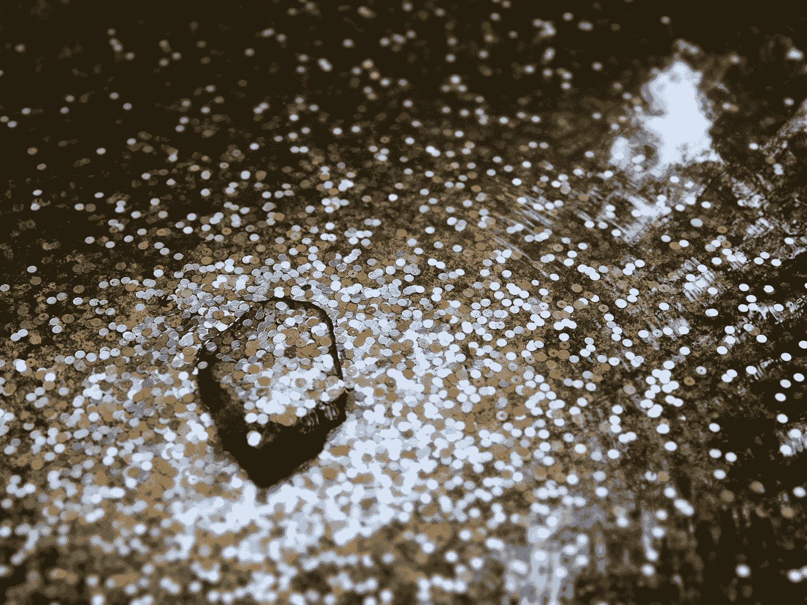

# 为什么你那些看似无关紧要的小事如此重要

> 原文：<https://medium.com/swlh/why-your-small-seemingly-inconsequential-actions-matter-dc94577ff5be>

## 实际上，它们很重要。这个悖论有助于解释为什么。

Photo by [abigail low](https://unsplash.com/@dbwldo?utm_source=medium&utm_medium=referral) on [Unsplash](https://unsplash.com?utm_source=medium&utm_medium=referral)

又下雨了。

坦率地说，去健身房上 8:30 的课并不是我最想做的事情。相反，这是一个喝不完的咖啡和读一本好书的完美日子。