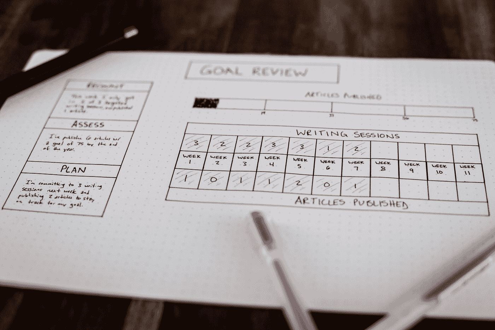

# 为什么你富有成效，却不成功。以及如何改变这种情况。

> 原文：<https://medium.com/swlh/why-youre-productive-but-not-successful-and-how-to-change-that-1d53ca9f1879>

停止快速奔跑，停留在原地。

Photo by [Isaac Smith](https://unsplash.com/@isaacmsmith?utm_source=medium&utm_medium=referral) on [Unsplash](https://unsplash.com?utm_source=medium&utm_medium=referral)

> 爱丽丝后来回想起来，也弄不明白他们是怎么开始的。她只记得他们手拉着手跑，王后跑得很快，她只能尽力跟上，但王后还是不停地喊着“快点！”！“快点！”但是爱丽丝觉得她可以…