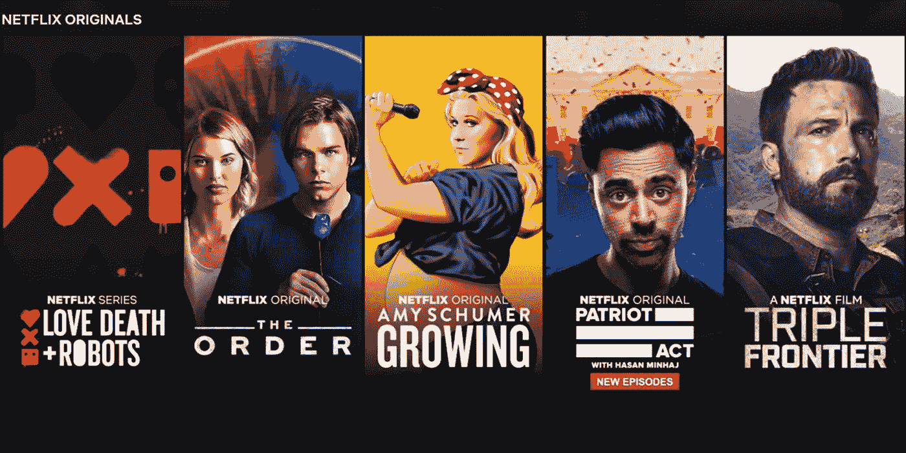
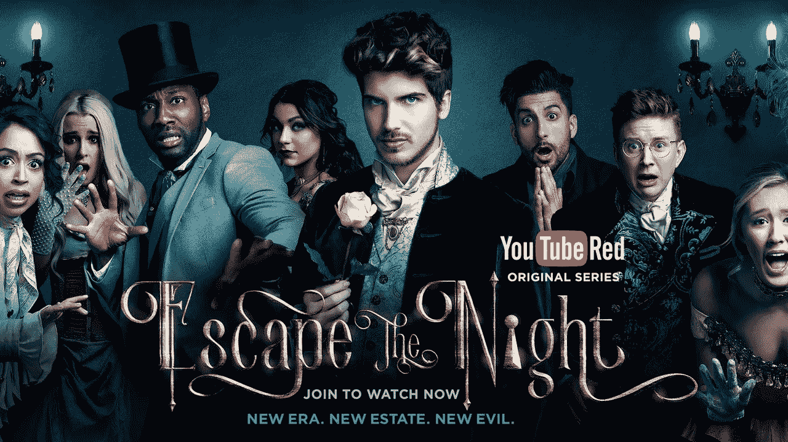

# YouTube Premium 失败的原因

> 原文：<https://medium.com/swlh/why-youtube-premium-fails-66b6ef2fcd51>

现在是 2019 年，似乎每个人和他们的母亲都在试图进入基于订阅的流媒体市场。目前的主要玩家，网飞、Hulu 和 HBO，正准备面对来自迪士尼、ABC、亚马逊、苹果和其他公司的新产品的冲击。然而，有一家公司似乎准备轻松进入基于订阅的流媒体领域，但几年来一直尝试失败:YouTube。

YouTube 优质服务的第一次迭代于 2015 年以 YouTube Red 首次亮相。从那以后，它经历了一次更名，在 2018 年简单地更名为 YouTube Premium(简称 YTP)。2016 年底，它仅积累了 150 万用户(目前的用户水平未知。)

相比之下，网飞的用户从 2016 年底的约 8000 万增长到 2018 年底的超过 1.2 亿。这个市场显然增长迅速，但 YTP 仍是一个小角色。那么，YTP 错在哪里呢？为什么它没能将 YouTube 每月 15 亿活跃用户的巨大缓存转化为完全付费的每月用户？

# **YouTube 的价值主张**

如果有一家公司彻底改变了人类消费视频内容的方式，那就是 YouTube。它成立于 2005 年，最初是一个亲密的视频分享网站，用户可以在那里为他们的朋友和家人发布非结构化内容。14 年后，YouTube 凭借自身实力成为娱乐行业的一个巨大分支，每年为母公司谷歌带来数十亿美元的广告收入。成为 YouTube 名人已经成为一种全职职业，任何人只要有视频创作工具、有个性，再加上一点运气，都可以积累一个专门的观众群。

YouTube 之所以如此具有革命性，是因为它使视频内容的传播民主化:创作者免费发布，观众免费观看。在早期，网络效应迅速巩固了 YouTube 作为内容数量和质量第一平台的统治地位。第一批著名的 YouTubers 用户，如尼加西加、弗雷德和谢恩·道森，用一种广泛吸引人的类型建立了他们的观众群:喜剧。但随着 YouTube 观众的增加，大多数小众类型和主题的创作者发现，即使是他们也能找到渴望消费他们内容的观众。

YouTube 对观众的价值主张过去是，现在也将继续是，在一个复杂的算法的帮助下，免费获得大量各种主题、不同格式和长度的数百万小时的视频，该算法会根据观众的口味推荐无穷无尽的新视频。

如果你认为 YTP 可能不符合这一价值主张，你是对的。但首先，让我们简单看看最初的基于订阅的流媒体服务:网飞。

# **网飞:旋转适应**

在早期，网飞是一个类似于 Blockbuster 的仅提供邮件的 CD 租赁服务，允许用户轻松访问第三方内容的多样化图书馆。这种传播娱乐的方式在当时已经相当创新了；网飞通过避开实体店来削减成本，客户喜欢将租赁物直接送到他们邮箱的便利。然后，网飞采取行动，将其内容作为流媒体服务放到网上，正确地预测到互联网将是其娱乐资产的超高效和便捷的分销渠道。

一旦转向完全在线内容消费的支点完成，邮件服务停止，网飞就建立了一个流媒体帝国……从其他人的东西上。他们做出的第二个正确预测是预见到创造原创内容以生存的需求。在网飞原创公司创立之前，它们受到第三方内容提供商的支配，这些提供商可以随时撤掉它们的内容，或者向它们勒索高得离谱的许可费。此外，网飞原创是一个让观众着迷于新的和令人兴奋的内容的绝妙方法，这将在用户用尽旧材料后证明每月费用的合理性。

因此，网飞目前的价值主张是这样的:每月支付少量费用，就可以无广告、无限制地离线访问各种优质长篇内容，其中一些是我们平台独有的。与家人和朋友分享你的计划，尽情狂欢。

这两个转变，一个是分销方式的转变，一个是垂直整合的转变，最终形成了一个极其有效的商业模式的基础，使网飞保持了巨大的增长。难怪其他人都争相复制它们，而且随着传统娱乐公司将其内容独家提供给自己的平台，网飞是否能从其图书馆中失去第三方内容仍有待观察。那么，为什么 YTP 会失败，而网飞会繁荣？

# **YouTube Premium:夹在中间**

在比较 YouTube 和网飞的价值主张时，我们看到了一些非常明显的相似之处。两家公司都声称提供广泛的内容访问，并且都利用互联网的力量进行高效便捷的分发。但除此之外，它们从根本上服务于不同的目的。网飞是一项迎合高端品味的高端服务:提供的内容通常都不是免费的。另一方面，YouTube 是一个大众化的平台，创作者和观众都可以自由访问。它的大部分内容是由拥有电话和互联网接入的人创作的，与网飞的制作同行相比，即使是更成熟的创作者也只有最少的资源和培训。同样，UX 也不那么昂贵，广告在货币化视频的开头、中间和结尾播放。

通过 YTP，YouTube 试图侵占网飞的高端市场。从 YTP 的网站上，我推断 YTP 的价值主张是提供优质版的 YouTube 体验，没有广告，可以访问独家内容(包括音乐)，以及离线视频等其他 UX 的小改进。理论上，YTP 的用户将受益于更干净的 YouTube 体验，享受酷炫的新节目和音乐。

但正是在试图两全其美的过程中，YTP 未能产生影响。我们最容易从它平淡无奇的内容主张中看到这一点，这表现在几个方面。

1.  **小众创作者**

首先，为了利用其流行频道的现有用户基础，他们要求这些频道的人物来创建他们新服务的一些首批内容。然而，这些内容最终并不引人注目，原因有两个:第一，这些创作者太小众，即使他们有数百万订户；第二，他们没有创建高质量、优质流媒体内容的背景或资源。

我想起了像乔伊·格赛弗的《逃离黑夜》(Escape the Night)这样的节目，它被作为 YTP 的旗舰内容大力推销给我。看了第一集，我可以自信地说，制作和写作质量只是比不上橙色是新的黑色。此外，该系列显然依赖于小众明星的力量作为其巨大的吸引力，主演是 YouTube 社区“滑稽视频博客”的名人录。结合一个基本的神秘谋杀情节，它没有像《纸牌屋》那样的高阴谋政治剧的广泛吸引力。

**2。缺乏宣传和文化认同**

第二，他们没有一个有效的策略来为他们的内容产生与网飞原创内容同样的轰动和认同。虽然有人可能会认为这是一次营销失败，但我会指出网飞的起步位置，这是它成功利用独家内容为高价辩护的原因。

网飞所要做的就是从数百万现有订户中说服一些好奇的订户给这些原创作品一个机会。一旦他们迷上了，嗡嗡声开始建立，原件被视为告诉他们的朋友获得网飞订阅的额外理由，因为哦，我的上帝，我们需要谈论新一季。这种病毒式的嗡嗡声让用户对他们的订阅和它提供的酷内容更感兴趣，也让新用户更容易招募，因为这种嗡嗡声证明了高价的合理性。如今，在用广受好评的产品多次证明自己之后，独家内容已经变得和第三方内容一样有吸引力，如果不是更大的话。

与此同时，YTP 从一个更困难的位置开始，说服免费用户成为付费用户。不仅质量标准高得多，现有用户的缺乏也让它更难产生轰动效应。发布免费剧集并不奏效，因为一旦付费墙建立，用户就会意识到他们支付 12 美元只是为了结束这一季——为什么不直接点击另一个免费视频，右边有一整列免费视频！没有文化上的认同，也没有可以完全证明 YTP 价格合理的病毒式宣传。此外，YTP 缺乏网飞在现有优质第三方内容方面的基础，这就像网飞提供免费访问其第三方内容，然后试图以高价引入原创内容。

事实上，由于与 YouTube 的免费视频的内在联系，我认为让他们的内容获得优质地位的努力几乎是不可能的。这是因为 YTP 包含着与其母服务的根本矛盾。YouTube 被设计成容易消费，预算有趣。人们来到 YouTube 不是为了艾美奖级别的表演，而是为了轻松的笑声或快速消化的信息或他们最喜欢的相关创作者的作品。YouTube 从根本上来说不是优质的，试图创建一个优质的子品牌会导致混乱的品牌信息，最终导致用户不愿为订阅付费。

# **干净利落的离婚**

那么，YouTube 如何利用其庞大的用户群，以一种对其价值主张真正有意义的方式提供优质流媒体服务呢？我想重新定义这个问题，并从谷歌的角度来看待它。它最大的竞争对手正在争夺可能取代电视的相关性。他们如何利用现有的基础设施和 YouTube 的市场渗透率来创建一个可持续的、优质的、基于订阅的流媒体平台？

我认为，YTP 品牌需要再次重启，但这一次，作为一项独立的流媒体服务，远离 YouTube 的支持。这可能会成为一个全新的品牌，拥有自己时髦的名字，或者与谷歌 Play 商店整合，类似于亚马逊推出流媒体服务，作为亚马逊 Prime 的一部分。这让新服务摆脱了迎合 YouTube 利益的义务，在 YouTube 这个平台上，优质内容无法以真正吸引各类用户的方式存在。

幸运的是，他们仍然可以吸收 YouTube 的所有优秀部分，包括如何建立一个干净的 UX 流媒体的专业知识，以及可以轻松用于新平台的现有技术基础设施。剩下的是创造或授权足够多的高质量内容，这些内容具有广泛的吸引力，甚至开始证明价格是合理的——尽管如果有任何公司有资源这样做，那将是谷歌。