# 2019 年会见证“SEO 内容”的死亡吗？

> 原文：<https://medium.com/swlh/will-2019-see-the-death-of-seo-content-3e882d62da16>

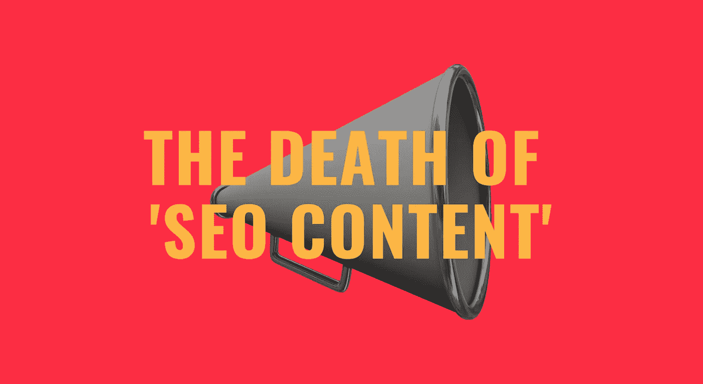

## 真的，真的应该。

让我们玩一个游戏。

哦，这不是一个特别有趣的游戏——当然没有饥饿的河马——但它仍然是一个游戏。

以下是英国三家主要贷款机构各自“信用卡”页面的介绍性段落:哈利法克斯银行、特易购银行和巴克莱银行。

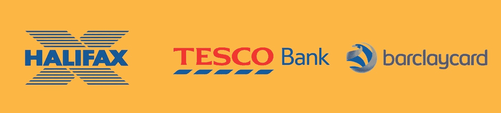

看看你能不能猜出哪一部分“SEO 内容”属于哪一部分。

# 内容示例 1:

信用卡

信用卡可以是一种灵活的借钱方式。有了正确的信用卡，你可以控制你的财务，分散你现在想买的东西的费用，或者在你的日常消费中获得回报。你通常会被收取借款利息，除非你每个月都结清余额或者提供无息贷款。

# 内容示例 2:

信用卡。

比较我们各种各样的信用卡产品、交易和优惠，无论您是在寻找一张用于日常购物、进行余额转账的信用卡，还是一张简单易用的信用卡。您可以使用下表来查看是否有适合您的卡。

# 内容示例 3:

**信用卡**

比较我们的信用卡系列

寻找一张适合你需要的信用卡？无论您是想转移余额，获得帮助建立您的信用评分，还是分摊大宗采购的成本，您都可以在这里找到满足您需求的卡。

1.  巴克莱银行
2.  哈利法克斯
3.  特易购银行

好玩吧。

还和我在一起吗？

这当然是一场艰难的比赛，这正是我的观点。

这些都是拥有可观营销预算的大公司。很可能他们每个人都认为他们的信用卡页面对实现他们的商业目标非常重要。

我们被告知，在广告中，重点是脱颖而出；拥有美国药典；当竞争对手画一个“O”时，画一个“X”；他们走的时候也走。

然而，在这里我们看到三个竞争者都在说同样令人费解的幼儿语言。

我们对这家公司及其产品一无所知，甚至不知道为什么我们应该继续阅读。

现在，想象一下这些答案是由一个数字助理读出的。下图中的内容来自于对[我是否应该获得一张巴克莱信用卡]的真实查询。

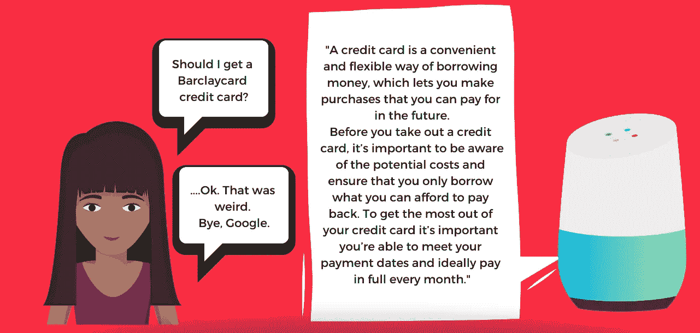

没有品牌声音，没有文学天赋，没有激情。

为什么这么平庸，这么没意义，这么… SEO？

# 将 SEO 内容归咎于 SEO

有一个独特的风格，表示“搜索引擎优化内容”。

当一家公司把对页面内容的责任交给他们的搜索引擎优化专家，条件是后者也是内容营销专家时，这个令人沮丧的短语就出现了。

该公司将密切关注所有营销资产，以确保它们符合品牌，但这些内容将被区别对待。

其目的是通过搜索引擎帮助页面对盈利关键词进行排名；任何对用户体验的负面影响都会被 SEO 流量的增加所抵消。

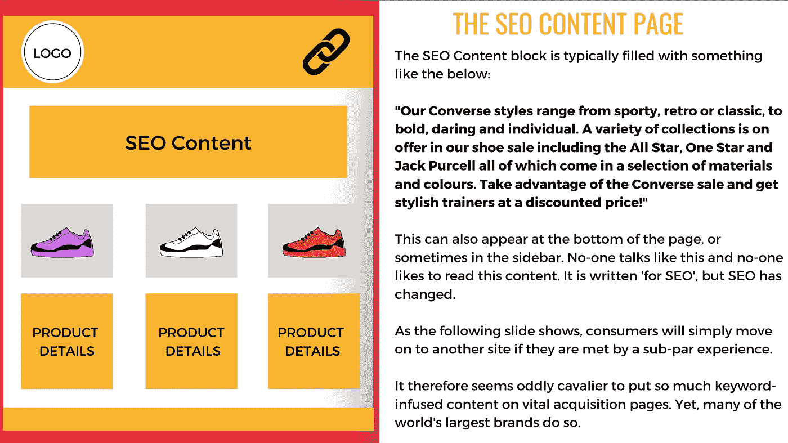

The structure of an ‘SEO content’ landing page

输出是单一的，由块中排列的关键字组成，由陈词滥调串在一起。

> 毫无疑问，用这么多关键词说这么少是有诀窍的。

“根据你的需求选择最好的信用卡”，他们说，努力寻找“正确的”关键词密度。在网上找到最适合你的信用卡。

品牌接受低于标准的内容是基于这样的理解，即 SEO 知道如何与 Google 沟通。据推测，谷歌只对每月搜索量超过 1000 次的普通重复查询做出回应。

> 人们关注的是说了什么——以及重复了多少次——而不是*怎么说的。*

我们已经看到了像“[潜在语义索引](https://www.searchenginejournal.com/latent-semantic-indexing-wont-help-seo/240705/)”这样的废话，给只不过是一种不合时宜的策略增加了伪科学的光泽，这种策略本应随着目录列表而消亡。

大概是时候 SEO 赶上其他营销学科了。

# 到了搜索引擎优化阶段，品牌不应该停止

> “每一个广告都应该被认为是对品牌形象的贡献。”—大卫·奥格威

我们都知道 GEICO 壁虎。

如果你不认识他，他是一只壁虎，他出现在美国所有 GEICO 的广告上。出于某种特定原因，他有英国口音。

下面，我们看到他开始各种恶作剧，吃布法罗鸡翅，喝一杯泥，变成一个毛绒玩具。

他也有足够的空间发展自己的产品系列；保险公司是美国最大的广告支出者。

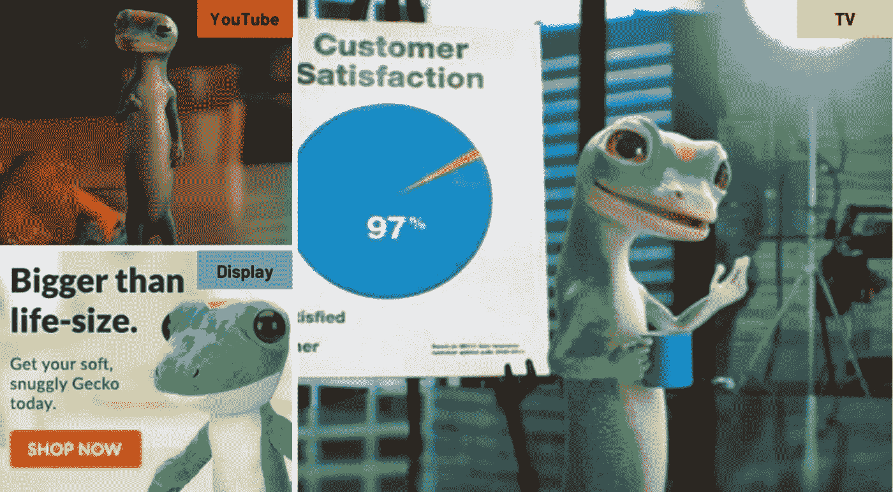

在 GEICO 的主页上，他那苍翠的面容正等待着我们:

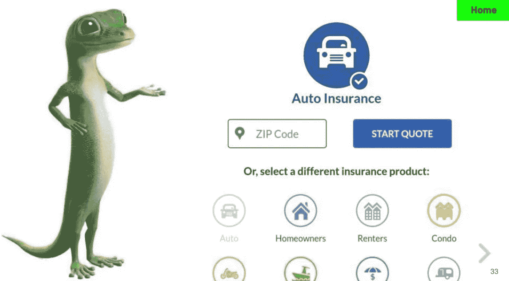

然后，点击链接进入汽车保险页面，你会看到更多可怕的“搜索引擎优化内容”。

试着阅读下面的内容:

有人在讨论人工智能是否能从人那里接管内容创作。

我欢迎我们的新机器人霸主——他们写得不能再差了。

我也知道它是怎么发生的:

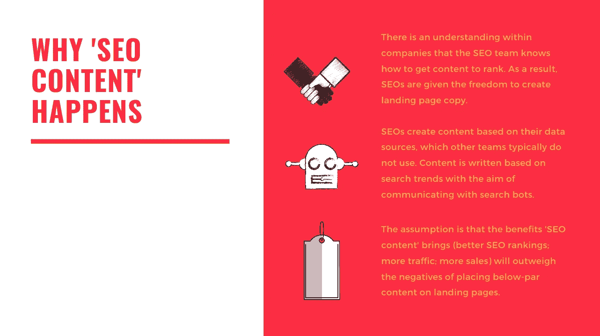

# “搜索引擎优化内容”不适合今天的目的

搜索领域已经发生了变化，受众行为也发生了变化。

尽管用户输入、说出和点击哪些查询一直不明确，但我们至少知道查询的种类已经增加了。

来自 Ahrefs 的研究(下图)显示，92%的查询每月搜索量为 10 或更低。

> 在他们的研究数据集中的 19 亿次查询中，只有 0.01%的每月搜索量超过 1 万次。

对于每个品牌和每个行业来说，这种模式都在发挥作用。例如，对于一家金融公司来说，会有大量的[信用卡]搜索量，但也会有数以千计的重要变化。

搜索不再是坐在台式电脑前，输入简短的查询，如[购买运动鞋]或[汽车保险]。

这意味着我们需要新的内容来迎合更复杂的需求状态。

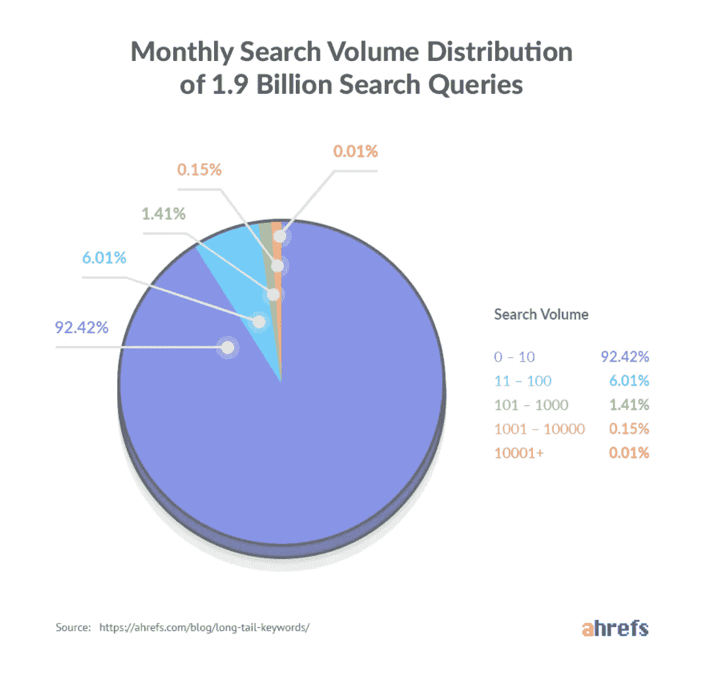

Source: Ahrefs data

当然，有些人会反驳说，仍然值得瞄准高容量的头部术语，因为它们的收益将超过网站从数百个长尾查询中获得的流量。

如果搜索引擎仍然以这种方式工作，这将是可以接受的逻辑。

谷歌的自然语言处理技术足够智能，可以理解我们语言的细微差别，自蜂鸟算法推出以来，它已经取得了重大进展。为了排名，内容不需要包含相同的关键字来匹配查询。

此外，搜索是一种越来越视觉化的体验。这在一定程度上是对新的消费者旅程的回应，年轻人倾向于通过社交媒体找到他们的信息:

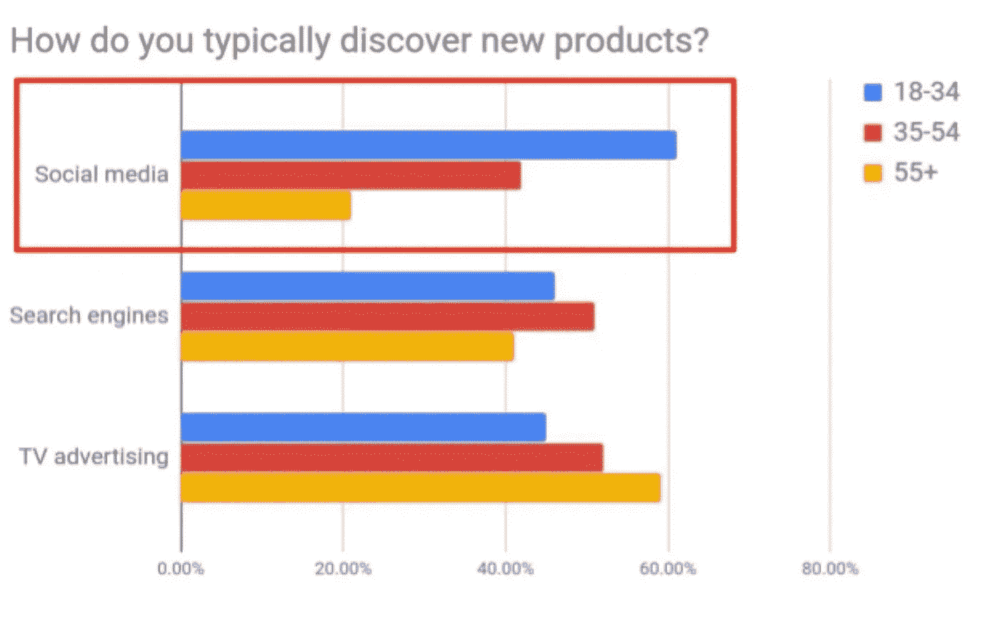

Source: *The Era of Ecommerce, ClickZ/Catalyst*

作为回应，谷歌发布了一系列关于视觉特征的公告，这些视觉特征将很快装饰其搜索结果。

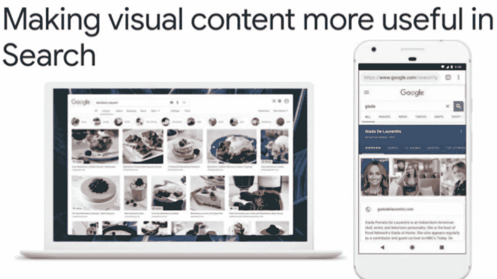

Google’s new visual search experience

亚马逊和 Pinterest 都不遗余力地鼓励“搜索栏之外的发现”。

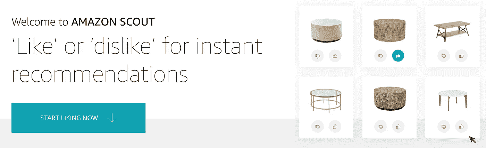

Amazon Scout

与此同时，搜索引擎优化机构正在推出大量生产的登陆页面，充斥着充满关键词的标题标签、描述和介绍段落。

这是来自英国[信用卡]的谷歌 SERP:

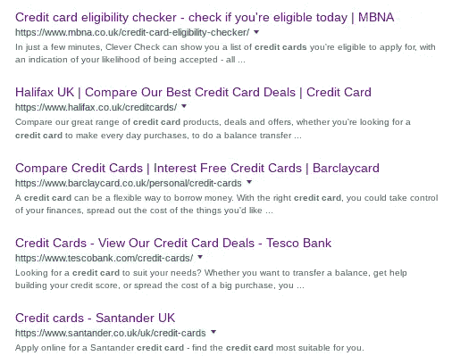

‘Credit cards’ search results

它很快就会变得非常不同，这种单调的内容将被展示出来:试图迫使谷歌将品牌放在最重要的第一页，而不是为客户提供价值。

如果排名的唯一方法是准确地说出竞争对手所说的话，那么这值得吗？

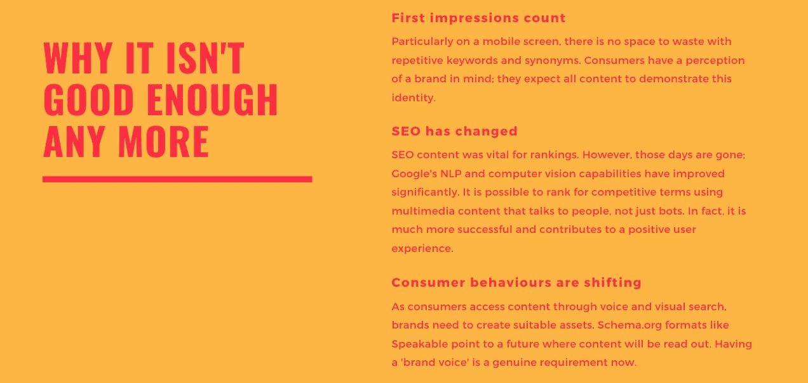

# 前进的道路

SEO 造成了这种情况，它也可以非常有利地清除这种情况。

搜索引擎结果页面比以往任何时候都更具竞争力。空间非常珍贵，消费者也不耐烦了。

SEO 知道如何登上首页，但他们并不总是从事创造高质量内容的行业。

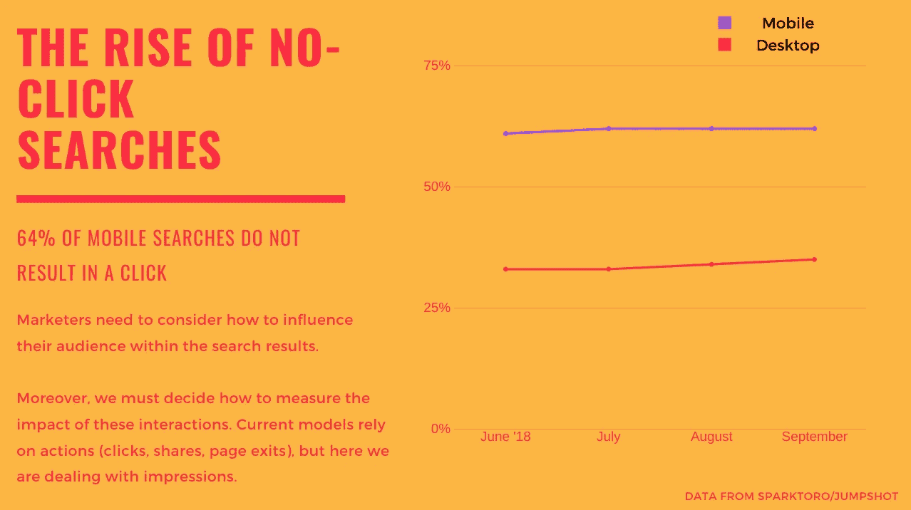

今天，SEO 与品牌直接联系在一起，也许它曾经是关于获取其他地方产生的需求。

82%的人会点击一个搜索结果，因为他们知道这家公司。这意味着 SERPs 现在是重要的品牌空间，包含文本、图像、视频，在不久的将来，还包括音频。

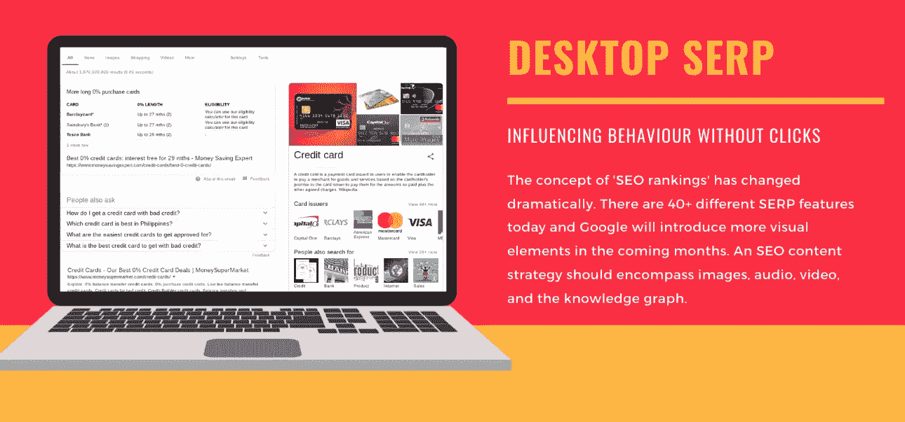

这些结果由品牌的内容资产提供，通常来自他们的网站，但也来自他们的应用程序和知识图表中包含的任何实体。

人力资源软件公司 [Teambit](https://teambit.io/) 提供了一个很好的例子，展示了如何以一种简单而有说服力的方式来实现这一点。

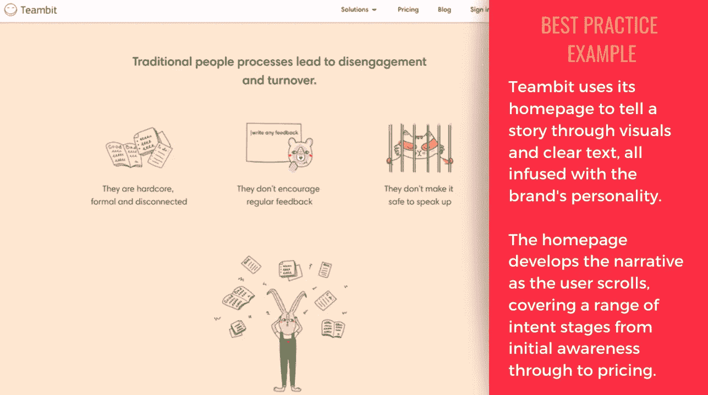

主页包含许多可以通过搜索提供的内容资产，包括文本、图像和评论。文本展示了公司的个性，而不是关注关键词的数量。这种改进的用户体验也将至少间接地有益于 SEO。

所有了解技术如何实现与消费者新互动的品牌都有机会。

这种洞察力可以形成一种更具冒险性、更成功的战略，让品牌在搜索引擎的推动下，与目标受众展开对话。

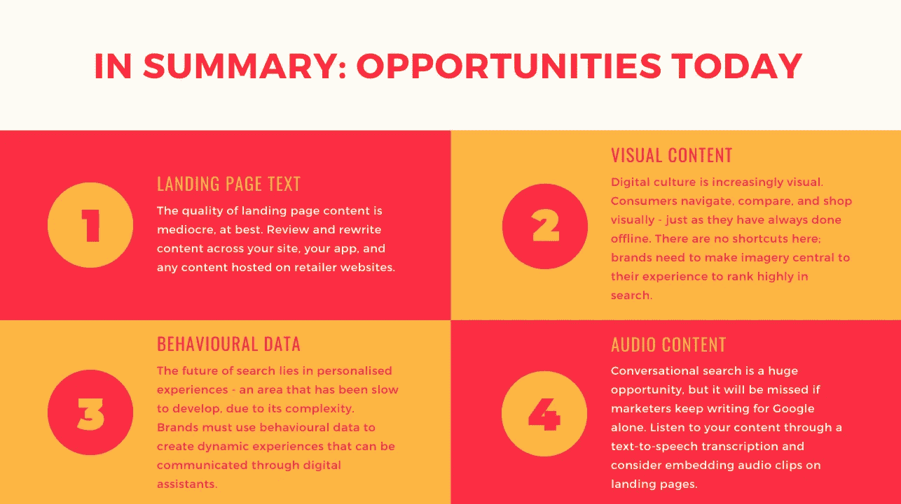

*想要更多？完整演示如下。*

## 这篇文章发表在[《创业](https://medium.com/swlh)》上，这是 Medium 最大的创业刊物，有+409714 人关注。

## 订阅接收[我们的头条新闻](http://growthsupply.com/the-startup-newsletter/)。

