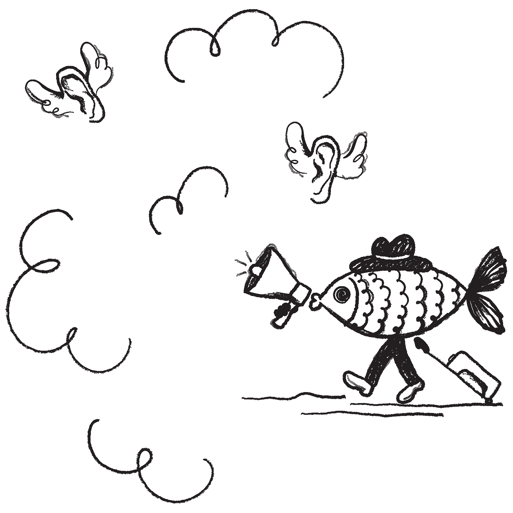
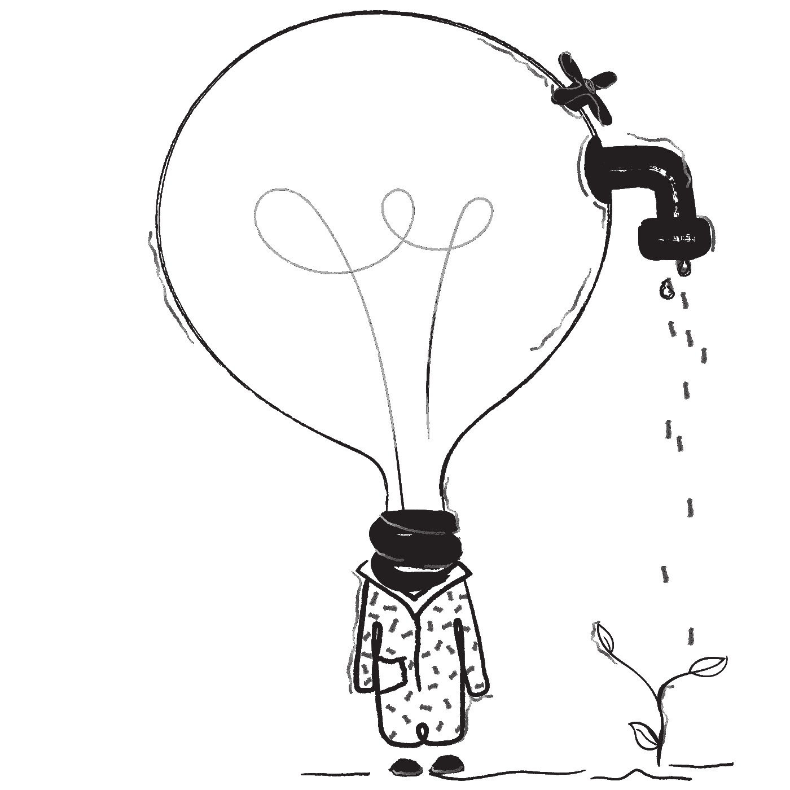

# 你害怕人工智能扼杀你的销售工作吗？如何利用它来提升你的销售价值

> 原文：<https://medium.com/swlh/will-machine-kill-your-job-or-will-give-back-the-power-to-you-as-an-individual-4a551a87e5d3>

> “我们的智力是我们成为人类的原因，而人工智能是这种素质的延伸。”——脸书大学首席人工智能科学家 Yann LeCun

Product hunt 上周投票最多的产品是一个生成机器生成人脸的页面[https://thispersondoesnotexist.com/](https://thispersondoesnotexist.com/)。它们如此真实，看着它们既有趣又恐怖。他们眼神传递的人性让你不寒而栗。PH 社区迅速两极分化，支持者设想酷的用途，悲观者警告潜在的滥用。在过去的几天里，我已经看到了基于它的设计师服务。
这个自动创建的照片服务不仅是对时装模特找工作的一个警告，也是一个吸引和潜移默化社会的科技趋势的标志。
畅销书作家尤瓦尔·赫拉利在《德乌斯人》中谈及算法如何比我们自己更了解我们时走得更远。

我们现在几乎正在检查我们的社交活动——我们喜欢和分享的东西。然而，一旦他们直接访问我们所有的在线和离线数据，以及我们体内的传感器和我们周围的设备，该算法将能够预测什么对我们更好。所以我们会在他们中间传递越来越多的信息，并在更多的任务中交出每次的决定权。这将意味着我们社会的许多变化，包括公司销售产品的方式，使一些职业过时。尤瓦尔继续阐述民主的含义，甚至谈到一个可能取代智人的新种族，但我们将开始分析对专业人士的影响。

与产品搜索社区类似，对未来的恐惧或寻找机会分裂了我们大多数人——包括高科技专业人士。
所有行业的数字化转型为人工智能的崛起铺平了道路。但是销售世界已经受到了另一种结构性力量的冲击，那就是互联网。销售专业人士和其他人一样担心人类灭绝，但由于销售中重要的是销售数字，他们更担心人工智能对销售方式的影响，以及他们工作的未来。正如在每一次转型中一样，重要的是谁能够适应以及如何发展，以便在新的环境中不仅生存下来，而且取得成功。我们将分析三种情景，帮助销售人员不仅保住他们的工作，还提升他们在业务价值链中的角色。

**AI:谁用谁取值**

我们都知道，当我们获得产品推荐、个性化新闻、交通堵塞警报和许多其他有用的服务时，我们不仅从中受益，平台也获得了更多、更好的数据，因此每次都更有价值。只要提供一定的最低限度的隐私，这对我们大多数人来说是可以的。我们大多数人认为不公平的是，我们数据的所有权不属于我们，而是平台专有的。此外，他们的兴趣往往与用户不一致(又名广告)。
政府正在审查他们对个人数据的使用，使得提供这种服务变得不那么有吸引力。谷歌最近宣布将关闭个人 G+,主要是因为数据隐私问题。(天哪，你会拿 3 亿用户怎么办)
企业变得更加困难。有了 GDPR，他们就不能拥有数据，更不用说使用它了。
*对我来说，个人掌握着开启数据不可否认价值的钥匙。*
重点是让每个人成为数据的拥有者以及潜在的用途和好处。以应用程序、实用程序和个人助理的形式，帮助我们每个人处理身边的海量信息。跨越孤立服务和平台的桥梁。
为了我们自己的利益，在我们的控制、隐私和任何其他要求的保证下。

知道我们应该在活动中遇见谁是有用的吗？当然，也要安排查看每个人日程的最佳时机。为什么不使用亚马逊风格的建议来满足我们的专业需求，比如找出你的网络中谁可以帮助你解决当前的问题。从销售的角度考虑，为什么不反过来使用它——找到我能帮助的人。

这些问题让销售人员的未来看起来令人怀疑。

那么，为什么需要销售人员呢？过去，销售人员几乎是“收银员”——产品信息的守护者——任何对产品感兴趣的顾客都不得不经过。

现在，客户喜欢按照自己的节奏进行初步调查——大多数消息来源认为，在与销售代表进行任何互动之前，60%至 80%的买家旅程都是由他们自己完成的。

一个能够理解自然语言的智能聊天机器人(例如[对讲机](https://www.intercom.com/))能够访问商业知识库，将更适合于帮助自助服务的客户。

**这类功能很可能会被机器取代，但如何吸引新客户呢？企业使用营销自动化这样的系统已经有一段时间了。幸运的是，销售并不是产生需求的最终解决方案，甚至差得远。即使是最复杂的集客营销系统也需要访问者留下他们的电子邮件。不到 2%的受访者会这样做。**

此外，并不是所有的潜在客户都会拜访你，尤其是在 B2B 领域。来访的都不是真正有潜力的人。要获得这些，你需要使用目标销售——对外销售。
销售的外向部分在人工智能到来之前很久就已经陷入危机。电话推销是一项非常不愉快的工作，无论是对销售还是对被打断的客户。此外，它的效率非常低——98%的高管从不回复陌生来电或陌生邮件。
这种情况不是机器对人的问题。两者在陌生来电的情况下都会表现不佳。

> 冷打电话的问题不在于打电话，而在于冷。

然而，有两个关键的改进，机器可以帮助人类戏剧性地改变游戏；

扩大范围，提高质量。所以更多更好。让我们看看是如何运作的

**增强销售人员的外骨骼**

泰勒为个人客户所做的推销的激光质量和通过广播实现的大众传播之间的传统权衡即将改变。
首先-快速笔记-广播每天的工作越来越少(广告盲和饱和)
社交和专业网络的大规模采用为媒体创造了临界质量，使其成为大规模的个人工具。
社交是个人。广告——即使是社交更新(赞助)、推文或电子邮件的形式，也只能做到这一步。
*正是一个人的真实性赋予了同行推荐的价值。*

因此社交成为最有影响力的渠道。
有一个空间，人的价值在任何机器之上。人工智能启用与否。
然而，孤独的人也迷失在社会渠道的混乱和饱和中。从生理上来说，站在永无止境的社交网络顶端是不可能的。仅仅追随几个关键客户往往是徒劳的，以至于销售人员忽视了它作为一种销售工具。但是机器来拯救有限的人类了。让我们看看他们如何扩展我们在 3 个关键领域的能力，就像外骨骼为工厂工人或士兵所做的那样(无论你更喜欢什么样的形象)

**1。打造你的专业品牌和受众**

现代销售并不是通过向人们发送垃圾邮件来创造商机。此外，在高尔夫球场或午餐时销售的传统关系建立客户经理也大多出局了。并不是说关系不重要。然而，买家现在试图回答他们研究后提出的问题。这需要一个单一来源无法提供的专业化。“相信我所有人”是行不通的。你必须被视为你所销售的每一个问题/好处的主题专家。下一代销售人员精通社交，建立个人品牌，并使用一系列 mark 技术工具来帮助他们。
销售人员不需要为他们销售的每一种产品写书。
但是他们必须对产品如何帮助他们的顾客做生意(或生活)有自己的看法。分享一下。
不分享等于不存在于社交 feed 中。将这些见解转化为数字世界的关键。
建立品牌的一个重要因素是规律性。大多数人——尤其是忙碌的销售人员——倾向于在高峰时期使用社交媒体，然后是长时间的沉默。一些工具可以帮助我们变得更有规律——例如，为我们的领域主题寻找和[安排内容](http://quuu.co),你可以添加你的个人风格或者评论它们或者创建[特定主题页面](https://home.passle.net/)或者[时事通讯](https://www.vestorly.com/)
想法是分享你自己独特的观点，而不是来自公司网站的官方版本。
**我们要去哪里？**
你已经可以追踪你的内容如何帮助你的目标——访问量&转化。下一步是使它个性化，与你的每个目标潜在客户分享一些他们感兴趣的独特设计。这种跟踪还将为销售人员提供关键的洞察力，以确定谁准备好接听电话——一劳永逸。
然而，就在跳到庆典之前，一个问题；我们如何“知道”潜在客户的兴趣是什么？

**2。发现谁对你卖的东西感兴趣**

过去，销售人员一直在根据过于简单的标准挑选潜在客户名单；公司规模甚至收入都不能很好地反映特定产品的实际需求。这是所有可用的，所以这就是为什么潜在客户电话(冷电话)诞生。现在互联网上充斥着各种各样的数据，其中许多数据可以代表人们对我们的产品感兴趣的可能性；[从他们正在使用的技术](https://www.datanyze.com)和工具，到负责购买的人的丰富资料，甚至他们关心的东西(例如 [Sidetrade](https://www.sidetrade.com/) )。你可以看到他们分享或喜欢的东西——尽管被认为是多余的——可能是兴趣的代表，因此是区分优先顺序的好方法。有了所有这些，你可以对谁是客户有一个很好的了解。问题不是访问数据，而是以一种时间有效的方式处理数据。
人类不可能站在社交媒体的顶端(双关语)。即使只是追随一个狭窄的客户群体，在商业上也是低效的。人们分享各种各样的东西。那么换一种方式做呢？当有人谈论与你相关的事情时，请保持警惕。你的人工智能助手可以全天候监控你所有的关系和潜在客户，让你能够及时、高效、有针对性地做出反应。然而，即使你知道谁对你卖的东西有偏好或兴趣，工作也没有完成；你得想办法联系上。在我们生活的这个充满噪音的世界里，每天都有更多的挑战，那么人工智能有什么帮助吗？

**3。扩大的个人互动**

恋爱很难。它们需要时间来维护，并且不容易创建。它们需要我们个人的关注，以迎合每个连接的个性。人工智能可以帮助我们专注，而不是取代我们。不是为了接触更多的人，而是以更好的方式。当然，你可以用它来群发信息或者用基本的自动应答器来聚集追随者。这就像用你的 iPhone 敲碎坚果一样——是的，你可能从中获得了一些东西，但你错过了工具的要点。
我们的想法是将我们之前讨论过的所有元素结合起来，打造独特的互动方式，保持个性化水平，就像你在做这项工作一样。
目前的技术水平仅限于一些基本水平，你可以通过互动和定制的信息来监控活动，以保持关系。
通过 [www.sequences.me](http://www.sequences.me) 你可以创建一个序列，对你的目标分享的内容进行评论或点赞，然后在 Twitter 上关注他们或在 Linkedin 上联系他们，然后等到他们谈论特定的话题(你定义的)时再发送相关消息。当然，你可以为每一个与你相关的话题定义模板。这些模板可以自动调整，以显示收件人变量，如姓名、职位、公司甚至他们分享的帖子。这为每个人创造了真正独一无二的交往机会，但其规模也与现代专业人脉和潜在客户的规模相当。
现在甚至可以分析收件人的个性(根据他们的写作方式和分享内容),因此模板也可以根据每个连接的风格进行微调。

天空是极限吗？
这个系统能够——也将会——进化去学习什么最有效。它将跟踪人们对你的信息和你分享的内容的反应。他们会阅读它吗？一段时间后，他们会转化并成为顾客吗？这将稍微修改算法信号并改进下一个建议。
一些公司(如 insidesales.com、Salesforce.com)已经在研究客户基准，分析“所有”数据来预测谁更有可能成为客户。这听起来像汤姆·克鲁斯的《少数派报告》中的“犯罪前”情节；他们会在顾客了解自己之前发现顾客。
“所有”数据的问题在于，大部分数据分散在孤立的平台和站点上。然而，你可以将你的个人助理连接到任何你与网络互动的服务和平台上；像 Medium、Quora 或特定论坛和社区这样的网站。你的助手可以提醒你，或者它可以自己进行第一次互动。
既然智能聊天机器人已经被证明可以与人类聊天相媲美，那么这些系统是否可以更进一步，不仅促进机会的开启，也促进机会的结束？

人工智能系统能完成销售吗？

我们一直在谈论帮助人类进行优先排序的助手，那么为什么不完全取代他们呢？。
如前所述，许多客户服务角色、一次性交易或销售都是如此，目的是将产品与客户群相匹配。然而，B2B 是一种复杂的销售。任何参与企业交易的人现在都知道，大部分时间都是为了协调议程。人类是政治动物，仅仅依靠“规格”注定会失败。销售就是帮助客户找出什么是最好的。所以这是——或者应该是——一件创造性的作品。这就是销售人员应该关注的地方——分享他们在其他情况下积累的经验价值。

**那么，这个财年做什么呢？**

在 Alexa、Siri 或 Google assistant 管理你的客户业务之前，销售专业人士会一直在你身边。所以最好的办法就是提升自己。我们已经看到，机器能够并且将会做得更好，而不是人类做低级工作。但这也不是关于机器人自动化接管所有客户关系并解雇你的销售部门。
几乎每天都有新工具出现，旨在完成某项工作。与其只是等着看什么是“公司批准”,不如亲自去尝试一下。看看哪些对你有用，改进一下，分享一下。还有许多像你一样的人，希望改善
我将在本页和 [www.getsalesdone.coach](http://www.getsalesdone.coach) 上写一些工具，帮助个人生产力和流程为初创公司或新项目带来增长。人类成功的关键在于转变。我们适应新情况并使用或创造工具来实现这一目标的能力。技术发展意味着挑战，但也将带来机遇。对于销售人员来说，他们有机会在业务拓展中重新扮演核心角色。让我们成为有价值的专业人士。处理人际关系的创造力。

> 总结一位成长黑客的名言
> 自动化扩展范围，人性化建立关系

插图由[https://absurd.design/](https://absurd.design/)