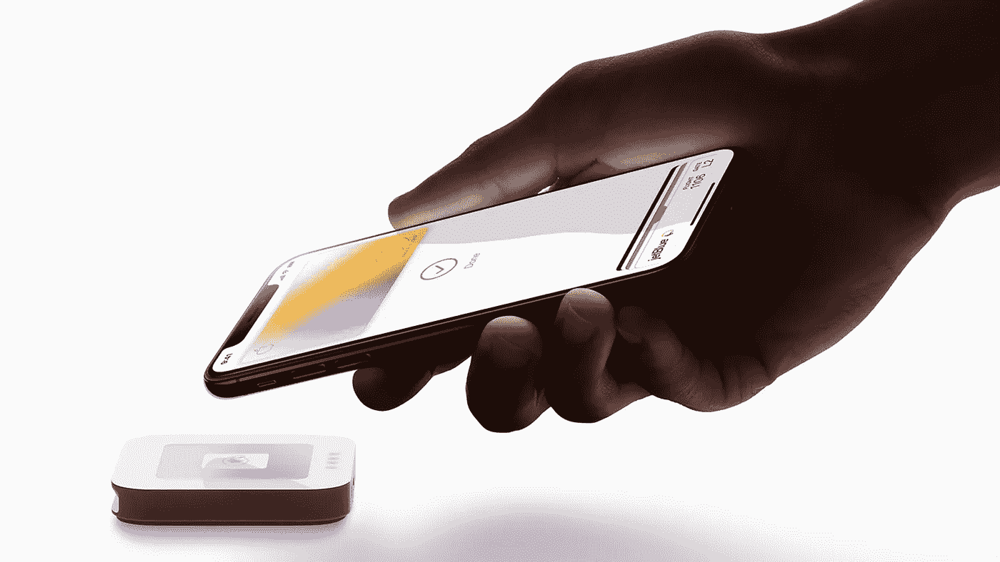

# 你口袋里的现金以后还会存在吗？

> 原文：<https://medium.com/swlh/will-the-cash-in-your-pocket-exist-in-the-future-8f1aebfa3db8>

## 我们花钱的方式正在改变。使用硬货币的人比以往任何时候都少，每天都有更多的交易以数字化方式进行。这是否意味着金钱的终结？

Does the new Apple Card contactless payment system finally mean cash is dead? | Photography Apple

往来账户并不“酷”。人们不会兴奋地在一家 Natwest 分行外等待…