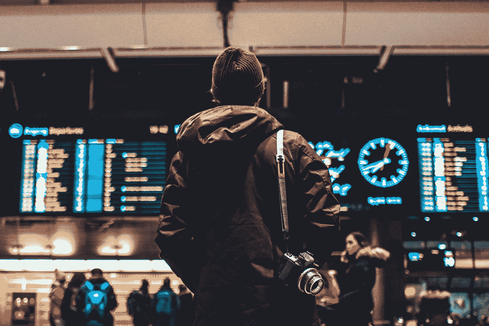

# 机场引入面部识别会妨碍我们的自由吗？

> 原文：<https://medium.com/swlh/will-the-introduction-of-facial-recognition-in-airports-impede-our-freedom-77171293f534>

## 用我们的自由换取便利

Photo by [Erik Odiin](https://unsplash.com/@odiin?utm_source=unsplash&utm_medium=referral&utm_content=creditCopyText) on [Unsplash](https://unsplash.com/search/photos/airport?utm_source=unsplash&utm_medium=referral&utm_content=creditCopyText)

想象一下，你不用向任何人出示护照就能走过机场。离开一个国家就不再有支票，进入一个国家就不再有支票。