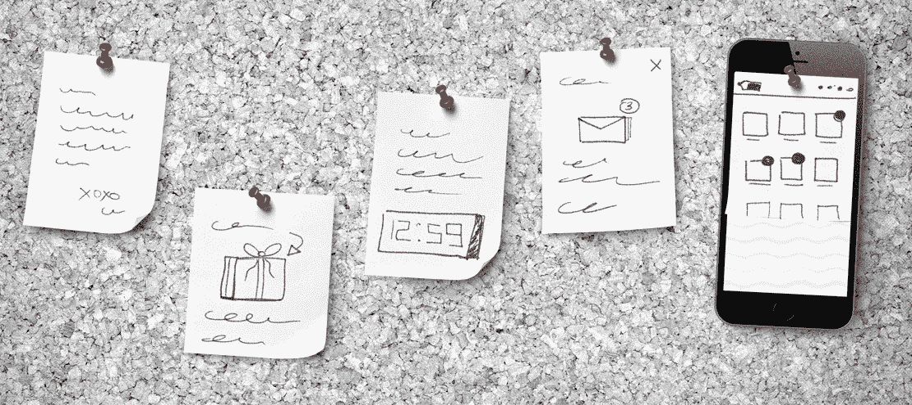

# 赢得实时个性化

> 原文：<https://medium.com/swlh/winning-at-real-time-personalization-efda3883d53c>

实时[个性化营销](https://www.mckinsey.com/business-functions/marketing-and-sales/our-insights/the-heartbeat-of-modern-marketing)关注客户的行为、兴趣和实时需求，使总销售额增加 15-20%。

也许你已经开始实施个性化来改善客户体验，但如果你不遵守这些基本准则，你可能无法最大限度地发挥其潜力。让我们来看看赢得客户的五种最佳做法…