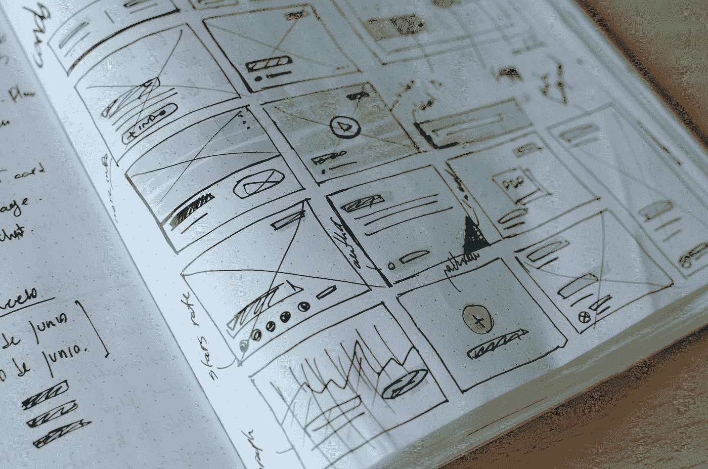
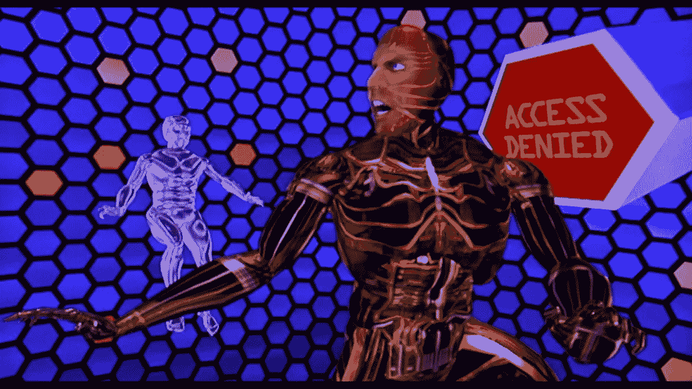
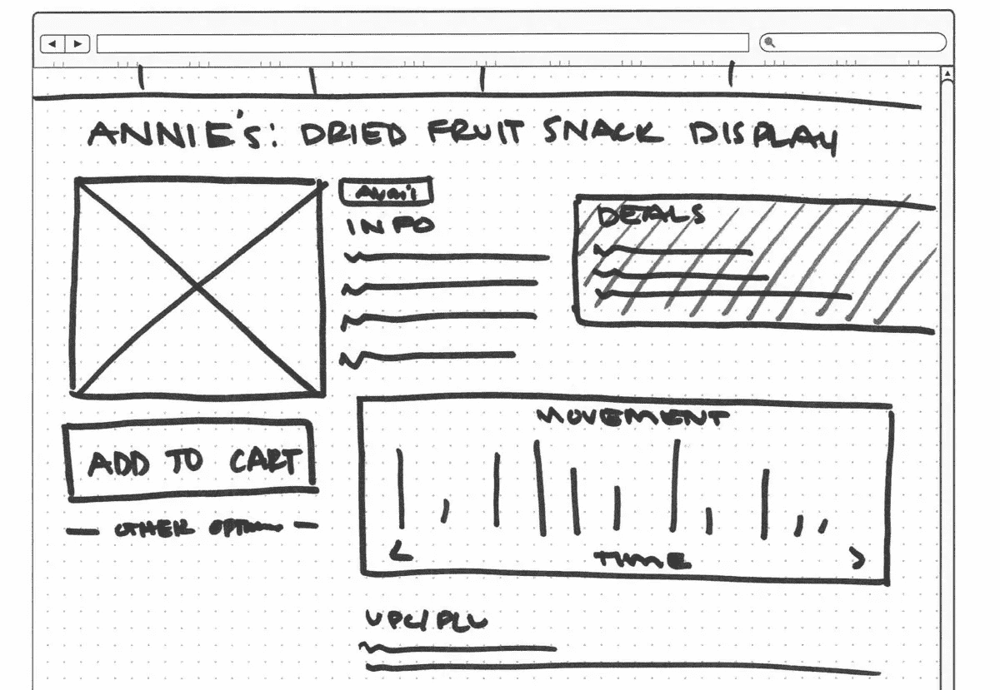
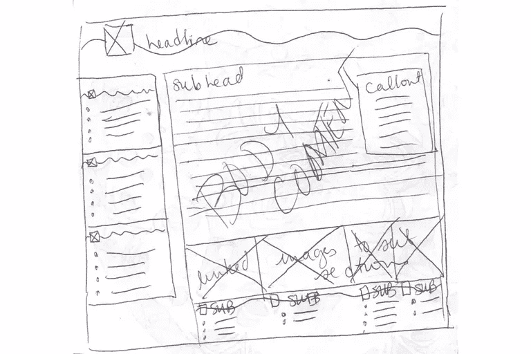
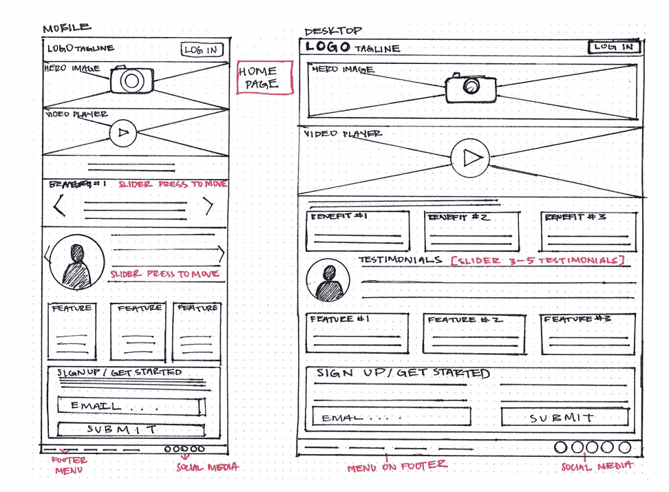
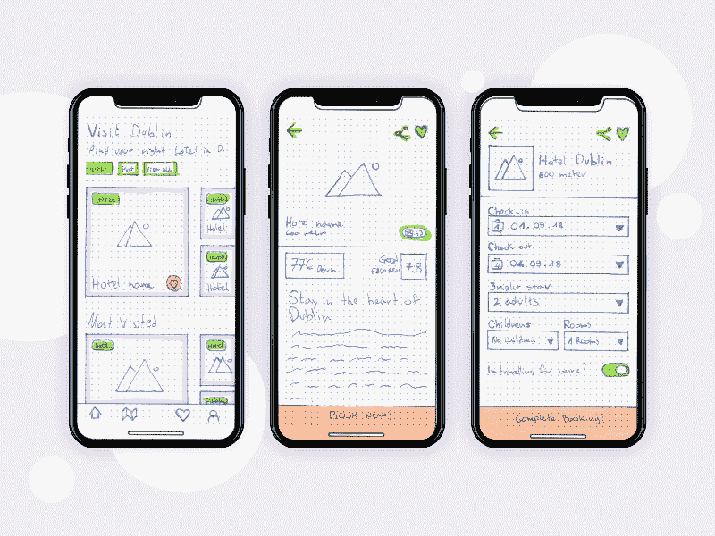

# 面向开发人员的线框图(不是假人)

> 原文：<https://medium.com/swlh/wireframing-for-developers-not-dummies-d84d96e0c109>

Photo by [José Alejandro Cuffia](https://unsplash.com/@alecuffia?utm_source=medium&utm_medium=referral) on [Unsplash](https://unsplash.com?utm_source=medium&utm_medium=referral)

当我们继续我们的编码之旅时，我们被提醒的一件事是开发人员应该懒惰；也就是说，我们应该努力以尽可能少的工作获得功能。然而，在追求雄辩和简洁(不要重复自我)的过程中，有可能将代码架构置于应用程序可用性之上。一心一意地专注于让我们的代码工作而损害用户流和可导航性是适得其反的，并且很容易避免。减少开发时间浪费和功能退化的一个方法是对我们的应用程序的准系统有一个坚实的认识。最好的方法之一就是从字面上勾勒出它们是如何工作的。因此，线框。

This is NOT a wireframe. It’s the Lawnmower Man.

# 那么到底什么是线框呢？

线框最初用于 CAD(计算机辅助设计)绘图中，以可视化 3D 结构，如建筑物或汽车，并在不需要细节的情况下辅助整体设计。由此产生的图画就像是由电线组成的物体的上层结构，并产生了我们今天使用的术语。对于开发人员来说，线框是应用程序的屏幕或功能的最基本的视觉表示。在您编写登录页面的外观或用户如何在页面之间导航之前，实际绘制这些连接并确定什么可以提供最佳用户体验是很有用的。作为开发人员，我们已经被鼓励在进行第一次迁移之前花时间找出模型之间的关联并考虑模式的细节——我们应该花一点时间考虑我们的页面如何相互交互。

Not what we’re going for.

# 好吧，那么我们如何线框？

尽管这可能违反直觉，但最好的线框方式是用钢笔(或铅笔)和纸。线框应该是低保真度的，快速的，有指导意义的。重点不是突出酷的功能或新颖的用例，而是确定用户实际浏览你的应用或网站的方式。添加的元素越多，线框的信息量就越少。一个好的线框应该是直观的，但足够简单，一个没有计算机知识的用户将能够浏览它，并给出有用的反馈。如果你花了超过 5 分钟的时间为你的应用程序绘制一个页面，你需要在这个时间框架内削减尽可能多的功能。

不要担心美学或设计，让 UI/UX 的人去做吧。你所需要做的就是在纸上画几个方框，然后在上面画出你打算如何让用户与应用程序进行交互。需要考虑的一些事情有:

*   当你打开一个网站或应用程序时，你希望看到什么？
*   什么信息最有价值或信息量最大？
*   您希望用户能够执行哪些操作？

下面是几个基本线框可以和应该是什么样子的例子:

Example landing page, courtesy [Atomic Object](https://spin.atomicobject.com/2018/12/11/wireframing-non-designers/).

Example wireframe, courtesy [Lifewire](https://www.lifewire.com/what-is-website-wireframe-3470020).

# 迭代和后续步骤。

一旦你有了一些草图，你会发现你的线框已经为你提供了一个有用的可视化工作流程和结构来构建你的应用程序。你可能想和朋友或同事坐下来，让他们浏览一下你的画框，看看对局外人来说是否有意义。一旦你对你的盒子感到满意，你就可以在它们的基础上完善和发展。你不想添加实际的内容或图形，而是使用占位符文本( [Lorem Ipsum](https://loremipsum.io/) 生成器非常方便)和简单的图标。

A more detailed wireframe from CareerFoundry student Samuel [Adaramola](https://careerfoundry.com/en/blog/ux-design/how-to-create-your-first-wireframe/).

你可能不需要(也不应该)超越最基本的草图，但是如果你发现这个过程很有用，并且有一些额外的时间，网上有很多工具可以根据你的草图想法构建干净的功能原型。 [Balsamiq](https://balsamiq.com/) 是一个简单易用的线框工具，有一个很好的操作视频库，如果你想更进一步， [InVision](https://www.invisionapp.com/) 可以让你导入你的图纸或 pdf，连接工作按钮和链接，以全面测试你的用户流。我在下面链接了一些其他资源。

A great example of the different stages of wireframing, by [Marko Peric](https://dribbble.com/shots/5036975-Visit-Dublin-iOS-Application).

可视化你的用户将如何实际参与你的应用程序是非常有用的，但是同样重要的是不要在这个过程的这个阶段花费太多时间。最终，线框化应该帮助我们花更少的时间编码，更清楚地了解我们希望用户如何与我们的代码交互，允许我们使用最简单的结构构建更清晰的架构。

更多阅读资料和资源:

*   [线框和原型制作的历史。](https://www.infragistics.com/community/blogs/b/devtoolsguy/posts/the-history-of-wireframing-amp-prototyping)
*   [线框和原型制作综合指南](https://www.smashingmagazine.com/2018/03/guide-wireframing-prototyping/)。
*   [10 款最佳线框工具](https://uxplanet.org/9-best-wireframe-tools-for-mac-ui-ux-designers-have-to-know-1c9a6f077645)，来自《UX 星球》。