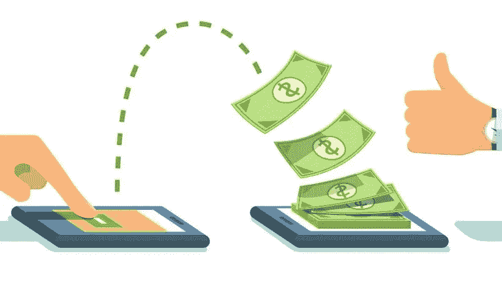

# 有了加密，汇款就像发电子邮件一样简单

> 原文：<https://medium.com/swlh/with-crypto-sending-money-is-as-easy-as-sending-email-2a672835063c>

在 crypto 工作时，我经常发现自己被迫使用假设来捍卫它。例如，当我谈到汇款就像发电子邮件一样简单时，我经常听到“但我可以用 Venmo 轻松地给人们汇款。”感觉既合理又正确:我昨晚付了晚餐的钱，并用 Venmo 向我的朋友请求资金。我们都安顿好了，对吧？嗯，算是吧。