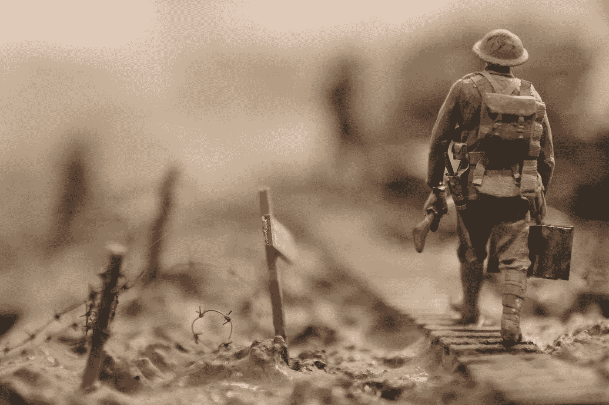

# 美国陆军询问其推特粉丝服役对他们有何影响

> 原文：<https://medium.com/swlh/with-memorial-day-approaching-the-u-s-d5dc8f691137>

## 成千上万的人做出了回应，这令人心痛

周四，就在阵亡将士纪念日的前几天，美国军方在推特上发布了一段年轻士兵内森·斯潘塞的视频。在这封信中，斯潘塞说军队给了他“为比[自己]更伟大的事情服务”的机会，而在军队服役让他…