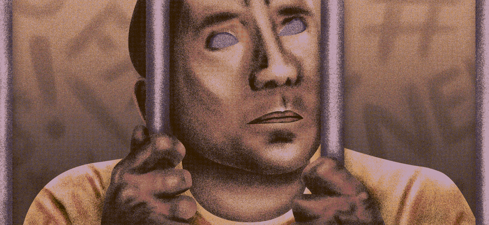

# 醒来-羞愧。

> 原文：<https://medium.com/swlh/woke-shaming-3b27530beadc>

## 停止比较激进主义！

Illustration: [**JESSICA SIAO**](http://www.jessicasiao.com/)

行动主义和社交媒体在 21 世纪已经成为同义词。Twitter、Instagram 和脸书已经成为所有年龄段的活动人士的首选武器，以打好这场仗，并推动世界走向“保持清醒”。网络激进主义已经导致了一种特定的公开羞辱，这种羞辱来源于单词“woke”。根据韦伯斯特词典，被唤醒意味着意识到并积极关注重要的事实和问题，尤其是种族和社会公正问题。

被“唤醒”的最初目的是为了保护被边缘化的社区，创造“社会意识”。它旨在集体提高阶级意识，以创造一个更加宽容和接受的社会。然而，正是与觉醒相关的召唤文化分裂了他们。

我意识到现在不是最愉快的时候——需要紧急关注的问题正在增加——气候危机、经济不稳定、种族主义、性别歧视和同性恋恐惧症正在慢慢变得比它们首次成为问题时更糟糕。然而，每当进步议程推进时，我所持的信念都会因我的恐惧而脱轨。进步人士似乎缺乏对积极的社会变革的理解。在一定程度上，人们不愿意承认胜利，并拒绝欢迎和接受那些想要巩固的人。

与前几代人或几十年相比，现代社会在全球社会不公正问题上变得更加直言不讳。由于每个人的观点和看法各不相同，在如何表示尊重和欣赏文化方面，保持 100%的政治正确几乎是不可能的。总会有人被冒犯。当然，有些关于某些主题的讨论是明显不正确的，比如强奸、同性恋恐惧症和种族主义。然而，即使如此，互联网已经成为一个有毒的地方，使彼此的观点无效，而不是讨论和辩论每个人对该主题的观点。

“取消”文化是造成这种毒性的一个因素，我们看到它每天都针对名人。你所说的任何事情都将成为对你不利的证据，即使说的是几十年前的事。你会看到不同的艺术家、政治家或有影响力的人因为无知时期的言论而在网上出现相同的抵制内容。在没有正确理解与你不同的观点的情况下，我们在哪里区分和划定我们“取消”和公开攻击的对象？我们的社会如此迅速地站起来攻击他们不同意的任何人，完全破坏了他们观点的背景，这就是为什么想要为了更大的利益而参与进来如此有害。我并不是说我不同意他们所说的事情并不可怕，也不是试图为他们的无知辩护，撇开对性侵犯的评论，我相信如果一个人试图成长和教育自己做得更好，他们不应该因为他们过去犯的错误而被击落。

当谈到代表其他文化和更深层的结构发言时，无知在互联网的毒性中起着至关重要的作用。尽管互联网和社交媒体称赞自己为那些没有发言权的人发声，但在帮助那些没有发言权的人和为他们而战之间存在明显的分歧。例如，如果一个不属于我的种族的个人声称另一个人盗用了我的文化，我认为他们没有权利这样做，因为他们没有受到事件的直接影响，也没有代表我的整个种族说话的权利。

在当今这个时代，我们倾向于对什么是对什么不是有自己的看法，以至于我们大多只是专注于证明人们是错的，而不是理解他们的错误，让他们有机会学习和成长。错误是人类的一个元素，尽管如此，在那些故意充满仇恨和偏见的人和那些不开化或过于热切的人之间仍然存在着对比。

与充满激情和激烈的对话相比，积极地在屏幕的阴影下公开羞辱是更容易的解决办法，这种对话实际上激发了思维并促进了变化。建立一个以同理心和开放思想为燃料的运动，而不是可能造成潜在创伤的羞耻和愤怒，可能不会造成太大的宣传，但与几个充满怨恨的社交媒体帖子相比，它带来了更多参与积极社会变革的机会。

不管你对事业有多投入，不管你的观点与主流观点有多不同，为了更大的利益，有必要用确凿的事实而不是你自己的猜测和看法来教育大众。声称可以在社交媒体上简单地消除毒性是不现实的，然而，在我们的世界中创造一个更受教育和更知情的环境可以大大减少紧张。

“醒来羞耻”让“醒来”的整个目的违反直觉，因为它否定了我们最初试图实现的目标——减少仇恨和偏见。