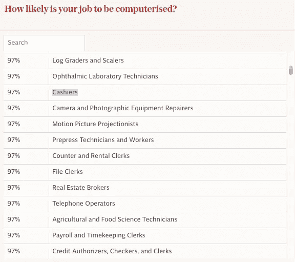
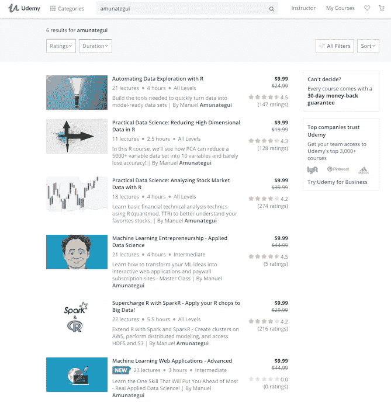

# 科技界的女性们，我们需要更多的你们加入机器学习革命

> 原文：<https://medium.com/swlh/women-in-tech-we-need-more-of-you-to-join-the-machine-learning-field-e776fbcdf63a>

让我们来谈谈我们当前的技术革命和女性参与其中的情况。从多个方面来看，这都是令人不安的时期。不是新消息，但仍然令人不安。这是我们需要经常提醒自己的，尤其是对于那些在技术行业和技术领导层的人。

我读了几篇关于这个话题的文章，想讨论两点。以下是《卫报》一篇题为“女性必须立即行动，否则男性设计的机器人将接管我们的生活”的文章中的片段，

> “女性更有可能受雇于面临最高自动化风险的工作。例如，商店中 73%的收银员是女性，97%的收银员预计会因自动化而失业。同一份报告预测，未来 15 年，科学、技术、工程和数学(Stem)领域持续存在的性别差距也将削弱女性的职业地位。”

# 可怕的数字

我进一步挖掘，找到了这 97%的来源，并在[《每日电讯报》的一篇题为“根据牛津大学的研究，这些是自动化风险最大的工作:你是其中之一吗？”的文章中找到了一份更完整的清单，列出了所有可能被自动化淘汰的工作](https://www.telegraph.co.uk/news/2017/09/27/jobs-risk-automation-according-oxford-university-one/)给你一个忠告，如果你的清单排在第一位，开始向下滚动，向下滚动，寻找一个更安全的选择。

[From The Telegraph](https://www.telegraph.co.uk/news/2017/09/27/jobs-risk-automation-according-oxford-university-one/)

但是回到科技领域的女性，另一个引语，来自最近[连线杂志的一篇题为“人工智能是未来——但是女性在哪里？”](https://www.wired.com/story/artificial-intelligence-researchers-gender-imbalance/)，

> “WIRED 与蒙特利尔初创公司 Element AI 合作，评估领先的机器学习研究人员的多样性，发现只有 12%是女性。”

显而易见，所有群体都需要在人工智能革命中得到代表和参与，以便所有观点的所有发明以及由此产生的各种副作用和涟漪都被捕捉、理解和解决。这些都是复杂的问题，因为它们在性别、经济地位、地理等方面有很大的不同。我们需要所有人齐心协力。否则，后果可能是灾难性的，我们可能会陷入一个不平衡的世界，成为一部恐怖的科幻电影的主角…

# 我的行动呼吁——加入科技和机器学习行业

我一生都在科技行业，我可以证明这一直是一个男性占主导地位的行业。但是它正在改变。如果你对是否进入这个领域犹豫不决，我会说薪水真的很好，挑战也非常有趣。如果你喜欢用狡猾和创造力解决问题，你会发现这个职业非常有价值。

从学校开始。加入科技项目的学生群体越多样化越好。所以，我想鼓励任何寻找智力激励职业的人考虑这个领域。每个人都有适合自己的东西——如果你不喜欢数学，那么就有逻辑，这就是我的情况。如果不是逻辑学，那么这个领域还有 100 个其他专业等着你！不要让任何恐惧阻止你——这个领域对于任何先入为主的观念来说都太大了。

我也想象加入一个 90%都是男性的团队并不总是那么容易。这种情况正在慢慢改变。它已经变得更好了，如果你加入进来，它会变得更好。当今工作环境的一大变化是远程工作。我已经远程工作好几年了，这为我提供了一个非常安全舒适的环境。你将能够专注于解决问题，而不受大型办公环境的干扰。我工作的公司，SpringML，大部分都很偏远，员工遍布世界各地。我们与 Google Hangouts 交流，通过交换想法、技术、最新工具来让我们在一起的时间有价值，我们跳过废话。

我想到的另一家公司是联合健康集团。这是一个拥有超过 260，000 名员工的大型组织，但其中 25%的员工成功地进行了远程办公。我们将会看到更多的这种情况，因为公司不想在每个城市都雇佣专家，同时也意识到远程员工往往比他们的同事表现得更好。

# 数据科学很有趣

我有大量免费的数据科学演练。它们用简单的英语编写，并试图将复杂的数据科学工作分解为实践练习。在 [amunategui.github.io](http://amunategui.github.io/) 找到他们。

[My Udemy Classes](https://www.udemy.com/courses/search/?src=ukw&q=amunategui)

我已经[创建了一系列关于数据科学的 Udemy.com 课程](https://www.udemy.com/courses/search/?src=ukw&q=amunategui)。如果你持观望态度，想感受一下 R 或 Python 中的数据科学，请在 Twitter 上连接，给我发消息，告诉我你想上的课程，我会给你一张免费优惠券。

在推特上联系我，给我发信息询问关于课程的任何问题。BTW，下面是一些业内最著名的:[我最喜欢的六门免费数据科学课以及它们背后的巨头](http://amunategui.github.io/favorite-free-classes/index.htm)。

如果你想知道你的工作是否在砧板上，看看我最近放的一个网络应用:[http://www.viralml.com/jobs-at-risk-of-automation](http://www.viralml.com/jobs-at-risk-of-automation)

感谢阅读！在 ViralML.com[注册订阅我的时事通讯](http://www.viralml.com/signup.html)

**曼努埃尔·阿穆纳特吉**

amunategui@gmail.com

推特:@amunategui

*作者* [货币化机器学习](https://www.amazon.com/s/ref=nb_sb_noss_2?url=search-alias%3Daps&field-keywords=manuel+amunategui)，[用在线课程创造收入流](https://www.amazon.com/s/ref=nb_sb_noss_2?url=search-alias%3Daps&field-keywords=manuel+amunategui)和[有机地发展你的网络品牌、知名度&流量](https://www.amazon.com/s/ref=nb_sb_noss_2?url=search-alias%3Daps&field-keywords=manuel+amunategui)。*amunategui . github . io 和 [ViralML](http://www.viralml.com/) 的策展人*

## 这篇文章发表在 [The Startup](https://medium.com/swlh) 上，这是 Medium 最大的创业刊物，拥有+418，678 读者。

## 在这里订阅接收[我们的头条新闻](http://growthsupply.com/the-startup-newsletter/)。

