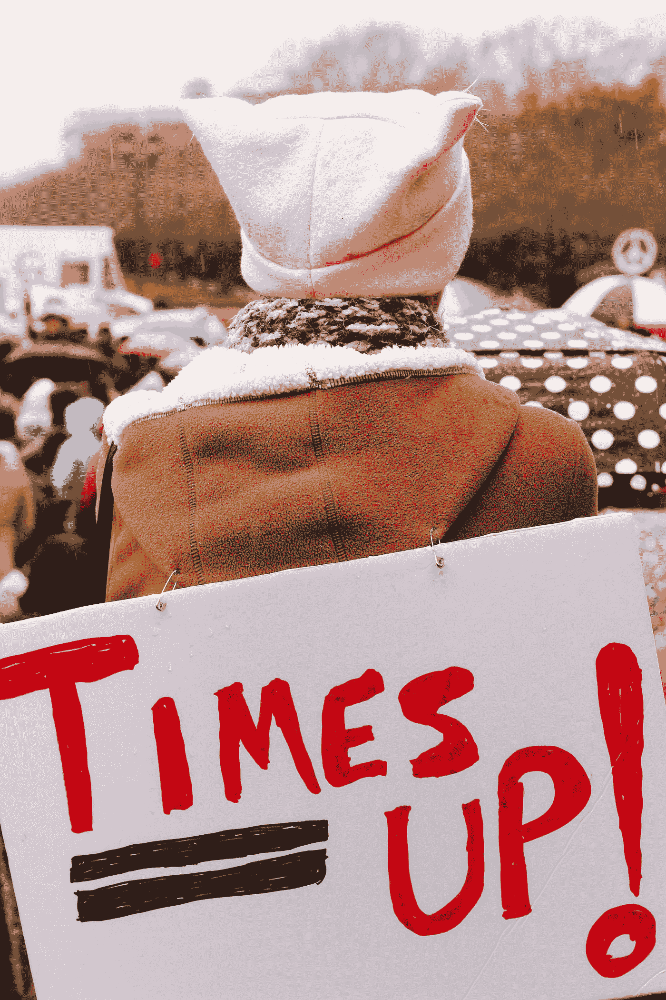

# 职场女性:现代故事

> 原文：<https://medium.com/swlh/women-in-the-workplace-a-modern-tale-26d99ec5ab84>

## 对于办公室里的女性来说，已经有了一些改善，让她们感到舒适。仍然有一些我们女人不得不面对的挫折，这些挫折是我们不应该面对的。

Photo by [Dane Deaner](https://unsplash.com/@danedeaner?utm_source=medium&utm_medium=referral) on [Unsplash](https://unsplash.com?utm_source=medium&utm_medium=referral)

我目前在办公室工作。这可能是我做过的最好的工作，我暂时不打算离开。尽管我有多热爱我的工作，但我希望我能改变它的文化中的一些东西。

我工作的办公室是一个非常男性主导的办公室，其他地方也类似。我的角色通常是由女性担任的，但他们给了我其他任务，让我脱离了日常工作。我的问题不在于办公室里的年轻男性(接近我的年龄)，而在于婴儿潮一代。他们有一种特殊的谈话方式，这让我很不舒服。

Photo by [STIL](https://unsplash.com/@stilclassics?utm_source=medium&utm_medium=referral) on [Unsplash](https://unsplash.com?utm_source=medium&utm_medium=referral)

虽然我知道我们有一个现场人力资源代表帮助我解决这些问题，但我知道没有什么是真正要做的。作为一个被各种方式骚扰过的女人，我已经学会接受它。

我最想做的就是大声说出我在这个办公室里经历的性别歧视和种族歧视。不幸的是，那会让我看起来像一个爱抱怨的人，而不是一个团队成员。

我喜欢这份工作，喜欢它给我的自由，让我可以去上学，可以支付账单和存钱，而且在着装方面没有严格的规定。我只是希望有更多在这里工作的女性也想表达出来。

我知道我并不孤单。我是社交媒体上的一个小组的成员，该小组讨论我们做的类似任务、需要的建议等。我看到很多帖子都是关于某些男性员工在期望他们做什么以及如何对待他们方面走得太远。

Photo by [Elyssa Fahndrich](https://unsplash.com/@elyssarenae?utm_source=medium&utm_medium=referral) on [Unsplash](https://unsplash.com?utm_source=medium&utm_medium=referral)

我没有经历过许多女性在工作场所遇到的性骚扰。随着#MeToo 运动的持续高涨，女性的处境并没有好转。

虽然我知道这是一个电视节目，但我能找到的关于畅所欲言如何伤害我们的最好例子是在*布鲁克林 99 的*集《他说，她说》。我不是提倡不要说出来，我只是提出它会如何伤害女性。挺身而出并取得胜利的角色最终离开了她所在的公司，因为她不再被邀请参加某些活动或与人交谈。她在同事中是个贱民，虽然她对结果很满意，也不介意离开，但这根本不应该发生。

理想情况下，当一个女人说出骚扰时，她不应该被回避或受到不同的对待。

我们已经在改变当前的办公室文化方面取得了长足的进步，但要获得平等待遇(包括薪酬)，我们还有很长的路要走。