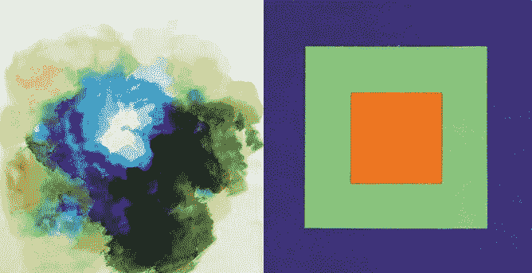

# 有色人种妇女:玛丽·加特塞德和艾米丽·诺伊斯·范德波尔

> 原文：<https://medium.com/swlh/women-of-color-mary-gartside-and-emily-noyes-vanderpoel-d05e2bfd9f54>

Fig 1: (left) Blue, Mary Gartside, from ’An essay on light and shade’, 1805\. Source: Alexandra Loske. (right) Emily Noyes Vanderpoel, *Plate V — Advancing and Retiring Colors*, Color problems; a practical manual for the lay student of color (1902) Source: Hathitrust.org.

为什么没有伟大的女艺术家？”(1971)，女性主义艺术史学家琳达·诺奇林(Linda Nochlin)颠覆了普遍接受的天才观念。她展示了伟大与社会关系(教育、当前思想和趋势、赞助、分配等)的密切程度。)就像独特的特质和能力一样。因为同样的原因，没有著名的…