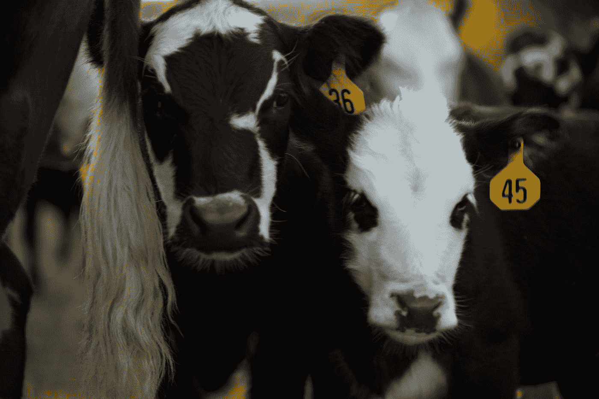

# 耕牛

> 原文：<https://medium.com/swlh/working-cattle-d24da97fae01>

Photo by [Micah Tindell](https://unsplash.com/@micahtindell?utm_source=medium&utm_medium=referral) on [Unsplash](https://unsplash.com?utm_source=medium&utm_medium=referral)

当我还是一名高中毕业生的时候，每年秋天赚钱的一个简便方法就是去当地的“喂养小牛” [特卖店](https://www.nasdaq.com/markets/feeder-cattle.aspx)打工。

这钱来之不易。工作到深夜很辛苦，但对我们这些知道自己在做什么的人来说，这至少是简单的赚钱。你只需要让一些牛工作几个小时，就可以把它们分到指定的栏里。对于知道自己在做什么的孩子们来说，这一切都很简单。对于那些不知道自己在做什么的人来说，这不是一个简单的放牛之夜，而是一个充满了被老人们踢、踩、吼的夜晚，他们因为你让小牛跑掉而生你的气。

对于那些没有在农场长大的人来说，饲养小牛是指准备好被“喂养”的断奶小牛，长到可以变成美味牛肉的大小。喂养小牛仍然有卖，但是在今天的垂直牛肉市场，我曾经工作过的那种喂养小牛的销售不再那么普遍了。过去，我所在的地区(以及其他大多数地区)有几十个农民，他们都有几头或几头小牛要在秋天出售。为了提高效率，公共饲养小牛销售将让所有这些农民把他们的股票集中到一个大拍卖中。这使得买家更容易从城外进来，导致农民的价格更高。举办这样的大拍卖需要几个雇工来运作一切，这对像我这样的孩子来说很方便。

在销售的前一天晚上，农民们会把小牛放在销售仓库。然后，这些小牛将被称重，并被分成一批一批出售。那是孩子们进来的地方。小牛被称重后，会被分配一个笔号，并从磅秤上释放。围栏编号将通过扬声器宣布，然后我们的工作是让小牛进入指定的围栏，而不让已经在围栏中的所有其他小牛逃进谷仓。我们需要尽快行动，因为总会有更多的小牛到来。有时一只小牛会从秤上跳下来，发疯似地准备打架。有时小牛犊会平静地走出来。大多数情况下，小牛会像典型的小牛一样出来——一种值得尊重的动物，但既不合作也不特别抗拒被带到指定的围栏。

如果你是在牛群中长大的，那么很容易辨别出你手上的是哪种小牛，然后适当地处理它。我们中的一些人以最温和的方式了解了牛，首先从我们母亲腿上的安全卡车上观察，然后像一个小孩子一样帮助一只小瓶子，直到最后我们知道如何从牛群中剪下一只小牛。我们这些每晚在家喂牛的人已经学会了读懂牛头上的公鸡，以区分兴趣和愤怒。我们知道何时以及如何坚守阵地，把一头向我们飞来的小牛变成一只围栏。我们知道如何在恰当的时候打开一扇门，把一头 600 磅重的小牛送到围栏里，而不会让我们的靴子沾上灰尘。对我们这些知道你在做什么的人来说，这很简单。对那些不知道自己在做什么的人来说，这是地狱。

很多年来，至少我镇上的一个朋友会需要一些钱，并认为出售饲养小牛听起来很容易。我总是试图指导我镇上的朋友如何养牛，同时暗暗期待着他们即将带来的精彩表演。我给的任何指示都不够快。没有任何理论上的方法可以教一个人如何放牛，所以我简单的解释没有多大帮助。耕牛不是那种你可以通过阅读一本书或观看一个操作视频来学习的东西。你只需要从做过的事情中知道如何去做。如果你还不知道如何养牛，你会在出售饲养小牛的活动中被狠狠地教训一顿。我承认，当我们完成工作后聚在一起时，我经常嘲笑我朋友的瘀伤。

那些从镇上来的孩子没有学习温和方式的优势。他们不得不通过被踢被踩来学习工作。如果你站稳了，他们无法分辨哪些小牛会转向一边，哪些小牛会真正碾过你，所以他们都让很多小牛逃跑，然后被碾过。这些孩子会让整个笔失去畏缩在一个开放的大门后，而不是等到完美的时刻，摆动它来接纳新的除了笔。现在我回想起镇上的孩子们给我提供了多少娱乐，我感觉有点糟糕。

大多数镇上卖过小牛犊的孩子第二年就再也没有回来过。有更容易的方法来赚取最低工资，而不是被你试图分类到一个围栏的牛践踏。不管出于什么原因，其中一些孩子会回来第二次尝试。一个镇上的孩子不可能仅仅通过一年做一次小牛犊买卖而成为专家，但第二次他至少会足够熟练，不会被踢或踩。如果在接下来的几个月里，他能在一个农场主那里找到一些固定的工作，到第二次出售饲养小牛的时候，他甚至能成为一个有经验的老手。那么饲养小牛的销售对他来说就不容易赚钱了，但这将是一项简单的工作。

当我开始一项新的努力或尝试学习一项新技能时，我经常会想到耕牛。我现在已经到了这个年纪，已经没有什么可以让我学习温柔的方式了。我曾经是一个傲慢的孩子，在喂养小牛的拍卖会上，当镇上的孩子发现放牛并不容易时，我暗自发笑。现在我意识到，如果我要学习新的东西，我必须在通往知识和智慧的道路上接受一些挫折。