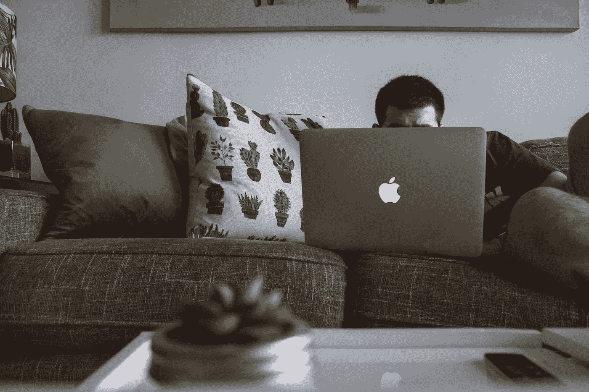

# 在家工作:阴阳两极

> 原文：<https://medium.com/swlh/working-from-home-the-yin-and-yang-7741c686b722>

## 事情并不都是美好的。

Don’t do this. Terrible ergonomics. Photo by [DESIGNECOLOGIST](https://unsplash.com/photos/YHd66D4gMMU?utm_source=unsplash&utm_medium=referral&utm_content=creditCopyText) on [Unsplash.](https://unsplash.com/search/photos/working-from-home?utm_source=unsplash&utm_medium=referral&utm_content=creditCopyText)

# 咆哮

我写这篇文章的时候是星期天早上。我刚在大风中遛狗回来。同样的风现在正穿过我头顶天窗周围的橡胶密封。听起来好像我在一艘船上。

我写字用的这张桌子最近用得更频繁了。在过去的几年里…