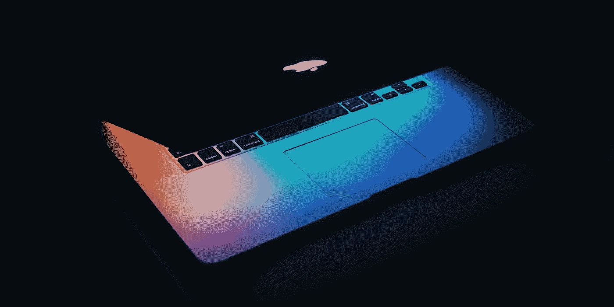

# 在信息时代工作

> 原文：<https://medium.com/swlh/working-in-the-information-age-78e15809991c>

## 重新定义 21 世纪人们创造价值的方式

The digital creator’s paintbrush — Photo by [Wesson Wang](https://unsplash.com/@wesson?utm_source=unsplash&utm_medium=referral&utm_content=creditCopyText) on [Unsplash](https://unsplash.com/search/photos/digital?utm_source=unsplash&utm_medium=referral&utm_content=creditCopyText)

## 介绍

毫无疑问，我们现在生活在一个高度互联、快节奏的世界里，在这个世界里，只需点击一个按钮，就可以获得知识和信息，思想可以瞬间传达给数百万人。在有记载的历史上，我们从来没有…