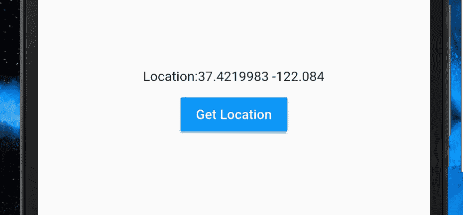

# 在 Flutter 中使用地理定位和地理编码(以及与地图的集成)

> 原文：<https://medium.com/swlh/working-with-geolocation-and-geocoding-in-flutter-and-integration-with-maps-16fb0bc35ede>

## 使用位置并将其与谷歌地图集成的指南


W 处理用户的位置是许多应用程序需要的一项常见任务，然而在应用程序中实现一个有效解决方案的步骤往往令人困惑，并且需要设置太多样板文件。大多数 Flutter 软件包**提取了大部分或者所有需要的样板文件**，直接给用户提供了最佳的解决方案，减少了处理的麻烦。这通常意味着通过抽象失去了一些细粒度的控制，但是大多数时候并不需要。

你可以浏览一个在原生 android 中实现定位的[教程，看看向仅仅想要用户的位置或想要跟踪它的应用程序开发者呈现的大量**通常不需要的**信息。](https://developer.android.com/guide/topics/location/strategies)

今天，我们将通过使用两个不同的插件来实现 Android 和 iOS 的获取位置、位置跟踪和地理编码，这两个插件为我们提供了对底层 API 的不同程度的控制，然后查看地图位置的实现，我们将使用地图上的标记来跟踪用户。

让我们开始吧。

# 插件 1: [“位置”](https://pub.dartlang.org/packages/location)

“位置”插件是获取和跟踪用户位置的最简单方式，没有任何样板代码的麻烦。

设置非常简单:

1.  将插件添加到`pubspec.yaml`

```
**dependencies:
  location:** ^1.4.1
```

2.向 Android 清单添加权限:

```
<**uses-permission android:name="android.permission.ACCESS_FINE_LOCATION"** />
```

3.向 iOS 添加权限`Info.plist`

```
<key>NSLocationAlwaysUsageDescription</key>
<string>Needed to access location</string>
<key>NSLocationWhenInUseUsageDescription</key>
<string>Needed to access location</string>
```

你就完了。

在 Android 6.0+中，我们需要在运行时请求访问位置，这个**包自己处理**。

## 获取一次性位置



它让我们得到两样东西:

1.  用户的一次性位置
2.  允许我们监听用户位置的数据流。

让我们创建一个简单的应用程序，像上面一样一次性获得用户的位置。

正如我们所讨论的，这个包不需要太多的设置，代码相当简单。

首先，简单地初始化一个位置对象。

```
**var location** = **new** Location();
```

`location`不是用户本身的位置而是帮助我们得到它的一个类。

位置以地图的形式返回，带有“纬度”、“经度”等关键字。

```
Map<String, double> **userLocation**;
```

最后，获取位置非常简单:

```
userLocation = **await location**.getLocation();
```

就是这样。

完整的代码:

在这里，我们得到了纬度和经度。其他可用因素包括:

```
 currentLocation[**"latitude"**];
  currentLocation[**"longitude"**];
  currentLocation[**"accuracy"**];
  currentLocation[**"altitude"**];
  currentLocation[**"speed"**];
  currentLocation[**"speed_accuracy"**]; //Not for iOS
```

## 收听位置更新

监听位置更新与获取位置没有太大区别，我们只是使用插件提供的流对象来监听更新。

```
location.onLocationChanged().listen((Map<String,double> currentLocation) {
  print(currentLocation[**"latitude"**]);
  print(currentLocation[**"longitude"**]);
  print(currentLocation[**"accuracy"**]);
  print(currentLocation[**"altitude"**]);
  print(currentLocation[**"speed"**]);
  print(currentLocation[**"speed_accuracy"**]); });
```

这方面的一个例子是:

它给出了一个与第一个例子相似的页面，但是这一次，我们监听位置。

这个插件使用起来很简单，不需要太多的设置和控制，使用和意图都很简单。接下来，我们将看到另一个对所涉及的 API 进行更多控制并且允许地理编码的工具。

# 插件 2:[‘地理定位器’](https://pub.dartlang.org/packages/geolocator)

## 设置

这个插件的设置和位置差不多。如果您也计划使用粗略定位，请添加

```
<**uses-permission android:name="android.permission.ACCESS_COARSE_LOCATION"** />
```

到`AndroidManifest.xml`。

首先，我们将使用这个插件完成同样的两个任务，这两个任务大致相同:

## 获取位置一次

使用`Geolocator`对象代替`Location`，并且代替`Map<String,double>`，我们得到一个`Position`对象。

```
Geolocator **geolocator** = Geolocator();

Position **userLocation**;
```

我们这样做是为了拍摄外景:

```
currentLocation = **await geolocator**.getCurrentPosition(
    desiredAccuracy: LocationAccuracy.**best**);
```

在这里，我们也可以根据我们需要的精度来设置定位精度。

## 获取位置更新

更新类似于“位置”包，但具有增强的选项。

```
**geolocator**.getPositionStream().listen((position) {
  *// Do something here* });
```

我们可以设置精确度，更新的时间间隔，是否要强制使用 Android 位置管理器等等。

```
**geolocator** .getPositionStream(LocationOptions(
        accuracy: LocationAccuracy.**best**, timeInterval: 1000))
    .listen((position) {
  *// Do something here* });
```

## 使用地理编码

地理编码本质上是**获取地址的物理地图坐标和细节**的过程。

```
List<Placemark> placemark = await Geolocator().placemarkFromAddress(**"Gronausestraat 710, Enschede"**);
```

您可以通过以下方式获得该地点的所有详细信息:

```
print(placemark[0].**country**);
print(placemark[0].**position**);
print(placemark[0].**locality**);
print(placemark[0].**administrativeArea**);
print(placemark[0].**postalCode**);
print(placemark[0].**name**);
print(placemark[0].**subAdministratieArea**);
print(placemark[0].**isoCountryCode**);
print(placemark[0].**subLocality**);
print(placemark[0].**subThoroughfare**);
print(placemark[0].**thoroughfare**);
```

我们也可以从坐标中得到一个地方的细节:

```
List<Placemark> placemark = **await** Geolocator().placemarkFromCoordinates(52.2165157, 6.9437819);
```

## 获取坐标之间的距离

该插件还允许我们**计算两个坐标**之间的距离，如下所示:

```
double distanceInMeters = **await** Geolocator().distanceBetween(52.2165157, 6.9437819, 52.3546274, 4.8285838);
```

# 将位置更新与谷歌地图集成

为了将 Google Maps 与位置更新整合，我们需要使用 [google_maps_flutter](https://pub.dartlang.org/packages/google_maps_flutter) 包和您选择的位置插件。

现在让我们只使用“位置”包。

**这一部分的前身是我的文章《探索 Google Maps in Flutter 》,我强烈推荐你用它在你的应用程序中设置地图。**

[](/flutter-community/exploring-google-maps-in-flutter-8a86d3783d24) [## 在颤动中探索谷歌地图

### 在 Flutter 应用中添加官方支持的谷歌地图

medium.com](/flutter-community/exploring-google-maps-in-flutter-8a86d3783d24) 

要将地图与位置跟踪集成，我们只需结合使用这两个插件。

让我们在用户改变位置时移动一个标记。

首先，我们创建我们的`MapController`和`Location`对象来操作地图和位置。(当 map 初始化时分配`mapController`，如上一篇文章所述)

```
GoogleMapController **mapController**;
Location **location** = Location();
```

接下来，我们添加一个标记来存储当前标记:

```
Marker **marker**;
```

现在，我们收听位置更新。

```
**location**.onLocationChanged().listen((location) **async** {
  // Do something here
});
```

位置更新时，我们将这样移动标记:

1.  如果不为空，则移除当前标记，因为现在有一个新的位置需要它。
2.  添加经纬度标记。
3.  将相机移动到新的标记位置，并设置其他特征，如缩放、方位和倾斜。(GMaps 文章中给出了详细信息)

```
**location**.onLocationChanged().listen((location) **async** {
  *// Step 1* **if**(**marker** != **null**) {
    **mapController**.removeMarker(**marker**);
  }
  *// Step 2* **marker** = **await mapController**?.addMarker(MarkerOptions(
    position: LatLng(location[**"latitude"**], location[**"longitude"**]),
  ));
  *//Step 3* **mapController**?.moveCamera(
    CameraUpdate.*newCameraPosition*(
      CameraPosition(
        target: LatLng(
          location[**"latitude"**],
          location[**"longitude"**],
        ),
        zoom: 20.0,
      ),
    ),
  );
});
```

现在，当用户移动时，标记将更新位置！

下面是完整的演示页面代码:

> 本文到此为止！我希望你喜欢它，如果你喜欢，留下一些掌声。请关注我，获取更多精彩的文章，并评论您对本文的任何反馈。

> **注**:我已经为 Flutter widgets 做了一段时间的深度潜水系列，如果你以前没看过，请读一下。以下是该系列的几篇文章。

[](/flutter-community/flutter-listview-and-scrollphysics-a-detailed-look-7f0912df2754) [## Flutter ListView 和 ScrollPhysics:详细介绍

### 深入探索 ListView 小部件及其特性

medium.com](/flutter-community/flutter-listview-and-scrollphysics-a-detailed-look-7f0912df2754) [](/flutter-community/a-deep-dive-into-hero-widgets-in-flutter-d34f441eb026) [## 深入探究 Flutter 中的英雄部件

### 颤振中英雄部件的力量教程

medium.com](/flutter-community/a-deep-dive-into-hero-widgets-in-flutter-d34f441eb026) 

**也可以随意查看我的其他资料:**

[](https://twitter.com/DevenJoshi7) [## Deven Joshi (@DevenJoshi7) |推特

### Deven Joshi 的最新推文(@DevenJoshi7)。谷歌认证安卓开发者。Flutter 的博客作者和发言人…

twitter.com](https://twitter.com/DevenJoshi7) [](https://github.com/deven98) [## deven98 -概述

### 谷歌认证安卓开发者。Flutter 和 Android 的演讲者和博客作者。热爱编码，人工智能和国际象棋。- deven98

github.com](https://github.com/deven98) [](https://medium.com/swlh)

## 这篇文章发表在[《创业](https://medium.com/swlh)》上，这是 Medium 最大的创业刊物，有+408714 人关注。

## 在这里订阅接收[我们的头条新闻](http://growthsupply.com/the-startup-newsletter/)。

[](https://medium.com/swlh)