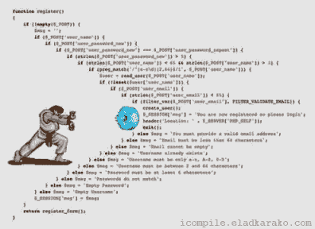

# 使用 Kotlin 协同例程

> 原文：<https://medium.com/swlh/working-with-kotlin-coroutines-507433ddd9e3>

协程是一个非常好的特性，目的是简化异步任务，使它们更容易实现和理解。

传统上，为了处理异步操作，你需要使用线程、任务、执行器或回调。所有这些机制都在一定程度上发挥作用。是的，他们完成了工作，但在某些情况下，你写的代码会变得非常混乱，难以阅读。在大量使用回调的项目中，这可能会很快失去控制；这里有一些嵌套回调，那里还有一些，接下来你知道的是你正处于*回调地狱*的中间。

上述技术的另一个问题是，使用关键的语言特性，比如异常，并不总是可能的。

Callback Hell is not a nice place

# 什么是协程？

协程是一种以顺序方式执行异步工作的方式，从概念上讲，它们类似于线程**，但更好**；它们重量更轻，控制能力更强。值得注意的是，维护协程比维护线程要“便宜”得多；许多协程可以在单线程中运行。

从技术上来说，协程是可以被**挂起**而不阻塞线程的代码块，让它可以执行任何其他工作。挂起不会发生在协程代码的任意部分，而是发生在**挂起点**，也就是说用 **suspend** 关键字标记的函数。

在上面的例子中，我们看到了一个使用协程的模式，我们有一个协程**构建器**负责创建和启动我们的协程，以及一组在协程内部调用的标有 **suspend** 的潜在耗时函数。

> *标有* suspend *修饰符的函数只能从协程或其他挂起函数中调用，试图从常规代码中调用它们会导致编译错误。*

# 建设者

如前所述，挂起函数不能从常规函数中调用，因此库提供了一组用于从它们启动协程的函数；协程是使用任何可用的构建器在给定范围的上下文中启动的。使用最简单的一个是[启动](https://kotlin.github.io/kotlinx.coroutines/kotlinx-coroutines-core/kotlinx.coroutines/launch.html)，但是也有其他可用的，比如[异步](https://kotlin.github.io/kotlinx.coroutines/kotlinx-coroutines-core/kotlinx.coroutines/async.html)、[运行阻塞](https://kotlin.github.io/kotlinx.coroutines/kotlinx-coroutines-core/kotlinx.coroutines/run-blocking.html)、[构建序列](https://kotlinlang.org/api/latest/jvm/stdlib/kotlin.coroutines.experimental/build-sequence.html)等等。coroutines 库中最酷的东西之一是它的可扩展性，只有很少的构造被嵌入到语言本身中，并且大部分实现都以库的形式提供，允许您根据需要进行定制。

> *重要:*[*run blocking*](https://kotlin.github.io/kotlinx.coroutines/kotlinx-coroutines-core/kotlinx.coroutines/run-blocking.html)*不应该在协程内部使用，因为它的唯一目的是充当常规阻塞代码与以挂起风格编写的库之间的桥梁，用于主函数和测试。*

在一个更具体的例子中，要启动一个协程，您需要调用构建器函数，并传入您希望作为协程启动的代码块:

在这里，我们从全局范围启动一个协程，这意味着它的生命周期将只受应用程序本身的生命周期的约束。

# 上下文

协程的构建者可以将一个**协程上下文**作为一个参数(默认情况下它使用 [EmptyCoroutineContext](https://kotlinlang.org/api/latest/jvm/stdlib/kotlin.coroutines.experimental/-empty-coroutine-context/index.html) )，一个上下文只是一组我们希望如何执行协程的规则，正是在这里你开始注意到协程的灵活性，在上下文中你可以定制如何执行这个特定的协程；选项从线程池到如何处理协程中抛出的异常:

在这里，我们告诉构建器，我们希望使用 *IO* dispatcher 运行协程，使用我们的自定义异常处理程序，并将其绑定到[作业](https://kotlin.github.io/kotlinx.coroutines/kotlinx-coroutines-core/kotlinx.coroutines/-job/) myJob。

> *每个上下文都使用一个* ***协程调度器*** *来确定协程应该在哪个或哪些线程上运行。协程可以被限制到一个给定的线程或者使用一个线程池。我们已经在库中实现了几个选项；在上面的例子中，我们使用了*调度程序。IO *针对网络或文件系统操作进行了优化。*

# 乔布斯

作业是要在后台执行的某些工作的实例，这些工作在其完成时达到高潮。它们可以按父子层次结构排列，取消父作业会立即取消其所有子作业。在上面的例子中，我们将自己的[作业](https://kotlin.github.io/kotlinx.coroutines/kotlinx-coroutines-core/kotlinx.coroutines/-job/)实例传递给协程的上下文，它将被用作协程的父作业。这意味着我们可以使用它对协程的执行进行更多的控制，比如使用 [Job.cancel()](https://kotlin.github.io/kotlinx.coroutines/kotlinx-coroutines-core/kotlinx.coroutines/-job/cancel.html) 终止它。

# 领域

我们提到协程是使用作用域启动的；作用域是决定协程生命周期的作用域，到目前为止，我们一直在使用**全局作用域**，它基本上允许协程运行，只要应用程序本身正在运行，这并不总是可取的:

假设我们有一个活动，其中我们在*全局作用域*中启动了一个协程，如果用户在 *slowFetch* 函数返回之前离开活动，协程将仍然在运行，这可能导致内存泄漏和潜在的难以发现的错误。更好的方法是将协程的生命周期与活动的生命周期绑定，这样一旦活动完成，协程中任何未完成的工作都会被取消。我们可以很容易地用示波器做到这一点；使活动实现 CoroutineScope 并将其绑定到作业，因此上面的示例更改为:

现在我们不需要担心协程中的内存泄漏，因为一旦用户离开活动，它就会被取消，太好了！

这就是了，我希望它能帮助你理解什么是协程，以及为什么你应该在服务器端或者在你的 Android 应用中使用它们；在后面的文章中，我们将讨论它在 Android 环境中的使用，特别是在最近宣布的房间支持之后。