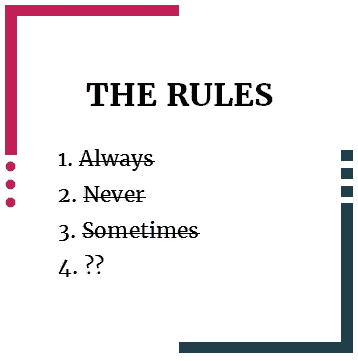

# 最差的写作建议:当规则不是规则的时候

> 原文：<https://medium.com/swlh/worst-writing-advice-when-the-rules-arent-rules-ac60acd9cb6d>

image credit: easyreaderediting.com

并非所有的写作建议都是平等的。

上面那个句子是一个最好的例子。这不是完美的结构，但我喜欢它，因为我的博客是以面对面的方式写的，所以我就这样写了。

这没什么大不了的，但是有些人会对不符合规则的“完美”句子结构感到不安…