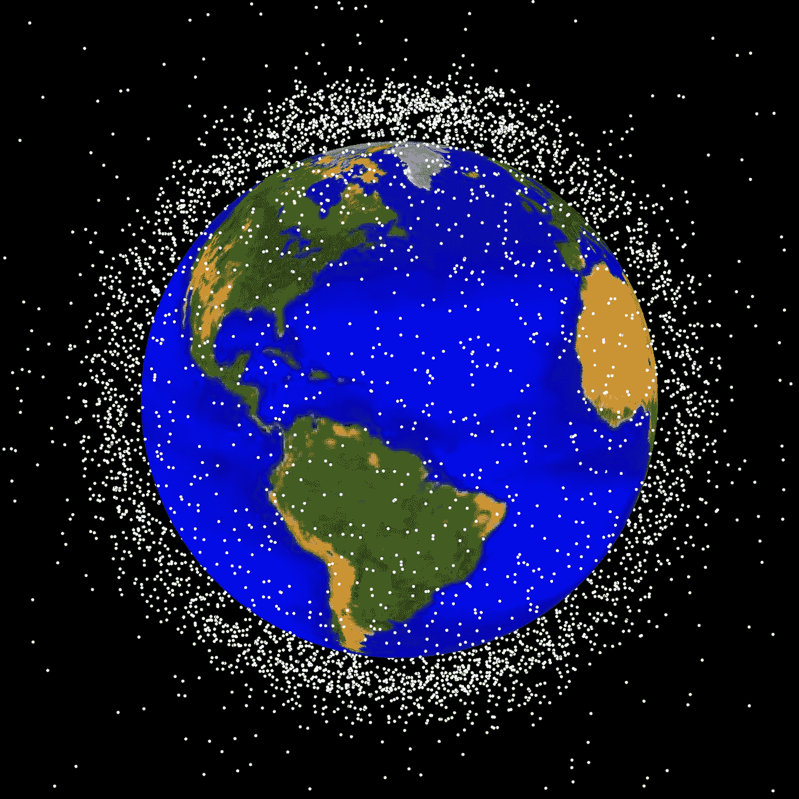

# 想要挖掘小行星的人应该首先考虑地球轨道上有什么

> 原文：<https://medium.com/swlh/would-be-asteroid-miners-should-first-consider-whats-in-orbit-around-the-earth-a919393f455c>

[Courtesy NASA](https://appel.nasa.gov/2010/01/01/the-greening-of-orbital-debris/)

每天有五千颗卫星从你头顶飞过。只有大约两千人在工作。其余的都是“垃圾”…不起作用…完蛋了。它们代表大约价值 200 亿美元的物质漂浮在太空中。目前活跃的 2064 颗卫星的平均重量是[3212 磅](https://www.ucsusa.org/nuclear-weapons/space-weapons/satellite-database)。如果报废的卫星遵循这个平均值，这意味着…