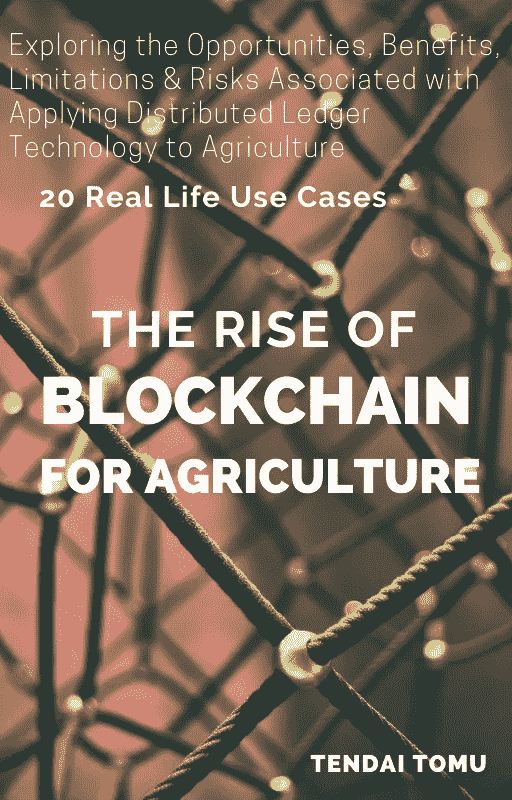

# 你会选择永生吗？

> 原文：<https://medium.com/swlh/would-you-choose-to-live-forever-82c44f20f318>

Photo by [Gabby Orcutt](https://unsplash.com/@monroefiles?utm_source=unsplash&utm_medium=referral&utm_content=creditCopyText) on [Unsplash](https://unsplash.com/?utm_source=unsplash&utm_medium=referral&utm_content=creditCopyText)

## 比我们的孩子活得长会是什么样子？

> 科学家的一项发现可能会导致一种革命性的药物，实际上可以逆转衰老。这种药物可以帮助受损的 DNA 奇迹般地修复，甚至通过保护火星上的美国宇航局宇航员免受太阳辐射来保护他们。一组研究人员在发现 DNA 修复和细胞老化的关键信号过程后开发了这种药物。
> 
> [每日邮报 201](http://months.http://www.dailymail.co.uk/sciencetech/article-4343142/Human-trials-age-reversing-pill-start-six-months.html) 7

如果上面的报道有一定的真实性，研究有一些药丸，那么我可以想象未来几乎每个人都在服用某种药丸来长生不老。

然后——嘣，人们开始死去。

哦，对不起。

我们犯了一个错误，它不像宣传的那样工作！

当我还是个孩子的时候，我非常害怕死亡

我记得曾经许下一个愿望，希望永远活下去。在我自己扭曲的思维范围内，我努力理解人类的“意识”是什么，以及我们死后它会发生什么——我推理说，我宁愿避免死亡，也不愿面对我没有完全理解的东西。

我还没有完全找到我成长过程中所有问题的答案，但我可以说，我现在对永生持怀疑态度。

尽管我仍然对遥远的未来很好奇，但我不想永远活着。

永远是一段很长的时间，正如他们所说，没有什么可以永远持续下去！

> 我不知道圣经中的诺亚是如何设法与自己一起生活了 900 多年的！

永生意味着经历你所爱的人的死亡——除非每个人也能永生。但是对资源的竞争将会如何发展呢？

# 好消息！！！

正如之前所承诺的，这本书更深入地探讨了这个话题，现在已经为你准备好了。

Purchase the book: |[Amazon](https://t.co/s9z9MLp7LT?amp=1) |[Gumroad](https://gum.co/iDLha) | [Bitcoin](https://t.me/Blockchain_Agriculture)|

如果每个人都能长生不老，地球会发生什么？我非常怀疑地球能够生产足够的食物和水来满足每个人的需求！

我想多活一千年还是几百万年？当然了。这将是一个有趣的尝试——只要我爱的人和我在一起，我的身体是年轻的，新鲜的和充满活力的。

等等——如果我们能长生不老，这是不是意味着我的国家养老金也会长生不老？

这个世界已经是一个黑暗扭曲的地方了。在我们来到这里的短暂时间里，我们经历了无数的战争、饥荒和无法治愈的疾病。我不喜欢成为这个我们称之为家园的星球持续退化的长期见证人..

永生很可能会非常无聊和痛苦。一个人也可能会没有有趣的事情可做。在同一个星球上行走了几个世纪之后，生活肯定会失去意义。

> 阿桑特·萨那

*如果你喜欢这篇文章，请关注我的*[*Twitter*](https://twitter.com/Tendy263)*/*[*Linkedin*](https://www.linkedin.com/in/tendai-tomu-75903612/)*。你也可以在这里* *给我买一杯* [*咖啡！*](https://www.buymeacoffee.com/Tendy263)