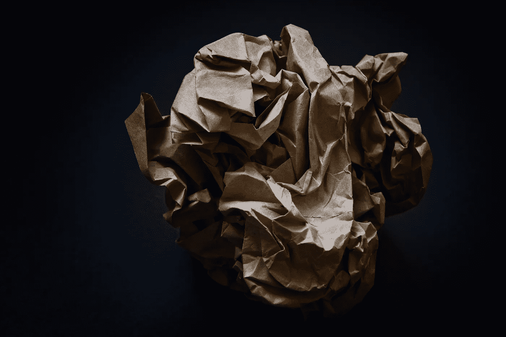

# 渺茫的希望

> 原文：<https://medium.com/swlh/wrinkled-hope-90d0575ca63e>

Photo by [Thomas Stephan](https://unsplash.com/photos/Y5wZ2p3AuaQ?utm_source=unsplash&utm_medium=referral&utm_content=creditCopyText) on [Unsplash](https://unsplash.com/search/photos/wrinkled-paper?utm_source=unsplash&utm_medium=referral&utm_content=creditCopyText)

## 关系中破碎的信任是如何难以修复的。造成的损害无法挽回，可以重建。

拿出一张纸；一张平整、干净、新鲜的纸。每当你伤害了你爱的人，就在纸上弄皱一部分。说你做了什么，皱另一个斑点。例如，如果你对你的伴侣大喊大叫，皱起一角…