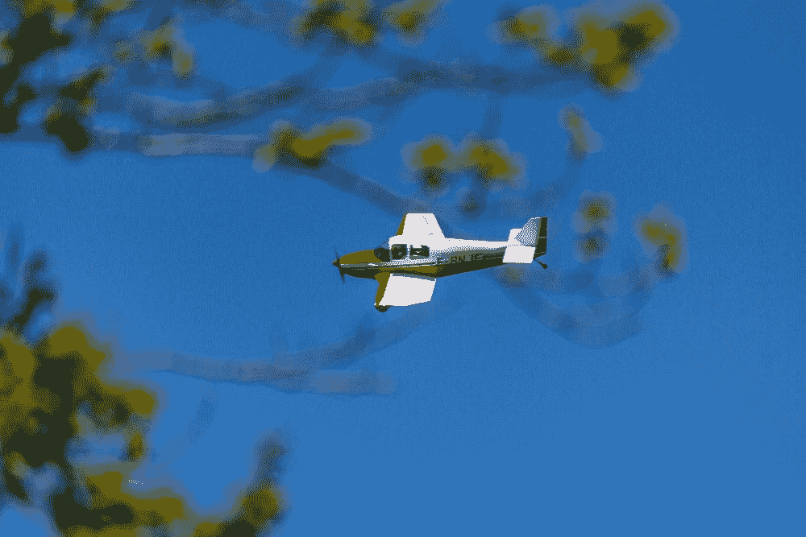

# 写作吧，就像没有人在阅读一样

> 原文：<https://medium.com/swlh/write-like-no-ones-reading-9ae17b7c7d9d>

## 看着你的话语翱翔

Photo by [Devon Rogers](https://unsplash.com/@dev) on [Unsplash](https://unsplash.com/photos/1iv21WJjTzA)

## 写作有点像开飞机。

我爸爸是私人飞行员。我 10 岁的时候开始和他一起飞行。我喜欢飞行，99%的时间我都很舒服。我唯一紧张的时候是在着陆前的 30 度转弯和有气流的时候。否则，我相信我爸爸的技术和…