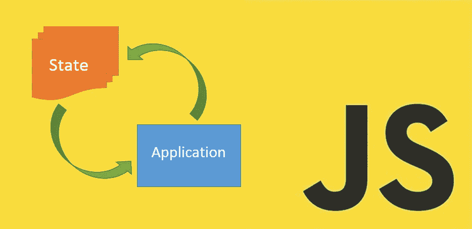

# 编写自己的 javascript 状态管理库

> 原文：<https://medium.com/swlh/write-your-own-javascript-state-management-library-3687d3c09aae>

如果说我们谈论 javascript 应用程序开发时有一件事是无处不在的，那就是状态管理。如果你不知道什么是国家或国家管理，也不知道为什么它在当今如此重要，你可能想读大卫·梅斯特的这篇文章或 T2 的其他文章。