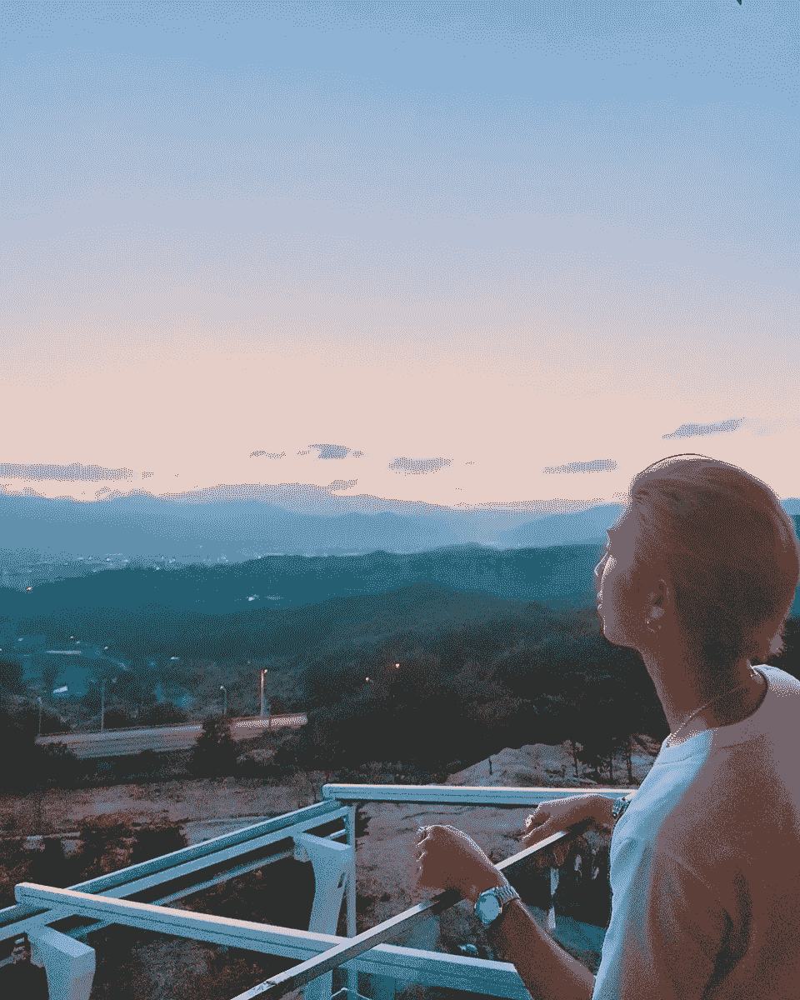

# 作家们，让我们永远记住我们为什么写作

> 原文：<https://medium.com/swlh/writers-let-us-remember-why-we-write-c40c119757b3>

> "用你内心的呼吸填满你的纸."

写作:毫无疑问是一种非常主观的艺术形式。我没有确切的权威来谈论这个话题，因为我正在努力提高自己的技能——但这些是我对写作的一些见解。

写作不是凭空挑选花哨的词语，也不是关于…