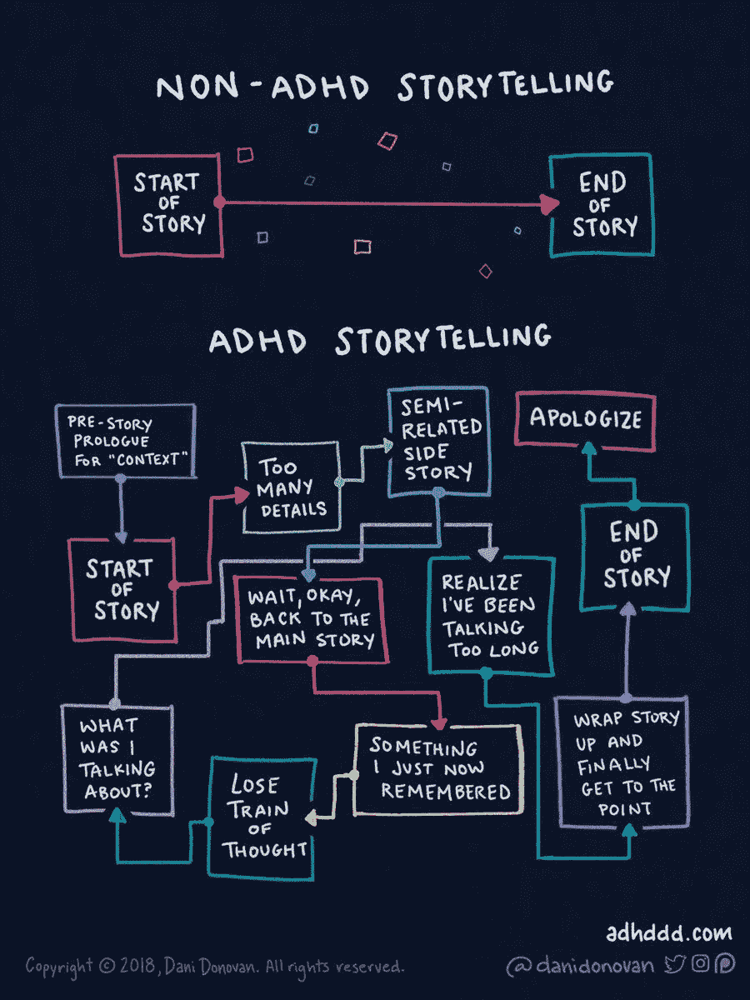
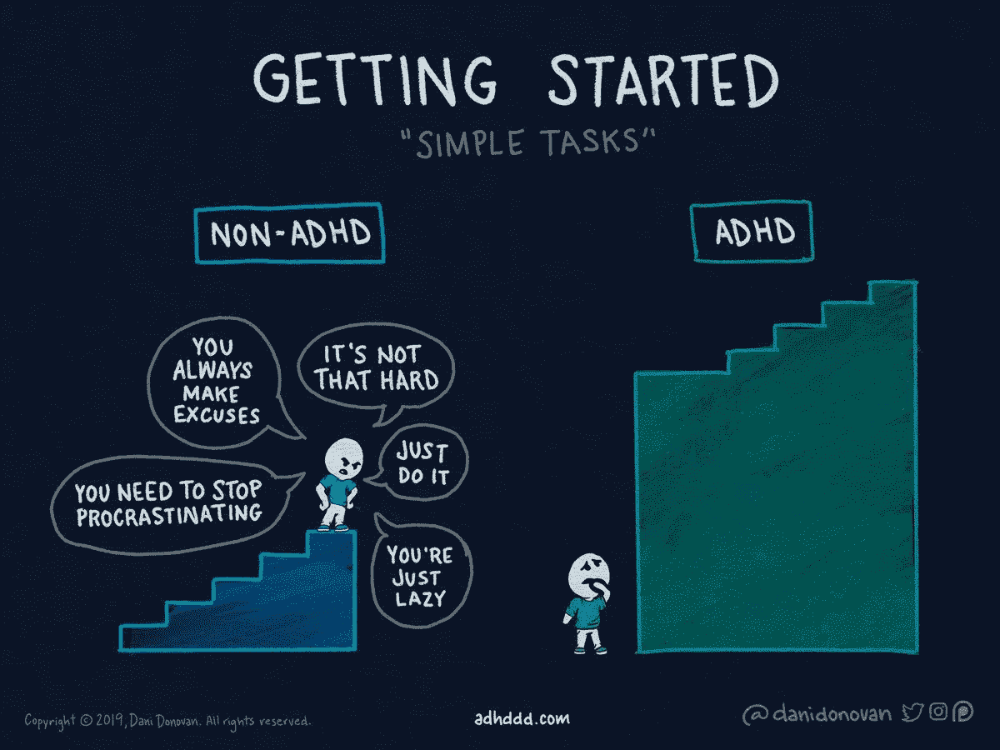

# 患有多动症时写小说

> 原文：<https://medium.com/swlh/writing-a-novel-when-you-have-adhd-9f368bf0916b>

# 你有多动症吗？我有多动症。

我说的不是口语意义上的 ADHD，它是神经典型的人在那天无法集中注意力时随意使用的。我说的是真正的执行功能障碍，这需要一场艰苦的战斗和不可抗力才能得到诊断。

注意力缺陷/多动障碍是一个糟糕的名字。我是我认识的最不“过度活跃”的人。这实际上是一种执行功能障碍，它不仅影响注意力，还影响记忆、动机、组织技能——仅举几例。

我的大脑就像你的大脑一样，但它在优先排序方面有问题。我们的大脑中都有一个小小的看门人，打开门，把我们的思想引导到正确的地方——同时给它们分配一个类别。一些想法是一流的名人和世界领导人，首先得到关注。其他的想法是 D 名单上的名人，或者也许是我们兄弟的女朋友的邻居的猫，这些都可以在以后解决。

对于多动症患者，我的门卫认为每个人都是碧昂斯，所以每个想法都或多或少地得到了同等的 VIP 优先权。

另一种思考方式是这样的:你的大脑是一个网络浏览器，你目前打开了 75 个标签。

真正让人头疼的是，我也是有创造力的类型。从一年级开始，我就是一个狂热的读者，偷偷把保姆俱乐部的书放进我的书桌里，在课堂上阅读。当我还是个孩子的时候，我经常写短篇小说，在我二十出头的时候，我是一个不出柜的同人小说作家，那时写同人小说还不酷。

现在写作虫咬了我一口。事实上，几年前它咬了我一口，但我现在才认真对待它。六年来，我脑海中一直有一个世界、一些人物和一个故事，我想把它变成现实，即使这意味着只有我丈夫会读它，而且它永远不会成为《纽约时报》的畅销书。

所以，大约五个月前，我开始认真地建设世界。我爱幻想，我的故事就是幻想，所以一个丰富多彩的世界势在必行。我最喜欢的幻想作家是不可思议的世界建设者，他们花了大量的时间来充实那些可能无法融入故事或与情节完全无关的细节。尽管这些细节服务于一个被动的目的——它们帮助塑造人物和地点，它们增加世界的深度。另外，这是你以后可以随时使用的材料。

我是一个伟大的世界建设者。这是一个足够结构化的任务，可以让我保持专注，但它给了我自由，让我可以去任何我想去的方向——一切都以故事的名义。但是最大的障碍出现在最终进入正题的时候——写那该死的东西。

当你患有多动症时，你很有可能是一个拖延症专家。对此我也不例外。我的生活是拖延症的大师班。对于一个拖延者来说，没有比最后一刻更重要的时刻了。我最好的作品在最后一刻诞生了，这让我遇到的几乎所有大学教授都很懊恼。

我与拖延症斗争得如此激烈，以至于我开始把她想象成一个海妖。她的歌是如此诱人，她的生命之源是未完成的和被遗弃的。一旦中计，我就完了。

在他们的核心，世界建设是规划阶段，写作是执行阶段。而且规划很舒服。这是不明确的——拖延症警报喜欢不明确。我可以很容易地研究到互联网的尽头，在中世纪的酒馆里玩什么类型的纸牌游戏，这样我就可以把它编织到我的故事的一些微小的细节中。

但最终，必须有一个真正的故事来添加那些巧妙的细节，这需要整个“写这该死的东西”的部分。执行那些精心制定的计划是相当有责任感的。也很吓人。

任何形式的写作都会加剧拖延的因素，因为写作是很难的，即使对于没有多动症的作家来说也是如此。它很脆弱，让人不舒服，而且，天啊，有人会读它的。可能(希望！)很多人会去读它。

此外，我很容易把自己的作品藏起来，不想让别人看，直到每一个句子都很完美，每个细节都完全充实。最终我对自己说，“天哪，我对逗号和语法一窍不通，也许在我尝试之前，我需要参加一些在线英语和写作课程。如果我发布这个狗屎，每个人都会知道我没有常青藤学位！”

这些想法变成了自我怀疑的循环。一旦怀疑的小鬼们抓住了这个，谁知道我什么时候会发布什么？自我怀疑是我拖延症魔女之阳的阴。他们互相扶持。我的怀疑小鬼们创造了一系列先决条件——在我面对大老板之前，我必须干掉一些小老板:写作。我的拖延症魔女栖息在我的另一个肩膀上，漫不经心地锉着她的指甲，就像“我无所谓！”反正拖延症也不想干了。

当你像奥德修斯一样经过拖延症警报器时，除了塞住耳朵，把自己绑在船桅上之外，如果你像我一样——一个患有多动症的作家，我不知道克服这些障碍的神奇公式。然而，我确实从我的旅程中得到了一些有益的观察。

1.  在开始之前，你不需要知道每一个纳米细节。那只是你的怀疑小精灵在你耳边低语。有世界建设和规划，但大部分发生的事情是有机发展的。享受旅程。
2.  许多作家被认为是“穿裤子的人”，他们凭感觉写作。如果你患有多动症，你可能会挣扎着做一个内裤。对于我们的大脑来说，无组织和模糊的任务是很难完成的，如果你不做一些策划和规划，你的小说将看起来很像我在维基百科上的一次随机狂欢——我开始是因为我想知道凯文·贝肯有多高，五个小时后，我在一个标签上看到了中世纪的秘密社团，在另一个标签上看到了碘片的药理学。
3.  找一个有责任感的人或团体——志同道合的人，他们帮助你，让你保持专注(远离拖延症魔女的诱惑之歌),并能给你反馈。
4.  要明白，如果你坚持认为你必须写一个普利策奖获得者或者失败者，你将永远也读不完第一章。
5.  为自己设定小的期限或里程碑。你需要一种前进的感觉来让火继续燃烧。此外，如果你没有一个截止日期，你不会拖到最后一刻，然后拿出你的才华。
6.  给自己一个结构，但不要被那个结构左右生死。弄清楚你的情节，你的主要人物和他们的动机，一个松散的时间线(想想写作格言“[三个灾难和一个结局](https://www.advancedfictionwriting.com/blog/2010/09/08/making-sense-of-story-structure/)”)，然后跟着它跑。有些结构是好的。把自己关在一个角落里，最终压制你的创造力是不好的。

最重要的是？对自己温柔一点。任何人都可以与世界分享他们的故事——你不需要文学博士学位。你只需要勇敢。

释放你的创造力，我的神经多样化的朋友们。不要让多动症(或任何其他问题)成为你和发挥想象力之间的障碍。找到你的部落，找到结构和创造力的平衡，并在前进的道路上杀死那些拖延塞壬和怀疑小精灵。