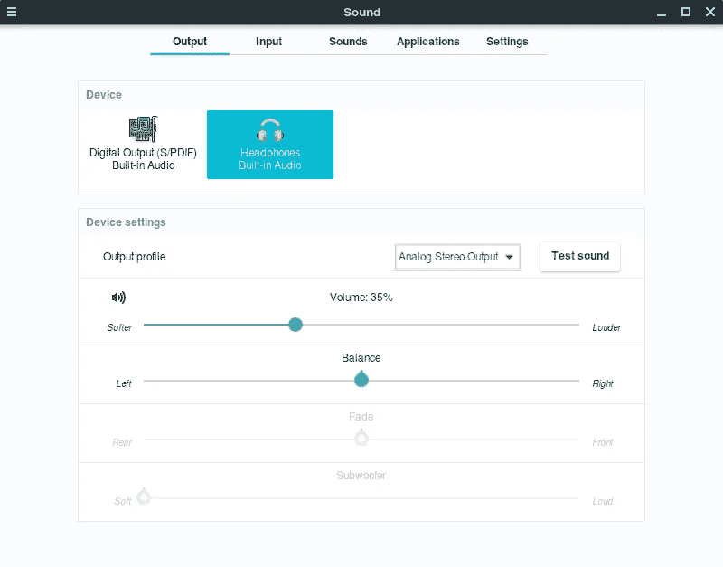
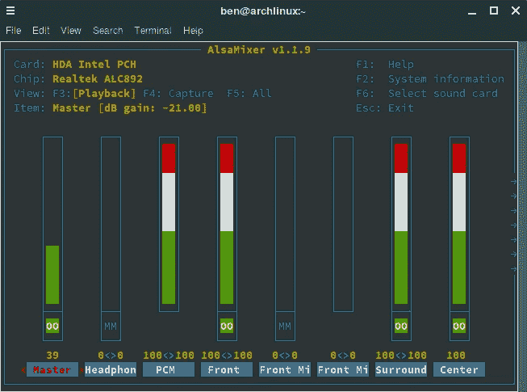
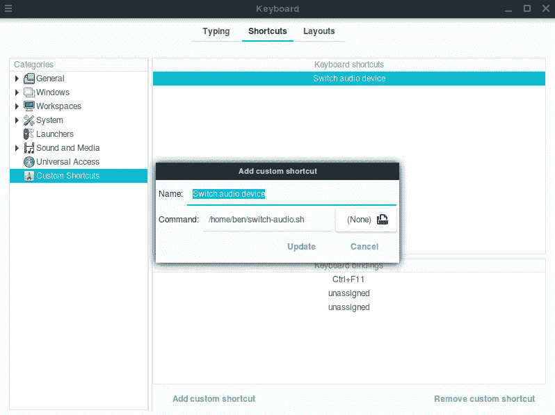
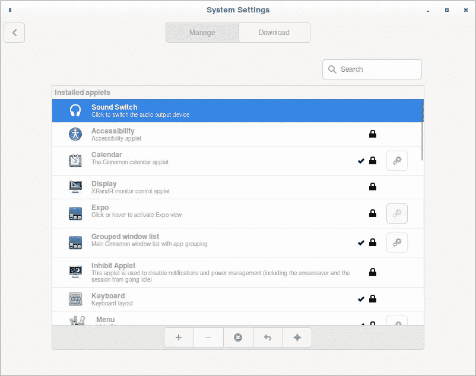

# 为 Cinnamon 桌面编写一个简单的任务小程序

> 原文：<https://medium.com/swlh/writing-a-simple-task-applet-for-cinnamon-desktop-38cc4e499372>

不久前，我安装了 Arch Linux。宇宙法则规定我在山顶喊出它，所以我们在这里。当我决定使用哪种桌面环境时，我想尝试一些新的东西；我用了 Ubuntu 很多次，所以我想避开 Unity 和 Gnome。进入[肉桂](https://github.com/linuxmint/Cinnamon)。它相当受欢迎，我听说过它的好处，所以我想我应该试一试。

我以前从未为 Gnome 或 Cinnamon 开发过，所以创建 Applet 对我来说是一个新领域。这是一次有趣的旅程，所以我将在这里分享我的经历，希望能帮助其他想做同样事情的人。

# 一个基本的用例

当我在家使用台式电脑时，我经常需要在扬声器和耳机之间切换音频输出。在 Windows 上，这是相当微不足道的；我可以点击系统托盘中的音量图标，点击设备下拉菜单，选择我想要的输出设备。

为此，我使用了键盘快捷键 [SoundSwitch、](https://soundswitch.aaflalo.me/)，这也很有用，因为我可以告诉它我想要在旋转中使用哪些设备，从而消除诸如纯数字或虚拟输出设备之类的干扰。这意味着我可以通过键盘快捷键 *Ctrl+Alt+F11* 在任何应用程序中快速切换扬声器和耳机。

正如我将在下一节解释的那样，在 Linux 上这并不简单。从好的方面来看，这意味着我可以创造一些东西了！我最初的目标很简单:通过使用键盘快捷键来切换音频输出设备。

# 探索解决方案

为什么我首先需要创建自定义的东西？就我的声卡而言，扬声器和耳机显示为单个*设备*上的两个*接收器*。主动接收器是通过物理地插入和拔出耳机来触发的，而且，至少在 Gnome 和 Cinnamon 中，不可能强制激活其中一个。



Cinnamon’s sound settings don’t have an option to change the active sink.

使用`alsamixer`可以获得更细粒度的控制。它为设备和接收器提供了混音器接口，以及一些低级声音设置。在用 F6 选择了我的声卡之后，我看到了混音器。



`Headphones`和`Front`是我要找的水槽。将`Auto-Mute Mode` 设置为`Disabled`后，我可以通过将一个滑块设置为 0，另一个设置为 100 来切换输出。这里只有一个问题: *alsamixer* 是一个交互式终端应用程序，因此不适合编写脚本。

幸运的是，`amixer`提供了类似的功能，但是使用的是非交互式命令。

```
amixer -c0 set "Auto-Mute Mode" Disabled # Disable auto-muting
amixer -c0 set 'old-device-name' 0%      # Mute the old device
amixer -c0 set 'new-device-name' 100%    # Enable the new device
```

另外，我需要使用`pactl`来告诉操作系统我们正在使用哪个接收器。

```
pactl set-sink-port 0 'sink-name'        # Set the desired sink
```

到目前为止，一切顺利。如果我使用正确的设备和接收器名称运行这些程序，我可以将输出切换到我想要的设备。

# 编写脚本

为了离我的目标更近一步，我需要一个脚本来运行上述命令，以便输出设备可以来回切换。我还选择使用`notify-send` 来显示一个短暂的桌面通知，让我知道输出已经成功更改。这是我想到的:

我们做到了！每次运行这个脚本时，它都会在耳机和扬声器之间切换。

# 键盘快捷键

现在我有了解决方案的脚本，我需要告诉 Cinnamon 在按下所需的键盘快捷键时运行它。谢天谢地，这并不难。*键盘*菜单有一个添加自定义快捷键的选项卡。设置好想要的组合键后，我把它指向我写的脚本。



I wanted to make the shortcut Ctrl+Alt+F11 like SoundSwitch, but that’s reserved for TTY, so Ctrl+F11 did the trick.

这似乎符合我的要求！按下 *Ctrl+F11* 将调用脚本，它将切换音频设备并发送一个漂亮的小通知。

# 更上一层楼

我实际上在我的工作流程中使用了上面的脚本一段时间，但是感觉好像缺少了什么。我希望有一个指示器，显示当前选择了哪个设备，以及通过鼠标点击切换设备的能力。系统托盘似乎是最适合这一点。有一段时间，我试图在 Cinnamon 的系统托盘中搜索编写应用程序的教程，结果出人意料地少。最终我意识到为什么:Cinnamon 上的系统托盘应用程序有一个名字:[小程序](https://cinnamon-spices.linuxmint.com/applets)。

# 编写我们的第一个 Applet

作为一名用户，到目前为止，我对肉桂非常满意。它简单、美观、可定制。另一方面，作为一名开发人员，我对此非常失望。

肉桂是[侏儒](https://www.gnome.org/)的叉子。正因为如此，它继承了它的很多功能。这是一件好事:Gnome 有很好的文档记录(除了一些明显的例外)并且很受欢迎，这使得它对像我这样的新手相对来说很受欢迎。

问题是 Cinnamon 对 Gnome 的改变没有很好的记录，至少对我来说，很难找到，或者在某些情况下不存在。

他们确实提供了如何编写简单 Applet 的快速教程。我以此为起点开始修补。伊莱·比劳尔的这篇博客文章更有帮助。有了这些资源，我就能制作一个小程序，当它在系统托盘中被点击时，将运行与我们上面的脚本相同的命令。两个必需的文件是`metadata.json`和`applet.js`。这是我的第一个`applet.js`的样子:

点击小程序，调用`on_applet_clicked()`函数。从那里我调用助手函数`switchDevices()`和`updateIcon()`。

Cinnamon 的基本 Applet 教程对我来说开始崩溃的地方是当我需要捕获一个系统命令的输出时，即`pactl` *，*以获得当前的输出设备。Cinnamon 的`util` 库不提供这种东西，所以我只好看底层实现，直接使用`GLib` 命令。

> **注意**:使用 GLib 的`spawn_command_line_sync()`是少数几个在你试图安装你的小程序时会导致警告出现的功能之一，声称它可能会导致 Cinnamon 的问题。当我运行的一些命令比预期的时间长，导致整个桌面挂起时，我发现这是准确的。

您还可以看到，我正在根据当前的输出设备设置图标。正如 Cinnamon 的教程中提到的，图标名引用了`/usr/share/icons`中已安装的图标。我发现图标`audio-headphones` 和`multimedia-volume-control`分别是耳机和扬声器的很好的类比。注意，我使用的是符号图标[因为系统托盘图标应该是简单单色的。](https://wiki.gnome.org/Design/OS/SymbolicIcons)



The Applet can be installed from the Applets menu, after which it will appear in the system tray.

总而言之，上面的代码和 Cinnamon 的示例小程序没有太大区别。它是一个`IconApplet`，点击时会执行一个动作。

我们完了，对吧？

# 小程序和信号

此时，我对自己的第一个小程序非常满意。当点击时，它做了一件事，它很快，它有漂亮的图标，可以正确地更新。只有两个问题:

1.  小程序本身不是由键盘快捷键触发的。
2.  如果我把旧的脚本挂在键盘快捷键上，Applet 图标就会不同步。

现在，我不会告诉你我花了多少时间试图弄清楚如何让小程序响应全局键盘快捷键。简单地说，我尝试了很多不同的方法，当我最终想出一个解决方案时，我感到非常沮丧。*找到了！*瞬间发生在我淘内置声音小程序代码的时候。我看那里是因为音量图标会根据当前的音量设置而改变；它必须与系统、键盘或其他设备连接！我看到了这几行代码:

```
this._sound_settings = new Gio.Settings({ schema_id: CINNAMON_DESKTOP_SOUNDS });
this._sound_settings.connect("changed::" + MAXIMUM_VOLUME_KEY, Lang.bind(this, this._on_sound_settings_change));
```

我们来分析一下。可以说这些行中最重要的部分是`connect`函数调用。 [Gnome 和 GTK 使用*信号*](https://developer.gnome.org/gtkmm-tutorial/stable/sec-signals-overview.html.en) 来允许任何对象触发任何其他对象上的事件，而不需要发射器知道关于接收器的任何事情。我用 Qt 做过一些工作，所以这个概念对我来说很熟悉。您会注意到在 Gnome 和 Cinnamon 文档中，许多对象都有一个信号列表，就像它们有一个属性和函数列表一样。这就是我们要利用的优势。

声音小程序连接的是什么？[g 设置](https://developer.gnome.org/GSettings/)。`Gio.Settings`允许我将我的小程序连接到 GSettings 键的 `[changed](https://lazka.github.io/pgi-docs/Gio-2.0/classes/Settings.html#Gio.Settings.signals.changed)` [信号](https://lazka.github.io/pgi-docs/Gio-2.0/classes/Settings.html#Gio.Settings.signals.changed)[。这就是我需要的联系！](https://lazka.github.io/pgi-docs/Gio-2.0/classes/Settings.html#Gio.Settings.signals.changed)

这是我的新计划:将小程序连接到我自己创建的 GSettings 键，并在设置改变时更新设备和图标。我们开始吧！

# 创建 GSettings 模式

为了编译我的 GSettings 模式，我需要在`/usr/share/glib-2.0/schemas`中创建一个`.gschema.xml`文件。这是我的样子:

`schema`的`id`和`path`属性应该是唯一的。`id`的约定是使用反向域名，后跟模式的唯一标识符。相同的内容可以用于`path`，除了使用斜线作为分隔符。注意`path` *必须*以结尾斜线结束。

我已经指定了 string 类型的名为`device`的设置(因此有了`"s"`)。一旦准备就绪，我需要告诉 GLib 重新编译模式:

```
glib-compile-schemas /usr/share/glib-2.0/schemas
```

完成后，我可以使用我的小程序中的设置。

# 重构小程序以使用 GSettings

现在我已经设置了 GSettings，我可以重构我的 Applet 了。我将它连接到一个指向我新创建的模式的`Gio.Settings`对象。当单击 Applet 时，它不会显式运行命令，而是简单地翻转设置值，让事件流获取它。这将确保无论在哪里进行更改，它都将被 Applet 获取。

现在 Applet 做了和以前一样的事情，除了现在它通过从我们的 GSettings 对象接收信号来做这件事。那么，还剩下什么？

# 通过键盘快捷键激活小程序

我剩下要做的就是使用键盘快捷键来触发设置更改。因为我已经将 *Ctrl+F11* 连接到一个 bash 脚本，所以我简单地修改了脚本，使用`gsettings` CLI 来进行修改。

就是这样！现在，我可以通过单击系统托盘中的图标或使用组合键来切换音频输出设备。在这两种情况下，都会更新图标并显示通知。任务完成！

完整的代码[可以在 GitHub 上找到。](https://github.com/BenJuan26/sound-switch-applet/tree/master)