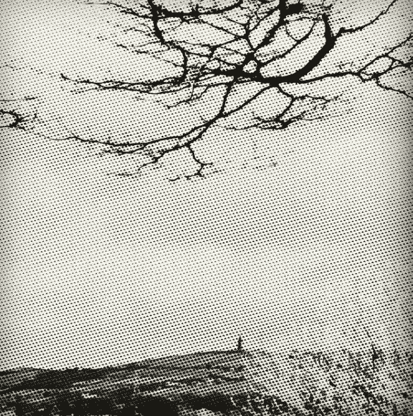

# 写角色——事情并不总是像它们看起来那样…

> 原文：<https://medium.com/swlh/writing-characters-things-arent-always-what-they-seem-a565820b0e0e>

Hartshead Pike

事情并不总是像它们看起来的那样。

我经常被问到的一个问题是:你的主角是以你为原型的吗？是你吗？'

作为一名小说家，人们会问我是如何塑造我的人物的。我在哪里可以找到他们？我怎么认识他们？他们是我吗？他们是朋友吗？亲戚？一个人在一次写作活动中与我争论说我不能…