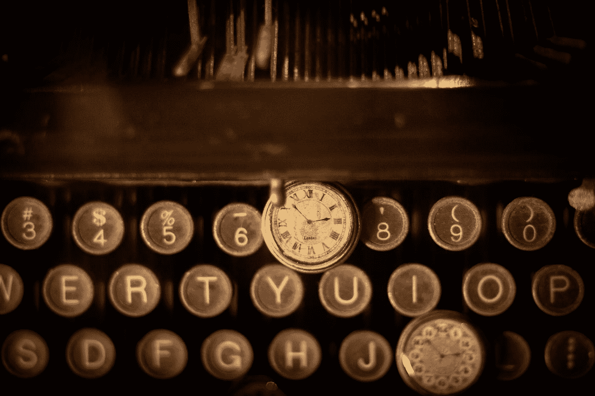

# 书写魔法

> 原文：<https://medium.com/swlh/writing-magic-eb6f17949af0>

Photo by [Cliff Johnson](https://unsplash.com/@cliff_77?utm_source=medium&utm_medium=referral) on [Unsplash](https://unsplash.com?utm_source=medium&utm_medium=referral)

## 就像挥舞魔杖一样，你体内的魔术师将手指放在琴键上开始，句子响起，涟漪效应开始。

## 实际上，你有 8 秒钟的时间来抓住读者的兴趣。