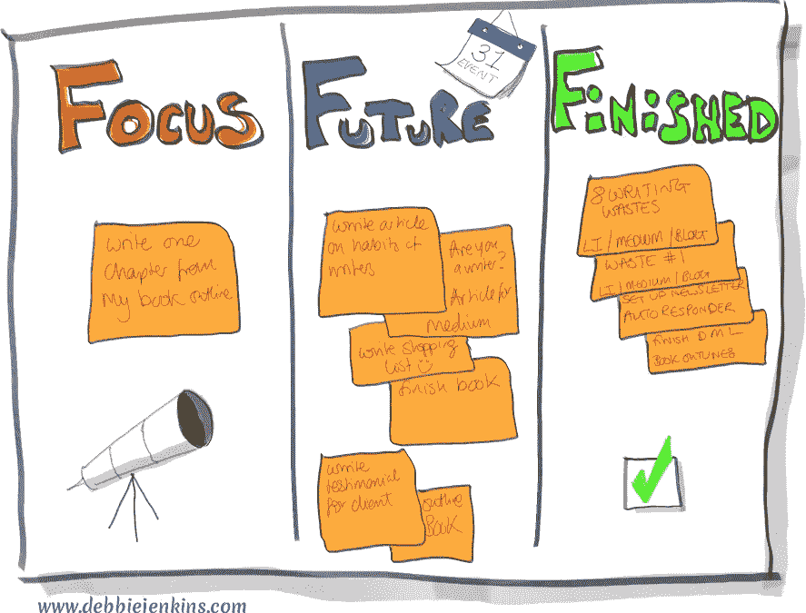

# 写作浪费 2:想法太多(正在写作)

> 原文：<https://medium.com/swlh/writing-waste-2-too-many-ideas-writing-in-progress-b934121fee15>

“金星，我想看看金星。现在土星！土星是我的最爱。看，火星来了。快回金星，快到山后面去！”

几年前，当我们搬到#DisasterFarm 时，这里没有光污染，星星的美景给我们留下了深刻的印象。所以我买了我的意大利-半个望远镜(比我高)作为他的生日礼物。我然后…