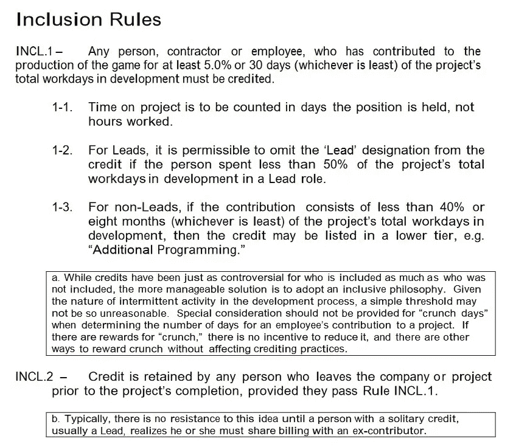

# XSEED Games 在公司离职后取消了游戏制作人的积分

> 原文：<https://medium.com/swlh/xseed-games-removes-producer-from-game-credits-after-company-departure-124ea70e0f61>

广受欢迎的《英雄传奇》系列背后的出版商陷入了困境，因为该公司的一名前制片人透露，在她离开公司后，他们开始从她之前制作的所有游戏中删除该制片人的演职员表。

问题中的制作人是 Brittany Avery，她在 6 月 7 日发现她的信用已经从 PlayStation 4 端口的【T2:英雄传说:冷兵器之路】中被移除。她在推特上表达了对此事的不满。

在这条推文流传开来并让人们开始讨论之后，XSEED Games 的决定遭到了强烈反对。事情发展到这一步，XSEED 发布了一条推特来回应批评，这进一步引发了对该公司的反弹。

除了受到游戏社区的普遍批评之外，一些行业专业人士也是 XSEED 关于工作室离开的所谓“政策”的批评者之一。仅举几个例子，这包括组成 [Tendershoot](https://store.steampowered.com/search/?developer=Tendershoot) 的独立开发者之一、杰伊·索伦、拉米·伊斯梅尔、独立开发团队 50%的成员[弗拉姆比尔](https://store.steampowered.com/developer/Vlambeer)和 Epic Game 的尼克·切斯特，仅举几个例子。

这是另一个例子，说明一家公司不断地诋毁和表现出对在他们手下工作的员工缺乏尊重，XSEED 的所作所为不仅破坏和表现出对 Brittany Avery 的完全缺乏尊重，也表现出对其他员工的完全缺乏尊重，这些员工在离开 XSEED Games 后受到了同样的待遇。

不管这个“公司政策”是什么，XSEED 真的需要改革，因为这是对帮助他们把游戏变成现实的人的不公平待遇。如果一个员工开发了这个游戏，他们离开了公司，这并不意味着他们从来没有开发过这个游戏。

看看 XSEED 的反应会很有趣，更有趣的是 IGDA 的反应，因为他们在这之前一直与 XSEED 保持着良好的工作关系，但 XSEED 最近的这一披露似乎违反了 IGDA 关于信用包含的政策。

一定要在下面的评论里留下你对这个故事的想法！

[不和服务器](https://discord.gg/jTqwyYt)

[推特](https://twitter.com/MellowOnline1)