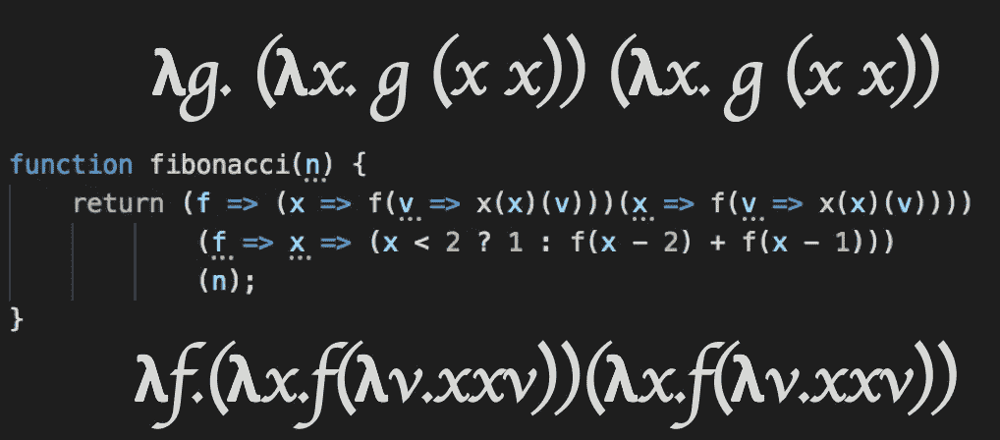

# Javascript 中的 y 和 Z 组合子—带实代码的 Lambda 演算

> 原文：<https://medium.com/swlh/y-and-z-combinators-in-javascript-lambda-calculus-with-real-code-31f25be934ec>



可以只用 Javascript 匿名函数做递归吗？

当然可以。这里是一行中一个数的阶乘

```
const **fact** = x => (x === 0 ? 1 : x * **fact**(x - 1));
```

不不这不是匿名的。您通过一个 Javascript `const`将函数**命名为事实**，并在其自身中引用它。我是说真的…