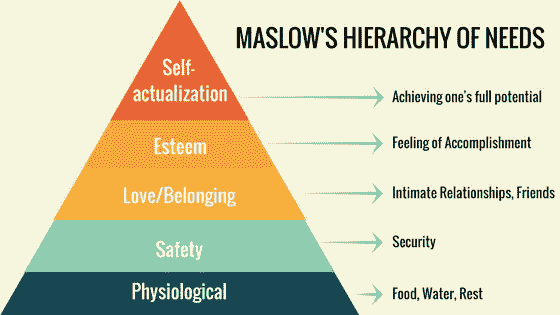
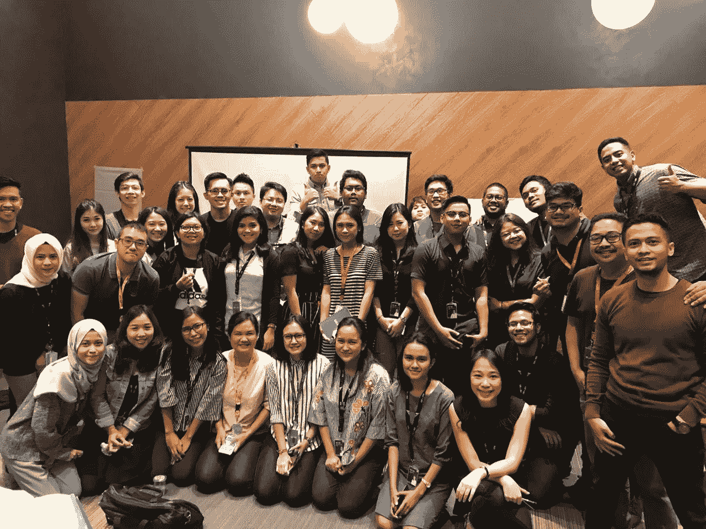
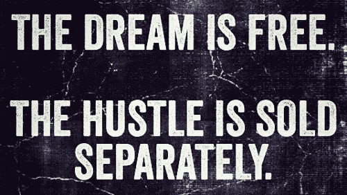

# 第一年:一个独角兽公司员工的反思

> 原文：<https://medium.com/swlh/year-1-reflection-from-a-unicorn-startup-employee-352843c1d85f>

## “快速行动，打破常规”环境的个人指南。

Photo by [Inês Pimentel](https://unsplash.com/@deadqueenines?utm_source=medium&utm_medium=referral) on [Unsplash](https://unsplash.com?utm_source=medium&utm_medium=referral)

***免责声明:*** *本观点不代表或完全反映作者目前工作的公司。所有陈述的观点都是我自己的，它们的应用是主观的——因此，它可能不适用或引起每个人的共鸣。*

距离我上次写文章已经有很长时间了。(*参考* [*我的印尼侨民在 SF 的文章*](/@rdarsono/insights-on-tech-and-the-indonesian-diaspora-in-silicon-valley-18509889ac1) *，以及* [*我 2 个月生涯的反思*](/@rdarsono/soul-searching-meets-learning-8711b96e7f5d) )。

在雅加达生活了一年后，我来到了这里，为印度尼西亚第一家独角兽公司 [GOJEK](https://techcrunch.com/tag/go-jek/) 工作。我碰巧在一个有趣的时间加入了这家公司。我参与了 GO-PAY QR Payment 的扩张，这是 GOJEK 的数字钱包和支付产品，从其起步阶段到目前成为印度尼西亚最大的电子钱包。

我仍然记得 2017 年底我经历招募过程时的焦虑、喜悦和兴奋的感觉。

这看起来很疯狂，现在回想起来，因为这绝对感觉我在这家公司呆了一年多。嗯，他们说为创业公司工作是以狗的年龄来计算的。一年真的感觉像 2-3 年(哈！).

[“Startup Years = Dog Years”](https://userexperiencerocks.wordpress.com/2017/07/13/startup-years-dog-years/) from UX Rocks Blog

我希望在走上这条快车道之前，有人能帮我“分解一下”。然而，如果我已经知道捷径，这次冒险就不会那么刺激了。

所以，这些是我给年轻时的自己或者即将踏上类似旅程的人的建议:

## **1。投资导师和值得信赖的伙伴**

我对导师的定义是，我信任的、工作经验比我丰富得多的人，以及我信任的同伴，或者只是相信你和你的梦想的人。

在你的第一个月，试着积极寻找能帮助你从里到外更多了解公司的新人。我认为你可以从别人的经验中学到很多，看看你在大局中的位置。

不幸的是，对于应届毕业生来说，有一种趋势是陷入他们的职能方面，而没有真正理解公司的愿景，以及他们的个人愿景，以及他们的日常交易如何对此做出贡献。

我不否认，我们中的一些人害怕接近别人或陌生人——认为这可能太多，或者害怕被拒绝或羞愧。

然而，我相信“所有的人一般都很好”这一论点。它们有好的一面，也有坏的一面。在工作环境中，那些已经有所成就并且做得很好的人有更多的东西去寻找。也许——他们觉得有回报的动力？指导年轻员工？或者更好的是，他们在你身上看到了年轻时的自己。想想马斯洛需求层次理论中的自我实现部分。

Read more about Maslow [here](https://en.wikipedia.org/wiki/Maslow%27s_hierarchy_of_needs)

有了这个提议，你就可以带着真诚的意图和个人情感去接触新的人际网络。尽管有一些警告，包括 1)你没有浪费他们的时间 2)你对这个人充满热情，你们有共同的兴趣 3)你保持尊重，并不断尝试增加价值。

可以尝试的事情:*联系你附近的工作伙伴，邀请他们一起吃午餐或喝咖啡。利用 LinkedIn，公司内部信息工具，或者你的“弱网络”节点(校友，共同的朋友等)。*

Our team has grown 10X from <10 in early 2018 to 100+ in 2019

## **2。忙碌和成长的心态**

我将“忙碌”定义为对实现目标的渴望(或驱使你到达理想目的地的能量)。成长心态(相对于固定心态)是一种信念，认为你可以在某件事情上不断变得更好。

I know it’s controversial, but this statement just strikes a chord with me.

考虑到你的具体目标，忙碌和成长的心态将会补充你的旅程。这两个属性将帮助你进入未知的领域，并以强势结束。

努力是你前进的动力。它必须是能直接“打动”你的东西。要么你有要么没有。它是一个二进制数。夸张地说，这是熬夜、鲜血、汗水和泪水。然而，你必须用自我意识来平衡这一点，因为每个人都有不同的努力程度。

Input = Output; but to work smarter, input < output (you input 20% for 80% in output)

此外，成长心态是区分“学习者”和“非学习者”的标准。就是比较优势。在这个时代，有这么多的机会去学习，提高自己！

Check out Adam Grant if you are into Organizational Psychology!

我个人喜欢去参加行业活动，了解最新趋势，接触新朋友。在这里查看您所在地区的最新活动: [Eventbrite](https://www.eventbrite.com/) 、 [Meetup](https://www.meetup.com/) 、[脸书活动](https://www.facebook.com/events/)。

在 Twitter 上关注行业领袖，在 Spotify 播客中倾听他们的声音，订阅他们的电子邮件列表，阅读他们的故事。(对于新手我推荐:[零对一](https://www.goodreads.com/book/show/18050143-zero-to-one)、[精益创业](https://www.goodreads.com/book/show/10127019-the-lean-startup)、 [Y Combinator 的创业库](https://www.ycombinator.com/resources/)、 [a16z](https://a16z.com/content/) 的文章、[首轮复习](https://firstround.com/review/))。

要尝试的东西:

*不断问自己，你是否能在某项特定任务上提高 1%、5%等等。*

*X %的改进是什么样的？在‘X’领域，什么被认为是世界级的表现？在你的角色中，谁是世界级的表演者？我该如何向他或她学习？*

## 3.平衡硬技能和软技能

技术技能很重要。它标志着你的能力。你的硬技能会让你得到这份工作，并完成最简单的任务。对于初创公司的分析职位，我的建议是掌握统计学、Excel、SQL 和 Powerpoint 的基础知识。

“In short, think MECE-ly ” — a consultant

此外，不要忘记这三项被低估的终身技能:阅读、写作和公开演讲。你会惊讶地发现，有多少人，甚至那些更有经验的人，并没有展现出这些技能。

除此之外，为了成长和繁荣，我们需要培养极度的好奇心、勇气、所有权、谦逊和自我意识。

而且，以上都像肌肉。

你用信念、时间和经验来训练他们。打个身体健康的比方——你需要热身、训练、滋养你的身体、举起更重的重量、做更多的重复，或许在别人最后一次重复时帮助他们。

有时候你可能会受伤，但这没关系。你可能需要休息，但你可以更坚强地站起来！

要尝试的东西:

报名参加一门你一直想上的课。投入其中。去参加那个会议或者培训。投资它。买那本书。滋养你的心灵。与那个人交流。建立友谊。

如果你到了这一部分，这是甜点:

为创业公司工作最有收获的事情之一是，有许多不同团队和个人设定最高标准的例子。

最棒的是，你可以直接从他们那里学到东西。如果没有，你仍然可以从他们的工作中学习。看到人才集中在一个公司里，真是太神奇了。

此外，你可以犯很多“错误”(这是学习的最高形式)，而且它不会让你“付出”任何代价(当然，根据严重程度，它可能会也可能不会影响你的证书)。

总而言之，我想说:

## 感谢我的导师和信任的伙伴——因为你们让我看到了想法的多样性，以及你们做的很酷的事情。

## 而且，它激励我不断挑战自己的极限，做最好的自己。

## 而且，我很感激能够在我的工作中融入领导力、同理心和目标。

## 现在，让我们通过我们的工作来传播爱，❤.

## 反正开心多分享多联系！请随意发送电子邮件或邀请。在这里可以找到，在这里可以找到。

## 这篇文章发表在[《创业](https://medium.com/swlh)》上，这是 Medium 最大的创业刊物，有+443，678 人关注。

## 在这里订阅接收[我们的头条新闻](https://growthsupply.com/the-startup-newsletter/)。

