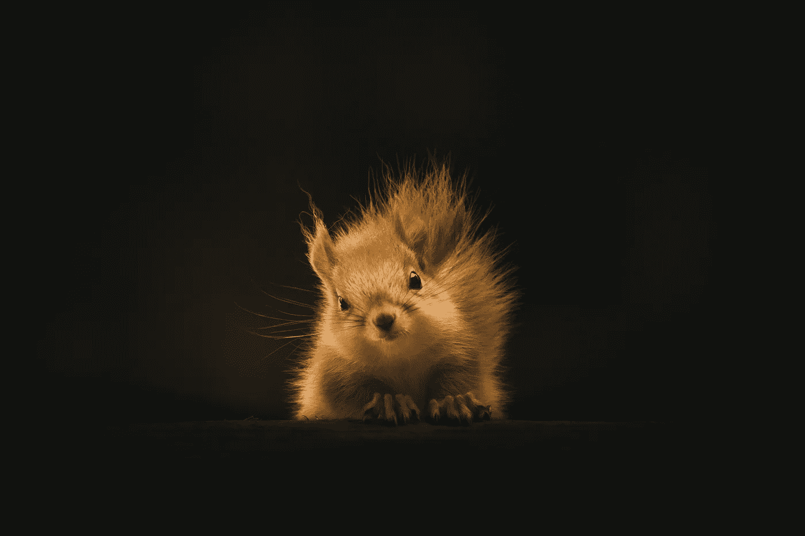

# 当你觉得自己是个又大又胖的零蛋时——记住这一点

> 原文：<https://medium.com/swlh/you-are-a-big-fat-zero-and-that-is-awesome-because-of-these-10-facts-1ed2bcd43e47>

## 当半杯满不仅仅是一个比喻——它是一个自我，打气。

Photo by Geran de Klerk

下一次，你会感到空虚，就像生活中一个又大又胖的零——微笑。一个在纸面上毫无价值的数字在现实生活中却价值连城。象征意义是无价的。

## 1.零确保没有人被遗漏——闪耀…