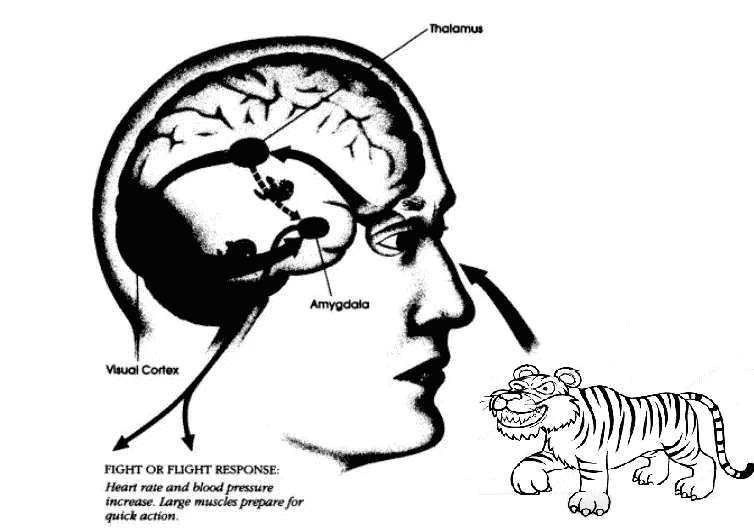
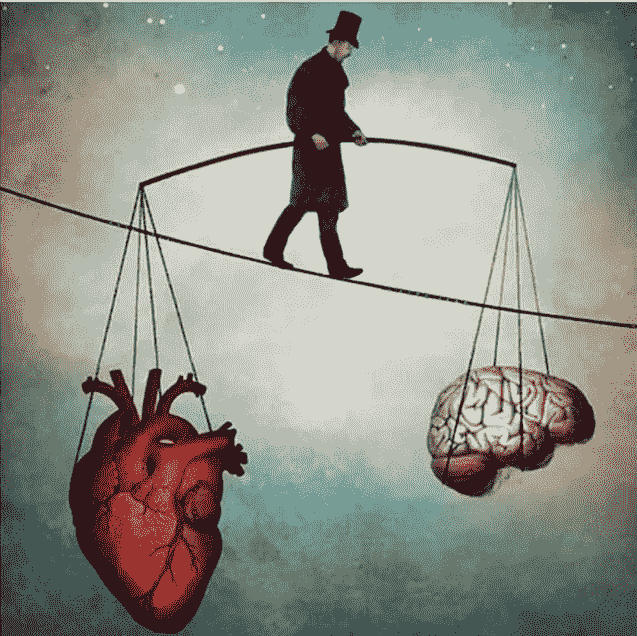
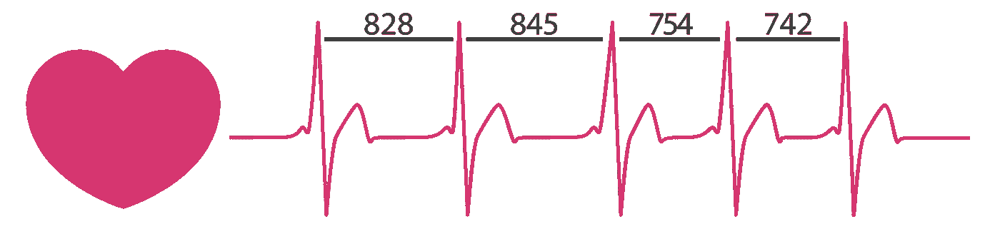

# 你生来就能抵制诱惑——方法如下

> 原文：<https://medium.com/swlh/you-are-born-to-resist-temptations-heres-how-20a5540c261c>

你有多少次发现自己陷入了一场战争，一方面你想变得健康和有效率，另一方面你想在躺在沙发上看网飞的时候狼吞虎咽地吃奶酪蛋糕？

在这场战争中，有时你内心的战士会赢，有时爱吃芝士蛋糕的怪物会赢。

[科学现在发现](https://psycnet.apa.org/record/2011-09271-009)赢得这场战争往往取决于你的生理状态。好消息是，你实际上可以学会有意识地将你的生理状态转换到那种状态。

最精彩的部分？

你可以训练你的身体保持这种强大状态的能力，这样当诱惑来袭时，你的默认反应将是[自我控制和自律。](https://livelikepros.com/increase-self-control/)

所以，让我们看看你如何唤醒你内心的战士。

但首先，你需要了解草莓芝士蛋糕和剑齿虎有什么共同之处。

# 两种威胁的故事——芝士蛋糕和剑齿虎

想象你正在亚马逊丛林中漫步。然后你听到身后的灌木丛在晃动。突然，神圣的狗屎！一只老虎跳出来向你扑来。那一刻你在想什么？没错，你不思考，你就跑。

幸运的是，你的祖先必须处理这样的威胁，而你从他们那里继承了快速应对它们的机制。

这就是所谓的战斗或逃跑。

丹尼尔·戈尔曼——情商[的畅销书作者，用他的话来说，你的大脑实际上发生了什么:](https://en.wikipedia.org/wiki/Emotional_Intelligence)

> 视觉信号首先从视网膜传到丘脑，在那里被翻译成大脑的语言。大部分信息**然后**到达视觉皮层
> ，在那里被分析和评估意义和适当的反应；如果这种反应是情绪化的，一个信号就会传到杏仁核去激活情绪中心。**但原始信号的一小部分以更快的传输速度从
> 丘脑直接到达杏仁核，从而做出更快(尽管不太精确)的反应。**

**On the sight of Danger, your amygdala controls your behavior before you are even aware of it.**

他接着补充道——理解这一点至关重要:

> **因此，杏仁核可以在皮质中枢完全理解正在发生的事情之前触发情绪反应。**

所以基本上，你的杏仁核——大脑的警报系统——抑制了你的深思熟虑和思考的大脑(额叶前部皮层)，而大脑负责理性思考和冲动控制。

这种快速自主的生理状态被称为“战斗或逃跑”反应。它可以确保你迟钝且善于思考的大脑**不会因为过度思考逃跑计划而碍事。**

但是，这跟芝士蛋糕和抵制诱惑有什么关系呢？

## 芝士蛋糕——一种新的威胁

想象一下，你在街区里走来走去，然后砰！你的目光锁定在面包店陈列柜上一块美味的奶酪蛋糕上。

Photo Credit: [thebusybaker](https://thebusybaker.ca/)

你还没来得及说“哦，我在节食”，你就已经在拉门把手了，主人欢迎你挂着舌头，流着口水的到来。

你的大脑*现在*发生了什么？这是凯利·麦戈尼格尔在她的畅销书 [*意志力本能*](http://kellymcgonigal.com/books) *:* 中对这种情况的描述

> 一看到奶酪蛋糕，你的大脑就会给你注射多巴胺，这种多巴胺被大脑中控制注意力、动机和行动的区域所接受。那些多巴胺信使告诉你的大脑“你必须现在就吃奶酪蛋糕，否则你将遭受比死亡更糟糕的命运。”

这就是我们面临新威胁的地方。当你被奶酪蛋糕的美味所吸引时，你的一部分回忆起你有更大的目标，比如健康、穿上你的牛仔裤等等。你的这一部分意识到芝士蛋糕威胁到了你的长期目标。

但是，不像老虎的情况，你只是逃离它，**自动战斗或逃跑的反应是你最不想要的。**

那么，你现在该怎么办？进化赋予了你武器来对抗这样的威胁吗？

## 意志力本能:暂停和计划

肯塔基大学的心理学家苏珊娜·塞格斯汤姆发现，就像压力一样，自我控制也有生物特征。

自我控制会在大脑和身体中级联一系列的变化，帮助你抵制邪恶的诱惑。Segerstom 称这些变化为 ***暂停-计划*** 反应。

“暂停-计划”反应与“战斗-逃跑”反应有一个重要的区别:它是由对内部威胁的感知而不是外部威胁来点燃的。

Inner-conflict

你很想做一件事(抽烟，在工作时访问不合适的网站，等等。)，但你不应该。或者你*应该*做一些重要的事情(完成一个项目，写下你的下一篇博客，等等)，但是你不想做。

这种内部冲突敲响了警钟；一个保护你免受自我伤害的警报器。

在这种情况下，最有益的反应是减速，而不是加速(就像战斗或逃跑那样)。暂停和计划是一种本能，可以帮助你停止破坏性的冲动。

不过，有个问题。

尽管就像战斗或逃跑一样，暂停和计划是人类与生俱来的天性，但你可能会从经验中知道，它并不总是像奶酪蛋糕一样令人本能和信服。

但是有一个解决办法！

# HRV:身体强大的意志力储备以及如何释放它

衡量停顿和计划反应的最佳和最准确的方法是一种叫做*心率变异性(HRV)的奇怪东西。*

Heart Rate Variability — Photo Credit: [firstbeat](http://firstbeat.com)

每两次心跳之间的时间略有不同。

令人惊讶的是，当你处于战斗或逃跑状态时，心率会上升，但 HRV 会降低，即每次心跳之间的时间更加有序和平等。

但是，当你运用自我控制来抵制诱惑时，你的心率会下降，但变异性(HRV)会上升。

心率变异性是意志力的一个很好的标准，你可以依靠它来预测谁会抵制诱惑，谁会屈服。例如，正在康复的酗酒者，其 HRV 在看到酒精时会上升，更有可能保持清醒。

研究显示，HRV 值较高的人更善于忽略干扰，推迟满足感，处理压力大的情况。他们不太可能放弃困难的任务，即使他们最初失败了，并收到了批评性的反馈。

丑陋的事实是 thatو比其他人更幸运，有些人心率变异性更高，因此意志力更强。

这就是为什么用塞格斯汤姆的话说:

> 许多因素影响这种意志力储备，从你吃的东西(植物性饮食，未加工食品有帮助，垃圾食品没有)到你住的地方(糟糕的空气质量降低心率变异性——是的，洛杉矶的烟雾可能是导致高比例电影明星康复的原因)。慢性疾病和疼痛也会耗尽你身体和大脑的意志力储备。

所以，如果你有更多的 HRV，你就有更多的意志力。**现在百万美元的问题？你如何能增加你的 HRV？**

# 深呼吸，增加 HRV 和意志力

接下来是一个简单的呼吸技巧，也是你能找到的为数不多的在情绪激动时能增强意志力的快速方法之一。

面对诱惑，把你的呼吸速度降低到每分钟 4 到 6 次。那将是每次呼吸十到十五秒。

当你的呼吸频率降至每分钟 12 次以下时，心率变异性会稳步增加。

这样做 2-3 分钟，你会对结果感到惊讶。

**Pro tip 1:** 试图减缓呼吸时不要屏住呼吸。否则，会引发压力。

**专家提示 2:** 控制呼气会容易得多。如果你有困难，集中精力减缓你的呼气(想象你正在通过嘴里的吸管排出空气)。

减缓呼吸会激活大脑中被称为*的前额叶皮层*——意志力的所在地——并增加心率变异性。因此，它将你的身体、大脑和身体从紧张状态转移到自我控制状态。

研究表明，经常练习这种技巧会让你对压力更有弹性，并增强你的意志力。

这是如此强大，有 HRV 培训计划，以帮助警察，股票交易员，和客户服务运营商，以提高他们的意志力和自制力。

作为一个额外的奖励，它让你在面对压力和焦虑时有一个清晰和冷静的头脑。

# 摘要

*   战斗或逃跑和暂停和计划都是身体管理能量的方式，但方式完全不同。
*   当你有压力时，你处于战斗或逃跑状态，在这种状态下，身体将能量转移到你的肌肉，让你的前额皮质处于饥饿状态。结果，你切换到一种自动驾驶模式，在这种模式下你无法理性思考。
*   因此，压力与意志力和自制力是不相容的。
*   意志力的最佳衡量标准是高心率变异性(HRV)。HRV 越高，你面对诱惑的自制力和意志力就越高。
*   提高你的 HRV 和意志力的一个快速方法是将你的呼吸减慢到每分钟 4 到 6 次。

当你受到很多诱惑时，你需要的只是放慢脚步。

