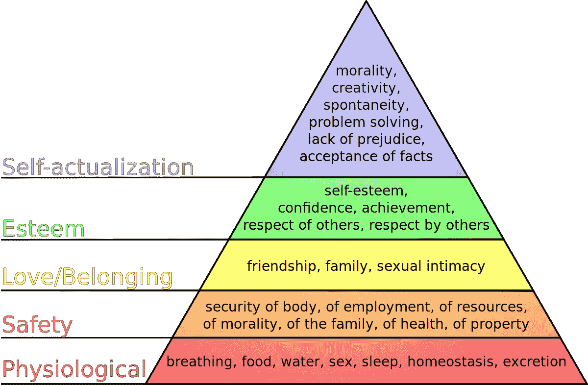

# 你就是你自己的品牌

> 原文：<https://medium.com/swlh/you-are-literally-your-own-brand-6ea3b5b02738>

## 或者:如何不做品牌

The path to branding may be steep & arduous but the view may well be worth it.

我们生活在一个不仅公司有品牌，人也有品牌的时代。不仅是名人，还有所有人。科学家、软件工程师、企业家。部分是由于社交媒体和互联网无处不在的机会，[每个人都被敦促](https://www.inc.com/nicolas-cole/3-years-from-now-if-you-dont-have-a-personal-brand-nobody-is-going-to-work-with-you.html)参与品牌宣传，宣传他们的技能、工作理念和更广泛的目标。与公司相反，人们在建立自己的品牌时没有产品可卖。他们*本身*就是产品。有了这个，他们就获得了影响力。影响被雇佣、推广实际产品或传播特定观点。还有一件可怕的事情，你总是[被告知要避免](https://www.targetinternet.com/a-guide-to-personal-branding/):成为*品牌外的*。说、张贴或做一些不符合你的品牌模式的事情。这正是有趣的地方。因为在大多数情况下，只有当你从一开始就没有个人品牌的时候，它才是品牌外的。你就是你自己的品牌。

假设你是一名医疗保健专业人士，想要建立自己的个人品牌。无数关于这个主题的操作手册会敦促你将大量专业医疗保健内容与你的社交媒体资料联系起来，并严格放弃非品牌主题，如爱好或其他兴趣。这样做是为了避免失去对医疗保健感兴趣的观众，但他们可能不会和你有同样的兴趣。现在，如果你和我一样，你会发现至少在某些时候，这是有限的，令人窒息的。因为这些其他的兴趣不是人为的东西。加上你专业的一面，他们*就是*你真实的自己。自我品牌指南讲述了“有机增长”，因为你内容的质量和一致性，吸引了对这个话题真正感兴趣的人。但是如果你仅仅通过展示你自己兴趣的一个方面来增加你的观众，我宁愿贴上“人工”的标签而不是“有机”的标签。

当然，这是双向的。如果你对生活方式不感兴趣，不要仅仅为了支付账单而围绕生活方式博客建立品牌。不会有结果的，尤其是从长远来看。你必须喜欢、热爱或热爱你的品牌所围绕的东西。如果你真的喜欢生活博客，那又怎么样呢？你的品牌生活方式是什么？你是“生活方式博主”吗？我的问题是:生活方式本身已经是一个品牌。这不是*你的*品牌。你远不止如此。如果你人为地将自己限制在现有的类别中，比如你的科学学科、你的商业分支甚至生活方式，你就不会进行自我品牌化，你*将自己与一个已存在的品牌联系起来。在某些方面，这可能是好的。就可识别性而言，已知和明确的类别是有利的。人们可能会看着你的作品，发现很容易把你归为一类。这可能有助于你[快速建立追随者](https://neilpatel.com/blog/personal-branding/)(因为记住，你并没有真正在这条道路上建立任何东西)。如果你在为一家公司或一项(社会)事业打造品牌，那么独一无二是绝对没问题的。在这方面，你需要快速而强劲的进步，这是借助品牌知名度来实现的最佳途径。但是对于你的个人品牌，考虑一下马斯洛的需求层次。你可能想大胆一点，通过建立自己的品牌来实现自我实现的崇高目标。*

Maslow’s hierarchy of needs which need to be fulfilled in ascending order. [Source](https://commons.wikimedia.org/wiki/File:Maslow%27s_hierarchy_of_needs.svg)

那么，你如何建立自己的品牌呢？你如何将你所有的兴趣(或者至少是有代表性的一部分)结合成一个有吸引力的组合？因为要克服的最大障碍将是使你的整体内容利基对那些不能立即将你归入一个既定类别的人有吸引力。为此，你需要找到你们兴趣的共同点。通常，这需要你找到一个或几个抓住你兴趣本质的高层次概念。你可能对内战、公司危机和总统弹劾感兴趣。到处都是声音。换句话说，你可能会对合法性的概念感兴趣。简洁&可识别。重要的方面是向你的目标受众传达这一首要原则，以减轻他们对你的主要信息的困惑。

有理由认为，这些不同的自有品牌对感兴趣的观众更有用。假设你是观众中的一员，只对公司危机感兴趣。如果这些危机涉及某种形式的合法性(在公司内部或对客户而言)，那么肯定可以从内战等其他领域的合法性危机中吸取教训。现在，如果每个人都坚持己见，历史学家会谈论内战，商人会讨论公司危机。没有重叠，没有协同，没有洞察力。要获得真正的洞察力[你需要跨越界限](https://www.timeshighereducation.com/blog/science-calling-out-nonconformists)。在传统意义上，跨越界限而不“脱离品牌”是非常罕见的。因此，真正的自我品牌的价值主张是你的兴趣的协同作用，这要归功于一个潜在的共同点。

所以本质上，要大胆。如果你真的想宣传你自己，你独特的观点和你个人的领域知识和洞察力的混合物，那么你不应该把自己和一个现有的品牌联系在一起。你应该做自己的品牌。虽然将自己与一个可识别的类别联系起来可能是一条更容易的道路，但你不会通过这种方式产生真正的价值。在大多数情况下，你只会强化一个[过滤气泡](https://en.wikipedia.org/wiki/Filter_bubble)，不幸的是，这个气泡经常围绕在任何给定学科的专业人士周围。自助书籍谈到自我品牌*资产*，提到你的各种社交媒体平台和/或你的个人博客。然而，我坚信你最有价值的资产是你的兴趣和跨不同主题和领域的领域知识。大胆地拆除学科和工作线之间的墙。大胆一点，你实际上会因为自己的某样东西而被重视和记住，而不是为了另一个品牌的无名小卒。做一个人的军队，而不是一个人军队中的士兵。

## 这篇文章发表在 [The Startup](https://medium.com/swlh) 上，这是 Medium 最大的创业刊物，拥有+431，678 名读者。

## 订阅接收[我们的头条新闻](https://growthsupply.com/the-startup-newsletter/)。

