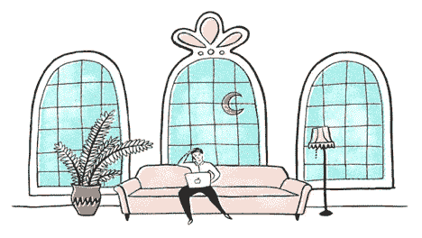
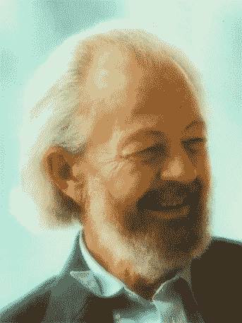
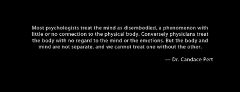
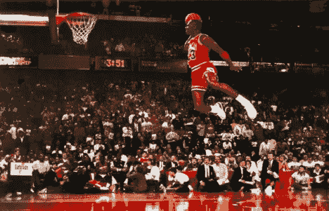
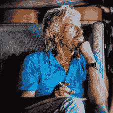

# 你是你自己最大的敌人——停止 8 步

> 原文：<https://medium.com/swlh/you-are-your-own-worst-enemy-8-steps-to-stop-81e9a3f448f9>

Photo by [Karl Fredrickson](https://unsplash.com/@kfred?utm_source=medium&utm_medium=referral) on [Unsplash](https://unsplash.com?utm_source=medium&utm_medium=referral)

## 我真的因为生病而惩罚了自己。

你是你自己最大的敌人。

不管你有多成功，你一直都是，而且永远都是。

无论是从内部倒下的帝国，还是破坏自己成功的个人，它总是更有可能自我破坏，而不是被外部力量超越。

很多时候，这些外部力量之所以重要，只是因为你或帝国变得容易受到它们的影响。

海明威成为有史以来最伟大的作家之一，然后自杀了。

每天都有人成为百万富翁，结果却破产了。

托尔斯泰疯了，纽约州长从他的个人账户给一个妓女汇了钱。

数以亿计的帝国因为一个人的自负而覆灭——而这个被外人超越的帝国是罪有应得。境遇不好的人也是这样或那样。这并不是因为他们个人应得的，也不是恶劣环境的受害者，而是他们的行为创造了他们的反应和结果。

**自然选择永远无法抗拒，对发生在你身上的一切拥有彻底的所有权是掌控一切的唯一途径。**

实践你的[自由意志几乎是不可能的](https://samharris.org/the-illusion-of-free-will/)，因此采取激进的所有权和减少负面影响是关键。

向前生活，就像发生的一切都是你自己的一样。不管是生病还是工作中被忽略。

不管是你的员工工作不好，还是你的公司表现不好。这一切都取决于你，彻底的坦诚和寻求接受残酷的事实只是一个开始。

上周我病了四天，感冒来得太快了。正如传奇人物、被授予爵位的大卫·霍金斯博士(1927 年 6 月 3 日-2012 年 9 月 19 日)如果还活着的话会对我说的:“我们生病是为了自我惩罚，主要是因为内疚”。

当然，这并不是说疾病本身不是身体上的，而是我们持有的信念是如此强大，我们尽一切努力确保我们相信的东西对我们来说是真实的，它们对我们的身体和免疫系统影响如此之大——甚至会给我们自己带来疾病。

如果你不相信这种说法，你要么否认，要么经常成为你周围事物的受害者。

你经常生病吗？

你会遇到不好的事情吗？

你们关系好吗？坏的，还是没有？

你是吸引人还是把人推开？

你的经济状况达到你的预期了吗？

也不需要这么科学。

我的一个家庭朋友总是抱怨所有的事情，在每一次支撑他们自我的打击之后，感觉自己变得更强大、更有意义。你可以理解为什么这位家庭朋友多年来一直找不到工作，并且经常生病，经常看不同的医生。

更糟糕的是，没有告诉他们这是他们自找的，有几次我甚至试图提出建议来结束他们无尽的痛苦，但他们都没有考虑。

***不要成为那个人。如果你想改变，你必须做一些不同的事情。如果你不这样做，你疯了，你活该。***

同样，坎迪斯·佩特博士的开创性工作得出结论:“身体是你潜意识的反映。”

她详细阐述了这些现象:

我知道这是真的，因为我很少生病，唯一一次生病是在我停止禁食/节食的时候——经常吃东西，吃糖，定期注射胰岛素。

当我这样做的时候，我开始讨厌自己——这个问题源于我胖乎乎的童年。对我来说，我的身体变得不那么有弹性，因为我的思想变得不太稳定。

"从你的屁股上起来"

“你为什么把那些都吃了？”

"如果你连吃什么都控制不了，你怎么能指望成功呢？"

“你不应该得到这些。”

**不要误会我的意思，我致力于此，并意识到这些强大的无形力量，它们从童年起就已经在我的思想和身体中燃烧，但只需要一秒钟就可以滑回去，变得容易受其影响。**

当某件事让你情绪激动时，这意味着它已经在你的内心燃烧，通常是从童年开始乔·德彭扎博士

除此之外——我是一个对自己很苛刻的有罪的混蛋——不断试图阻止我需要自我惩罚来减轻我所拥有的特权的信念。

虽然我变得更好了，但我不知道这是从哪里来的，但这肯定是一个礼物，也是一个诅咒。

也许这是第一代移民的内疚感，来自我了不起的父母，他们来到这里时一无所有，却获得了成功。

也许我没有我五个最亲密的朋友成功。我实践在事物之外实现的艺术——但是，它们仍然在那里，它们是衡量你在生活中所处位置的一个很好的方式。

我记得那一刻，我亲眼目睹我的疾病接管了我。我坐在我女朋友的沙发上，做一些工作。

我知道我正处于病情加重的边缘，并尽我最大的努力活在当下，意识到我周围的一切。只有高振动的想法。

因为我们知道，思想是物质的东西。它们被感觉到，并施加在人体上。

这就是为什么你有直觉，为什么压力会让你生病。这也是为什么你相信你的通灵者和灵媒是存在的。他们只是直觉大师。

有一秒钟，我失去了现在的意识。在吸气时，我呼出，并感到疾病接管。

我真的觉得自己在用疾病自我惩罚。就像我看着自己相信自己罪有应得。

鼻窦堵塞了。

鼻子开始流鼻涕。

眼睛开始流泪。

多操蛋啊。再说一次，我们有自由意志，但大多数时候我们真的没有。

这就是为什么我们的[项目如此重要](https://www.youtube.com/watch?v=La9oLLoI5Rc)。

这就是为什么我是我自己最大的敌人，而人类一直都是。尽管人们知道如何克服驱动我们的无形算法，但在实践中很难做到。

以下是我为不再成为自己最大的敌人而努力的事情。我强烈建议考虑他们。

# 1.承认你每天都在自我破坏

我们都是不完美的人。完全不完美。

你的工作是不断寻找你的缺失，并安装控制和系统来纠正。

从你每天可能自毁的事情开始，并建立系统来避免这样做。

把你的锻炼安排在日程表上，而不是相信你会为此腾出时间，这是必须的。

专注于你每天能做的最重要的一件事是至关重要的，更重要的是完成它。

不断减少负面影响，每天都去实现你的目标。

# 2.彻底掌控你得到的每一个结果

> "掌控自己的感觉对变好至关重要。"莉莉·里恩哈特

这种程度的彻底所有权是[将最优秀的人与其他人区分开来的地方](/the-mission/this-is-the-game-changing-daily-habit-that-separates-the-best-from-the-rest-23870a566aa)。

采取激进所有权的人给自己编程，把他们想要的东西带入生活。

按照我上面生病的例子。这当然不是我允许这种事情发生的过错，但我想这样对待它，这样我就可以不断改进，做得更好，以阻止任何和所有疾病发生在我身上，无论是身体上还是精神上的。

# 3.总是寻找不利的一面，并一直削减它

*“你每天都有竞争，因为你为自己设定了如此高的标准，以至于你每天都必须出去并达到这个标准。”迈克尔·乔丹*

迈克尔·乔丹成功的秘诀是他制定了自己的标准，并且只和自己竞争。每天提高标准，不断努力达到最佳状态。

我们的标准定义了我们，但它们可能会在瞬间滑落。

因为一次社交活动而分崩离析一周的饮食。

抑郁的情节[很快演变成自杀](/swlh/im-not-suicidal-i-m-just-indifferent-to-living-inspired-by-anthony-bourdain-2148d7a83ea0)。

**标准是不可协商的东西。它是你相信你是谁，以及你经常练习的仪式，经常是每天都练习。**

我对消极和坏想法的标准是零容忍。当我因为一个想法而受到负面打击时，我会立刻抓住它，不让我的自我得到满足。

无论是同事的义愤填膺，还是家人的行为不符合你的意愿。

我不能控制很多事情，但我可以控制我对它的感觉。

承认事情发生得很快，很快，让我们在事情变得更大之前就把它扼杀在萌芽状态。

一切都在我们的掌控之中。

# 4.寻求并拥抱彻底的坦诚和残酷的事实

> “人舒服的时候不会变，不舒服的时候才会变。”——克雷格·乏色曼，《看不见的聚光灯:为什么管理者不能隐藏》的作者

如果反馈没有触动神经，就不会产生变化。

如果你不接受这一点，你将会成为一个你不喜欢的受害者，你将会变得不那么有成长意识。那些习惯性地从寻找错误开始的人，会设定高标准并尽可能地减少负面影响。

随着时间的推移，他们最终会比那些保护自己和他人免受伤害的人做得更好。

伟大的进攻就是伟大的防守。亚当·格兰特博士在他的畅销书《原创》中证明了这一点。他提供了[一个又一个企业家的轶事，这些企业家通常被认为是冒险家，但实际上他们极度厌恶风险，并且精打细算](https://ia.acs.org.au/article/2016/why-top-entrepreneurs-aren-t-first-movers-or-risk-takers.html)。

当理查德·布兰森创办维珍航空公司时，他不仅仅是投身航空业。尽管他当时非常富有，但他是通过租赁一架飞机起家的。他还进一步削减了他的劣势，制造它以便他可以在需要的时候归还飞机。他没有去收购一些大型航空公司，他本可以这么做的。

这很有趣，因为他有一句名言:

"只要说是，然后继续想办法。"类似于跳下悬崖，在下山的路上想通的那句名言。

尽管在不同的背景下，这三种说法都有道理。

谷歌的创始人正在攻读博士学位，并坚持要完成学业。这是谷歌的巨大成功，无法控制，让他们停止他们的程序，最终致力于谷歌的全职工作。

# 5.了解你不同的现实层面，选择对你最重要的

如果你想一直生活在你的头脑中，金钱和关系可以变得不那么重要。

如果你想活在你的头脑之外，活在现实世界中，金钱和关系更重要。

这是我一直在努力的事情之一，平衡全职阅读和写作带来的丰富的内心世界，热爱孤独，以及必须生活在社会中的现实。

理查德·保罗·伊文思是一位内外世界的大师，他有一个概念，他称之为“5 个王国”——其中最重要的王国是第一个，你的内心世界。这是除了你自己之外任何人都不允许进入的精神场所。

保罗·埃文斯是世界领先的小说作家和图书出版商之一。生活在第一个王国很有趣，但我们当然必须生活在其他四个王国，包括生活伴侣、家庭、朋友、社区和世界其他地方。

要在所有方面都稳固，你首先必须在你自己的王国里稳固。

通过找到一个非常清晰简洁的内在目标，一个非常明确的你每天都在追求的长期目标，以及一个强烈的“为什么”存在，在这个王国里变得稳固

**最重要的是，每天反思这些，让自己在一天中处于最佳状态**。

# 6.认识到故事对世界和你自己的力量

*“如果没有普遍接受的关于金钱、国家或公司的故事，任何复杂的人类社会都无法运转。但是故事只是工具。它们不应该成为我们的目标或衡量标准。当我们忘记它们仅仅是虚构时，我们就失去了与现实的联系。然后我们开始整个战争“为公司赚很多钱”或“保护国家利益”。公司、金钱和国家只存在于我们的想象中。我们发明它们来为我们服务。为什么我们发现自己在为他们服务时牺牲了自己的生命？”Yuval Noah Harari 博士*

大多数事情并不像我们告诉自己的故事那么糟糕。通常是故事引起了压力，是大脑产生并发送给身体的不在场信息引起了压力。大多数时候，事情本身远没有我们内心的反应或自言自语那么糟糕。

正如山姆·哈里斯所说，意识就是一切。

这是进化的伎俩，让物种生存，这当然是有效的。

没有生产力的罪恶感。

不为别人服务，为自己服务的负罪感。

这是 40 亿年进化成功的结果。你在这里绝对是个奇迹。每当你发现自己小题大做时，要意识到这一点并尊重它。

# *7。彻底掌控你的精神状态*

保持巅峰状态是最简单有效的方法，让你变得平静、自信、冷静和清晰。真的是活得好的秘诀。

这就是为什么我每天大部分时间都致力于确保按时睡觉和早上 5 点醒来，这对我的精神状态有最大的影响。其他[领导也对此信誓旦旦，一遍遍开出](/thrive-global/you-make-or-break-your-life-between-5-7-am-a7f4125e1326)。

# *8。选择一个让你不可阻挡的关键习惯，让它变得不可谈判*

早起决定了我如何开始新的一天，也决定了我一天的精神状态。

我们的生活方式就是我们的生活方式，所以早上 5 点起床是我生活中最重要的一部分。它决定了一切。

我是否花时间去反思。

我是否花时间拓展我的思维，把我想写的东西带进生活。

我是否尽可能在最佳状态下锻炼到早上 9 点。

因此无论如何我都要做。当我不这样做时，我就会脱离常规，开始那些让我感到内疚、让我恶心的坏习惯。

很难把一个糟糕的开始变成一个好的一天。如果你错过了一个小时，你会花一整天的时间去找回它，你会变得不知所措。

我们都有一样主要的东西，这就是我们所需要的。

找到你的，永远不要谈判。

# 奖励步骤

# 尽可能多地安排日常高强度体育锻炼

剧烈运动增加血清素，释放内啡肽，类似吗啡的感觉。

正如[研究得出的结论](https://www.thealternativedaily.com/secrets-5-countries-happiest-healthiest-people/)，世界上最快乐的人，也是世界上最健康的人。

你的身体影响你的思想，正如你的思想影响你的身体一样。

一个健康的人头脑中的烦恼较少，对生活抛给他们的日常挑战更有弹性。

因此，他们不会被榨干。

# 结论

**历史往往会重演，历史已经得出了这样的结论:**

帝国从内部瓦解。

人们崩溃是因为他们自己。

变得易受外力影响是因为你内心的一种力量。

许多伟大的商业巨头在失去一切的情况下获得了成功。

许多伟大的销售人员成为伟大的呼风唤雨者，结果却搞砸了一切。

建立一个东西其实很容易，但是保持它并让它成长是对我们性格、决心和纪律的考验。

你是你自己最大的敌人，记住这一点，每天减少负面影响。

记住这一点，每周减少负面影响。

记住这一点，每个月减少负面影响。

记住这一点，每年减少负面影响。

记住这一点，每十年减少一次负面影响。

把对你来说重要的事情列个清单，钉在墙上。

一次又一次地减少负面影响，也许你可以超越自己，成为少数几个不是自己最大敌人的人之一。

> [*点击接收我个人用来赢得一天的晨间例行电子表格和愿景板。多年来我一直在改进它，它改变了我的生活。每周日早上你还会收到我的最佳每周文章。*](https://betreatedhowyouwanttobetreated.com/optin-main)

*如果你愿意经常捐款支持我的写作，你可以在这里给***。**

**如果你愿意用一个自发的地点来支持我的写作，你可以在这里给***。***

****

## **这篇文章发表在 [The Startup](https://medium.com/swlh) 上，这是 Medium 最大的创业刊物，拥有+428，678 名读者。**

## **在这里订阅接收[我们的头条新闻](https://growthsupply.com/the-startup-newsletter/)。**

****