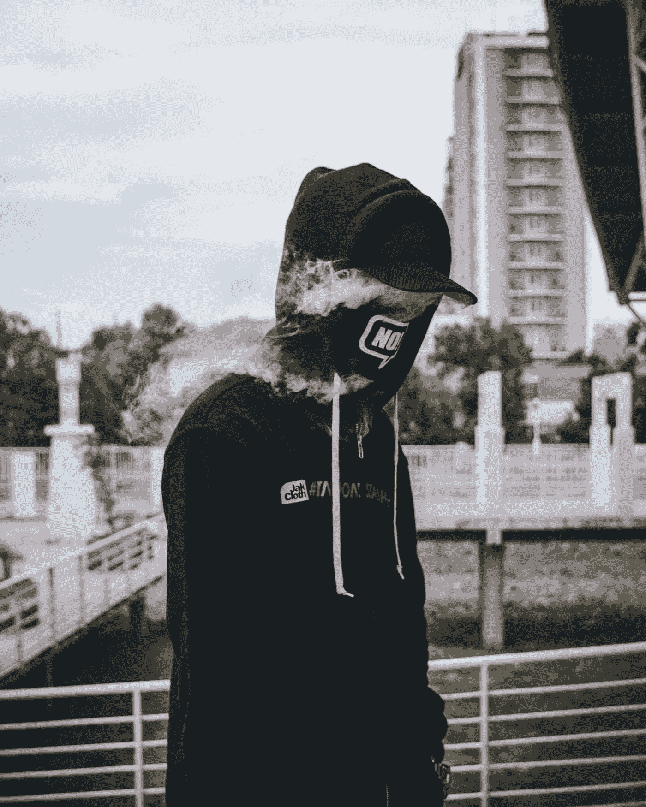

# 你是你自己最大的敌人

> 原文：<https://medium.com/swlh/you-are-your-own-worst-enemy-a4708db32134>

自我破坏比你想象的更普遍

Photo by [wild vibez](https://unsplash.com/@wldvbz?utm_source=medium&utm_medium=referral) on [Unsplash](https://unsplash.com?utm_source=medium&utm_medium=referral)

## “我们最大的恐惧不是我们不够好。我们最深的恐惧是我们的力量无法估量。最让我们害怕的是我们的光明，而不是我们的黑暗。”玛丽安娜·威廉森