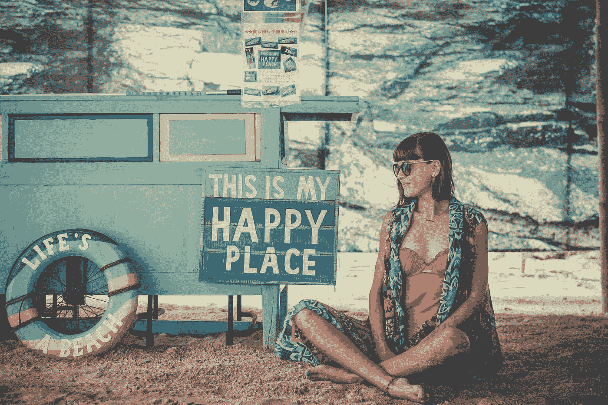

# 你可以像现在这样快乐地生活

> 原文：<https://medium.com/swlh/you-can-be-happy-with-your-life-exactly-the-way-it-is-58d04f148fba>

## 不要等待事情变得更好，开始充分地活在当下。

Photo by [Artem Beliaikin @belart84](https://unsplash.com/@belart84?utm_source=medium&utm_medium=referral) on [Unsplash](https://unsplash.com?utm_source=medium&utm_medium=referral)

我们中没有一个人不想快乐。从个人和文化角度来看，我们都痴迷于幸福——并且会不择手段地不懈追求幸福。

幸福被设定为一个目的地，我们目前过的生活只不过是一个试图寻找幸福的漫长旅程。

我们每天都收到信息，说我们现在的生活不够好。

如果你没有最新的科技产品，车道上的新车和六位数的收入，你还不如放弃，回去睡觉。

在比较陷阱中，我们看着别人拥有的东西，看着自己的生活是如何累积的，如果我们放任不管，这很容易夺走我们生活的快乐和意义。总会有人比我们拥有更多，做得更多，只是比我们“更好”。

不一定要这样。你不必总是等待事情变得更好，或者你的情况得到改善，看起来像一个完美风格的 Instagram feed。

事实上，如果你不断地等待事情变得更好，以此来感受快乐，你将会过着非常悲惨的生活。你所追求的幸福只有在当下才能完全体验到，伴随着它所有的混乱和不完美。

# 停止关注未来

我们花了很多时间关注未来会是什么样子。我们的梦想、抱负和目标总是围绕着改善和让生活变得更好。

但是我们没有意识到的是未来是不确定的。任何事情都可能在任何时候发生，缩短你的未来或者完全改变它的轨迹。

 [## 用正念找到你的力量

### 获得你所需要的意识，去发现你不知道自己拥有的内在力量。

medium.com](/swlh/using-mindfulness-to-find-your-power-422e6b71914) 

我们所拥有的只是眼前的当下——此时此地。

> “每个人都在寻找未来。他们从来不在当下。所以当他们到达未来时，它不在那里，因为他们不在那里。如果你明白这是你所拥有的时刻，这是你唯一拥有的时刻，那么你就活在当下，你会随波逐流，因为这是到达的点。就是现在。”——狄巴克·乔布拉

这是到达点。你现在就在其中，由你来决定你要用它做什么。

忘掉未来一分钟，一小时，甚至一天，看看它如何改变你的观点。当你能够完全理解留心、当下和体现意味着什么时，幸福最终会比你想象的要近得多。

# 放弃喧嚣

我们对忙碌和过度生活的文化痴迷正使我们生病、抑郁、焦虑和孤独。

这也是一个很大的干扰，让我们无法学会管理直接摆在我们面前的不愉快的情绪、感觉和情况。

我们许多人保持的极快的速度也让我们无法真正享受美好生活所包含的微小时刻和经历。

 [## 3 个简单的工具来设计你热爱的生活

### 你可以成为充满激情、目标和意义的生活的创造者。

medium.com](/swlh/3-simple-tools-to-design-a-life-you-love-4d53e251c934) 

这可能很简单，比如花点时间逛逛杂货店的花艺部，欣赏刚刚展出的新鲜绣球花。

也许是提前几站下车，走完剩下的路去上班，因为下了三天的雨后阳光灿烂。

如果你陷入了忙碌之中，你的注意力完全集中在你那永无止境的待办事项上，那么体验生活的机会永远不会是你可以利用的。

> “我对伟大没有异议。但如果到达目的地成为我现在放弃生活的借口，因为我还没有找到那个伟大的目标，那就算不是浪费生命，也是浪费一天。”—芭芭拉·布朗·泰勒

不要停止追求你的梦想和实现你的目标，但不要让这些成为你生活的全部焦点。你最终会错过就在你面前的美丽——那种能最终带给你幸福的美丽。

# 学会享受旅程

在我 20 多岁和 30 岁出头的时候，我一直在想，“当 ______ 发生时，我就可以快乐了”。无论我在哪里，在做什么，总会缺少一些东西，或者我想与众不同，这样我才会快乐。

这种生活方式让我痛苦，并助长了多年的抑郁和焦虑。

 [## 过充满快乐的生活完全是你的责任

### 不要指望任何人或任何事来为你做这件事。

medium.com](/@shannonhennig/living-a-life-filled-with-joy-is-entirely-your-responsibility-7b7ef8734f2a) 

用这种心态对待生活让我觉得我需要不断地证明自己，而我永远都不够。这种不懈的追求意味着我不能享受现在，因为我太专注于创造一个完美的未来。

经验告诉我，情况并非如此。

活在当下，实际上出现在旅途中，意味着思维的巨大转变，并使我体验到快乐、有意义和有目的的生活。

> “找到你的车道。为流动展示自己创造空间。跟随你生命的自然节奏，你会发现一种远远大于你自己的力量。”—奥普拉

找到你的自然节奏和流动状态可以让你进入一个每天都变得神奇的地方。你开始以一种新的方式欣赏平凡、无聊和平常。

你意识到生活就在眼前，你因为没有充分利用这一刻而错过了，尽管你有最好的计划和意图，但这一刻确实是你所拥有的一切。

虽然幸福似乎难以捉摸，但满足于现在的生活方式是完全可能的。如果你忽视你正在进行的旅程，只关注未来，你就会错过当下正在发生的事情。当你到达你生命中你认为应该快乐的时刻时，你无法欣赏或享受它，因为你不在当下。通过远离喧嚣，学会享受过程，你可以充分享受你所拥有的一切，而不是专注于你认为缺少的东西。

点击这里，加入我的企业家和创意人社区[。提高你的生产力，平衡工作和生活，向自主创业靠近。](https://www.shannonhennig.com/newsletter-sign-up)