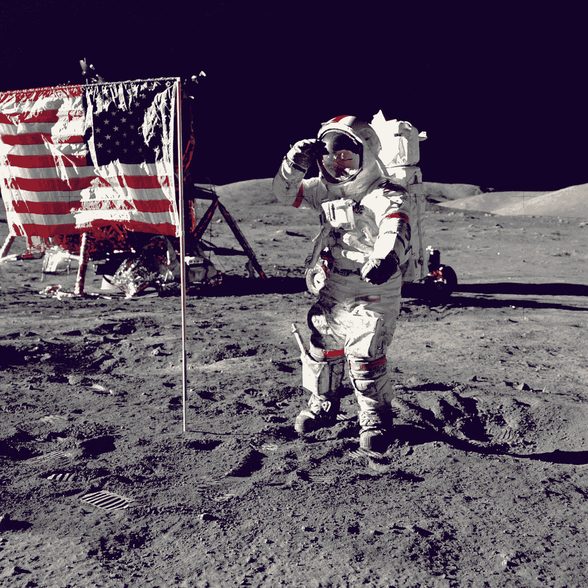
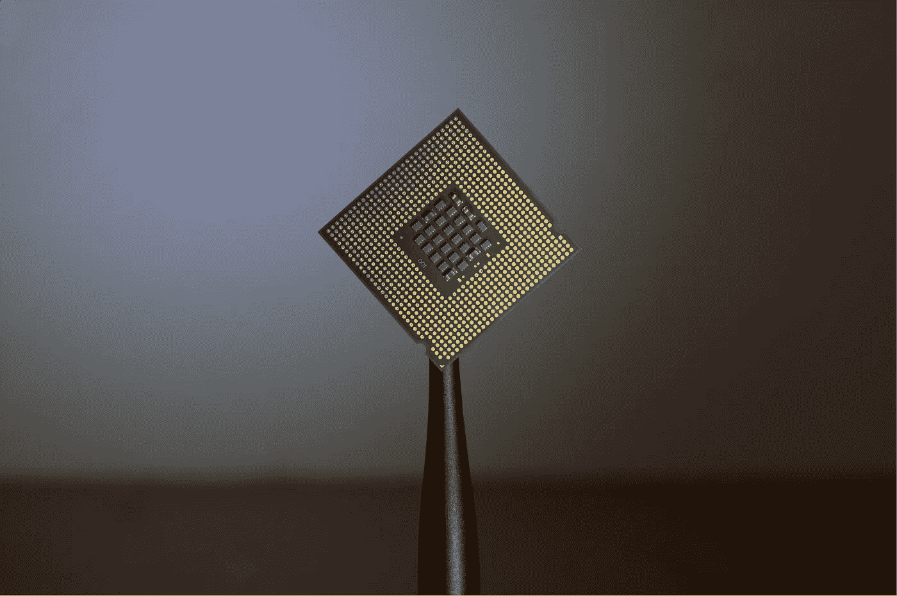
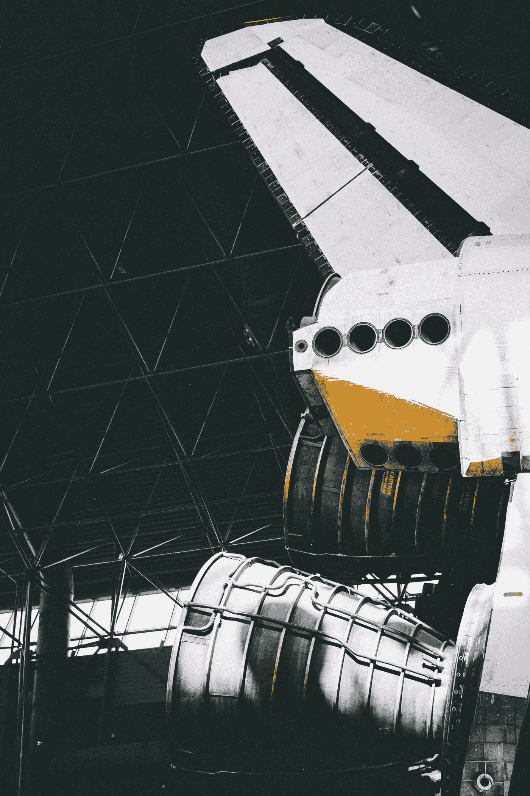
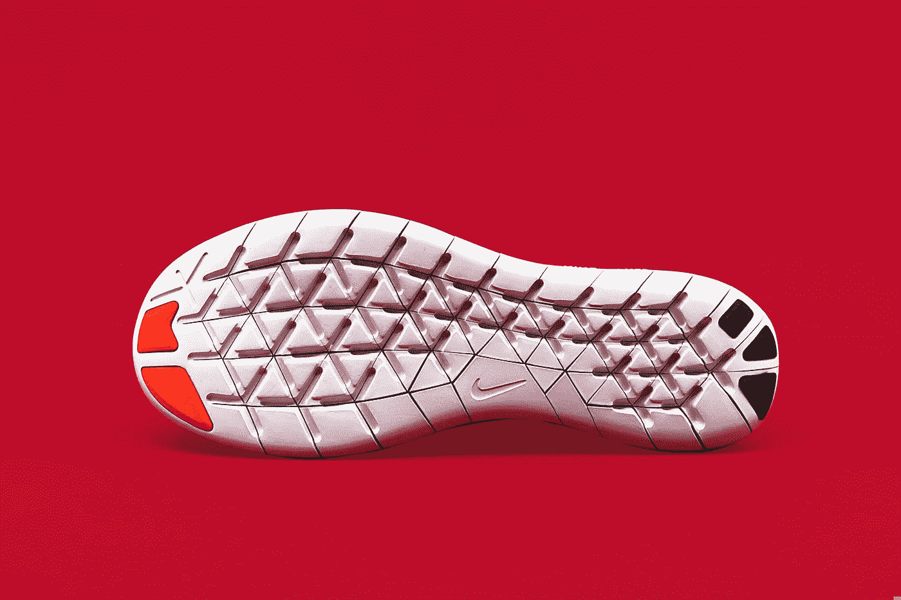
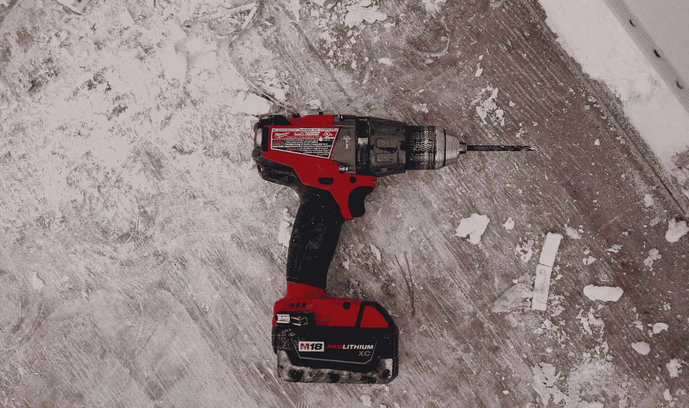
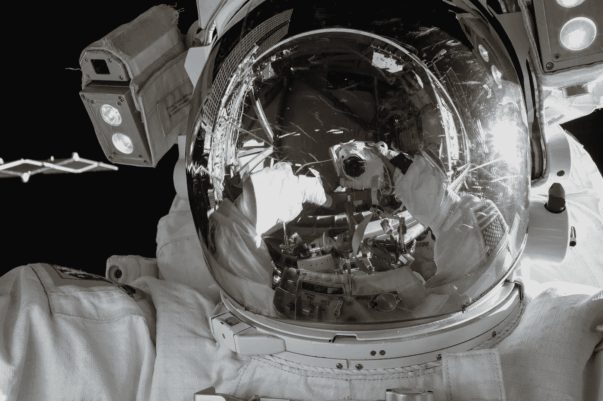

# 你可以感谢登月给了你运动鞋(和其他 4 项技术)

> 原文：<https://medium.com/swlh/you-can-thank-the-moon-landing-for-your-sneakers-and-these-4-other-technologies-7f2eb00a9df3>

Photo by [NASA](https://unsplash.com/@nasa?utm_source=unsplash&utm_medium=referral&utm_content=creditCopyText) on [Unsplash](https://unsplash.com/search/photos/moon?utm_source=unsplash&utm_medium=referral&utm_content=creditCopyText)

1969 年 7 月的首次登月可能没有像约翰·肯尼迪所希望的那样开启“太空时代”，但它确实开启了“技术时代”，我们都从中受益。这里有五项你可能不知道的技术是从阿波罗任务中使用的技术发展而来的。

## 1.集成电路:微芯片的先驱

Photo by [Brian Kostiuk — @BriKost](https://unsplash.com/@briankost?utm_source=unsplash&utm_medium=referral&utm_content=creditCopyText) on [Unsplash](https://unsplash.com/search/photos/microchip?utm_source=unsplash&utm_medium=referral&utm_content=creditCopyText)

这一点对于我们生活的数字时代至关重要。在德克萨斯仪器公司的杰克·基尔比发明集成电路之前，计算机需要很大的空间来容纳运行系统所需的所有处理设备。集成电路发明后，计算机可以安装在更小的空间里，节省了阿波罗任务的宝贵空间和重量。今天，微芯片为我们最喜爱的技术提供了动力:笔记本电脑、手机、汽车导航系统等等。

## 2.精确的药物剂量

Photo by [Meriç Dağlı](https://unsplash.com/@meric?utm_source=unsplash&utm_medium=referral&utm_content=creditCopyText) on [Unsplash](https://unsplash.com/search/photos/engine-thruster?utm_source=unsplash&utm_medium=referral&utm_content=creditCopyText)

帕克·汉尼芬公司将用于控制推进剂流入土星月球助推器发动机的设备改造成了[可编程植入式药物系统](https://www.nasa.gov/sites/default/files/80660main_ApolloFS.pdf)。该系统在患者体内输送精确的药物剂量。你可能熟悉它的形式，胰岛素泵，许多 1 型糖尿病患者使用它来帮助管理他们的疾病。

## 3.运动鞋鞋底

Photo by [REVOLT](https://unsplash.com/@revolt?utm_source=unsplash&utm_medium=referral&utm_content=creditCopyText) on [Unsplash](https://unsplash.com/search/photos/athletic-shoe?utm_source=unsplash&utm_medium=referral&utm_content=creditCopyText)

AVIA 公司将阿波罗宇航员使用的月球[靴子](https://www.nasa.gov/sites/default/files/80660main_ApolloFS.pdf)改造成一种轻便、无泡沫的运动鞋中底，以增加其弹性和透气性。这项技术已经普及到所有运动鞋品牌。由于这项技术，世界各地的运动员现在可以更努力、更快地比赛。

## 4.无绳电动工具

Photo by [NeONBRAND](https://unsplash.com/@neonbrand?utm_source=unsplash&utm_medium=referral&utm_content=creditCopyText) on [Unsplash](https://unsplash.com/search/photos/power-tools?utm_source=unsplash&utm_medium=referral&utm_content=creditCopyText)

Black & Decker [将阿波罗任务中用于钻探月球物质样本的无线工具和设备](https://www.nasa.gov/sites/default/files/80660main_ApolloFS.pdf)变成了外科手术工具。这些工具很快随着无线电钻、电锯和其他电动工具进入家庭使用。家装从来没有这么容易过。

## 5.隔热午餐袋

Photo by [NASA](https://unsplash.com/@nasa?utm_source=unsplash&utm_medium=referral&utm_content=creditCopyText) on [Unsplash](https://unsplash.com/search/photos/space-helmet?utm_source=unsplash&utm_medium=referral&utm_content=creditCopyText)

无论你是把午餐带到学校，还是在学校吃午餐，在你生活中的某个时刻，你都会接触到保温午餐袋。这些袋子闪亮的内衬是由阿波罗宇航员在太空旅行时用来隔离辐射的相同材料制成的。这种相同的材料用于家庭绝缘，以消除发动机和排气噪音，也是“太空毯”或应急毯的材料(应急包中的闪亮金属片)。

## 为科技和未来干杯！

虽然这个列表中只有五项技术是在 50 年前登月时实现的，但还有无数项技术在你的日常生活中扮演着重要角色。一些技术是在阿波罗任务之前发明的，但由于美国宇航局的高需求，我们其他人都负担得起。美国宇航局仍在开发有益于非宇航员日常生活的技术，你可以在 https://spinoff.nasa.gov/的[参观这些技术。尽管肯尼迪没能在月球上看到美国的土地(他在 1963 年 11 月被暗杀)，但他把人送上月球的努力导致了每天造福数百万人生活的技术的发展。所以，谢谢你，肯尼迪，谢谢你，阿波罗计划创造了我们生活的科技时代。](https://spinoff.nasa.gov/)